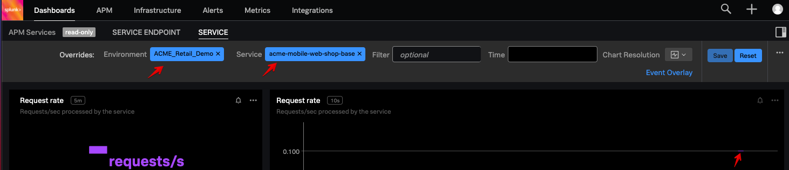
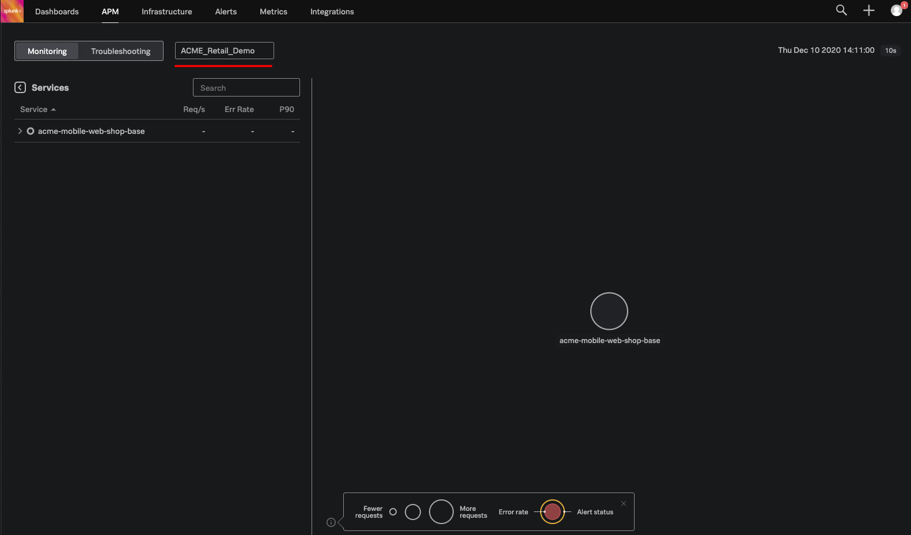

# Enable APM for Mobile Shop Springboot App (Cont.)

## 3. Run a case and find both the Service Dashboard and your trace

Go back to the browser tab with your Phone App running that you opened earlier, if you have closed it you can open a new one by navigating to *http://**[ec2_ip]**:8080/order* (where **[ec2_ip]** is the public ip address of your EC2 instance)

Generate your first trace in your environment by typing a phone name, selecting a number greater then 0 and  choosing a customer type:

- Name of a phone: For example *Geoff's big pictures phone*
- Quantity:  *2*
- Select a customer type: *Silver*

Click submit to run the application with the newly enabled FrameWork and Tracing settings, which will result in the generation of your first APM Trace.

The result should be similar to this:

### 3.1 Find your Service Dashboard for the Springboot app in Splunk APM

Right now your trace is being processed by the splunk APM back end, and since this is the first time this service is seen by Splunk APM, the corresponding service dashboard for the Springboot App will be generated.

Return to the APM Tab you opened in Step 1 of this section which should be displaying the Splunk APM Monitoring Dashboard.

Hover over **Dashboards** in the top menu, and then click on **All Dashboards**. A number of pre-built dashboards are provided for you in your default view.

Here you should have a Dashboard Group called **APM Services** (If it is not present, wait for a minute or two and refresh the screen, If it has not appeared after a couple of minutes, reach out the the workshop leader)

Select the **Services** Dashboard.

From the Environment Drop down box select ***UID_*Retail_Demo**, from the Service drop down box select ***uid*-mobile-web-shop-base** (where [UID] is your unique UID allocated to you for this Workshop.  The following examples have a UID of ACME).

This wil give you the automatically generated service dashboard for ***uid*-mobile-web-shop-base**.

If you set the time to -5 minutes you can see the single invocation, the averages over time on the left side will become active after a few minutes.

## 3.1 Look at trace info in splunk APM

Now navigate back to the APM Tab:

At the APM monitoring page, you should now have a single circle in the centre of the dashboard, this represents the UID_Retail_Demo Service.  Over the next modules you will enable APM on additional services which will then also appear in this view.

If you see more services please filter it down by selecting your environment ***UID_*Retail_Demo** from the drop down list.

You can also see the two endpoints used by the service.

Now click on **Troubleshooting** to go to the Troubleshooting view.

You should see your single service with on the right, two dashboards with a spike indicating the single invocation.

Select the top of the spike of the top dashboard as shown.

This will expand and show a list of traces matching the time frame selected. (In our case it should be our single trace.)

Click on the blue **Trace-id** to see the waterfall view of the trace. (Clicking on the Span name ***uid*-mobile-web-shop-base**  will expand it as shown.)

In the expanded view you can see the default tags send by the application.

Lets start enable APM in our first Lambda function to enrich this view!
