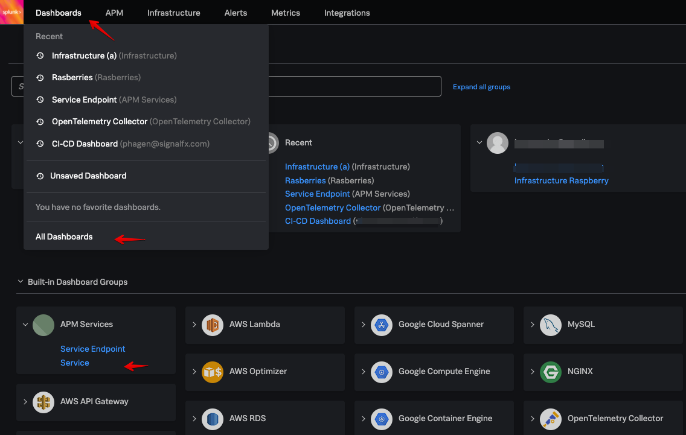

# Enable APM for On-prem Spring boot App (Cont.)

## 3. Run a case and find both the Service Dashboard and your trace

Go back to the browser tab with your Phone App running that you opened earlier, if you have closed it you can open a new one by navigating to *http://**[ec2_ip]**:8080/order* (where **[ec2_ip]** is the public ip address of your EC2 instance)

=== "URL"

    ```
    http://[ec2_ip]:8080/order
    ```

{: .zoom}

Generate your first trace in your environment by typing a phone name, selecting a number greater then 0 and  choosing a customer type:

- Name of a phone: For example *Geoff's big pictures phone*
- Quantity:  *2*
- Select a customer type: *Silver*

Click submit to run the application with the newly enabled FrameWork and Tracing settings, which will result in the generation of your first APM Trace.

The result should be similar to this:

{: .zoom}

### 3.1 Find your Service Dashboard for the Springboot app in Splunk APM

Right now your trace is being processed by the splunk APM back end, and the service dashboard for the Springboot App will be generated.

Return to the APM Tab you opened in Step 1 of this section which should be displaying the Splunk APM Monitoring Dashboard.

Hover over **Dashboards** in the top menu, and then click on **All Dashboards**. A number of pre-built dashboards are provided for you in your default view.

{: .zoom}

Here you should have a Dashboard Group called **APM Services** (If it is not present, wait for a minute or two and refresh the screen, If it has not appeared after a couple of minutes, reach out the the workshop leader)

Select the **Services** Dashboard.

{: .zoom}

From the Environment Drop down box select ***UID_*Retail_Demo**, from the Service drop down box select ***uid*-mobile-web-shop-base** (where [UID] is your unique UID allocated to you for this Workshop.  The following examples have a UID of acme).

{: .zoom}

This wil give you the automatically generated service dashboard for ***uid*-mobile-web-shop-base**.

If you set the time to -15 minutes you can see the single invocation, the averages over time will be filled in as well.

{: .zoom}

If you can, open a new ssh terminal to the EC2 instance you have been assigned and log in.
From the prompt run the following command to add some load on you service. (Do not use the existing session which is being used to run the app).

=== "Shell Command"

    ```text
    siege -H 'Content-Type:application/json' \
    "http://localhost:8080/order POST &lt; ./test/test.json" -c 10 -r 10
    ```
The dashboard should now start to populate with data.

## 3.1 Look at trace info in splunk APM

Now navigate back to the APM Tab:

{: .zoom}

If **All** is selected in the filter drop down you may now see a number of different services, select your own service which should be listed as UID_Retail_Demo.

You should now have a single circle in the centre of the dashboard, this represents the UID_Retail_Demo Service.  Over the next modules you will enable APM on additional services which will then also appear in this view.

**NEED TO ADD SCREEN SHOT WITH ACME_RETAIL_DEMO**