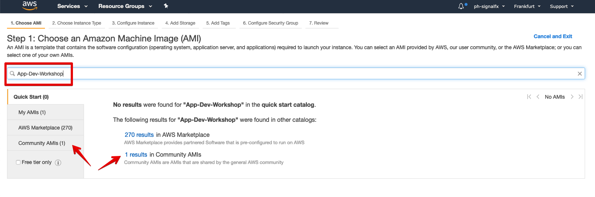
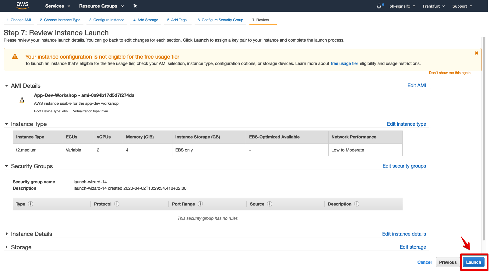
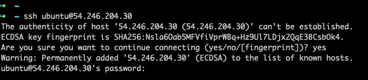

# Summary

* Use AWS EC2 to deploy a Ubuntu server prebuilt for the work shop.
* Explain the extra steps needed to  run the workshop on this instance

---

## 1. Starting the workshop instance

Login into your AWS account using the [AWS console](https://signin.aws.amazon.com) and go to the EC2 service page. As the Workshop Instance AMI currently only resides in AWS Frankfurt, Ireland, Ohio, Oregon or Singapore, please change your region to one of those by changing the drop-down list at the top of the screen

Click the blue **launch instance** button to go to the instance selection page and search for the workshop by typing the name _**App Dev Workshop V1.01**_ into the search box. You should find  get 1 result in the Community AMI's, and click on the on the Result link:

This should bring you to the choose and instance type screen. Here you can select the type of machine you wish to run the workshop on, we do recommend to use at least a **t2 medium**  with at least two cpu and 4 GB of memory. Once you made your selection press **Review and Launch** button.

Validate that the information on the review page looks like what is shown below and hit the **Launch** button to start the workshop instance.

You will be presented with a dialog box asking to provide credentials, there is no need to provide ssh keys so you can select the option **_Proceed without a key pair_**, then tick the acknowledge box to confirm you willing to pay AWS for this then hit the blue **LAUNCH INSTANCE** button

On the left side of you screen click under the **INSTANCES** heading on the _instances_ link to see your instance being deployed. Once the deployment is complete, copy the Public IP address from the **Description** panel at the bottom.

---

## 2. Connecting to your workshop instance

Start a command line session on your PC (terminal on a Mac, or putty on Windows for example) Login to your instance by starting an ssh session. (replace [IP-ADDRESS] with the IP address copied at step 6 from the previous section:
  
   `ssh ubuntu@[IP-ADDRESS]`

You will usually be asked to confirm that you wish to connect via ssh to the server, type yes to confirm, followed by a query for a password.

_**The password will be provided by the facilitator of the workshop**_.

Once your logged in successfully you should see the **APP-DEV** logo confirming that you are indeed using a workshop instance.

The system will install and launch your k3s kubernetes platform

---

If everything matches the screen shot above, your ready to begin your [workshop](https://signalfx.github.io/app-dev-workshop)
