# Working with Dashboards, Charts and Metrics

* Introduction to the SignalFx Dashboards and charts
* Editing and creating charts
* Filtering and analytical functions
* Using formulas
* Introduction to SignalFlow

---

## 1. Introduction to the SignalFx environment

Logon to the SignalFx organization you have been invited to

Hover over _**DASHBOARDS**_ in the top menu, and then click on _**All Dashboards**. A number of prebuilt dashboards are provided for you in your default view.

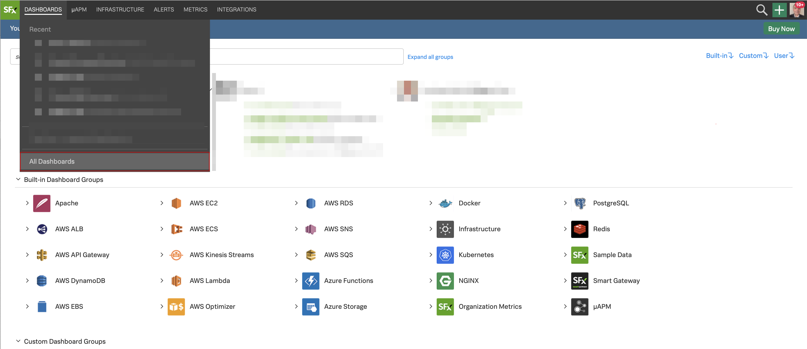

If you are already receiving metrics through a Cloud API integration or the Smart Agent you will see relevant dashboards for these services in SignalFx.

Among the dashboards you will see a Dashboard group called Sample Data. This group exists by default in all SignalFx accounts. Let's take a closer look at it.

---

## 2. Inspecting the Sample Data

In the All Dashboards view expand the Sample Data dashboard group by clicking on it, and then click on Intro to SignalFx dashboard

You will see a selection of sample charts. To learn more about charts you can click on the Intro to SignalFx, Part 1, 2 and Part 3 dashboards and read the description of the charts and its metrics.

Let's take a look at the Sample charts. Click on the **SAMPLE CHARTS** dashboard name:

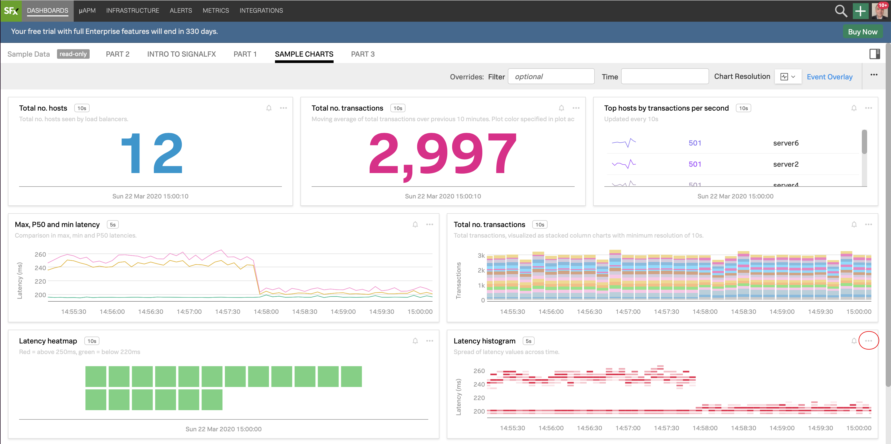

In the **SAMPLE CHARTS** dashboard you see a selection of charts that show a sample of the various styles, colors and formats you can apply to your charts in the dashboards.

---

## 3. Editing charts

Click on the three dots (...) on the Latency Histogram chart (circled in the screenshot above) and then on Open. You will see the plot options, current plot and signal (metric) for the Latency histogram chart.

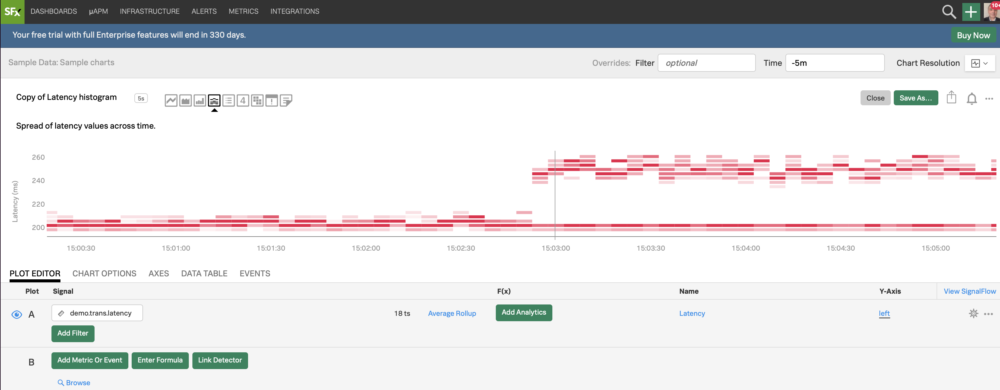

Click on the different chart type icons to explore each of the visualizations

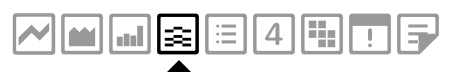

See how the chart changes. You can use different ways to visualize your metrics - you choose which chart type fits best for the visualization you want to have.
For more info on the different chart types see: [Choosing a chart type](https://docs.signalfx.com/en/latest/charts/chart-planning-creating.html#choosing-a-chart-type)

Click on Line chart type and you will see the line plot.

In the **PLOT EDITOR** tab under Signal you see the metric `demo.trans.latency` we are currently plotting.

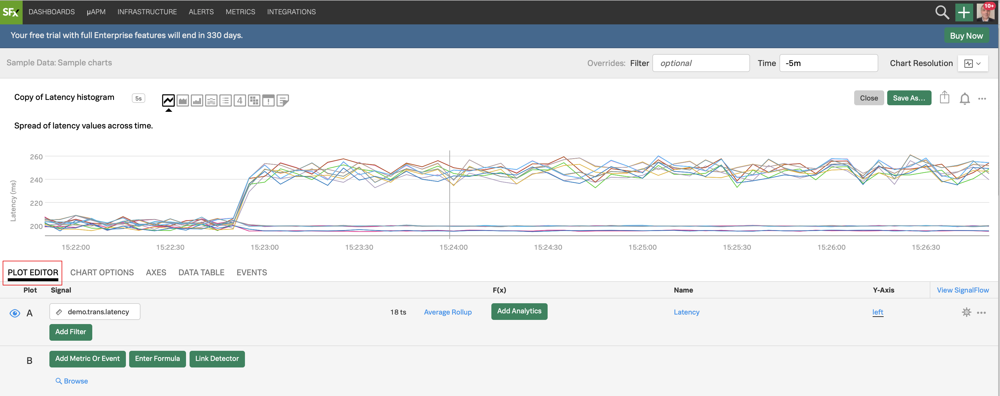

---

## 4. Creating a new chart

Let's now create a new chart and save it in a new dashboard! Click on the plus icon and from the drop down, click on **Chart**

You will now see a chart template like the following.

Let's enter a metric to plot. We are going to use the metric `demo.trans.latency`

In the **PLOT EDITOR** tab under **Signal** enter `demo.trans.latency`

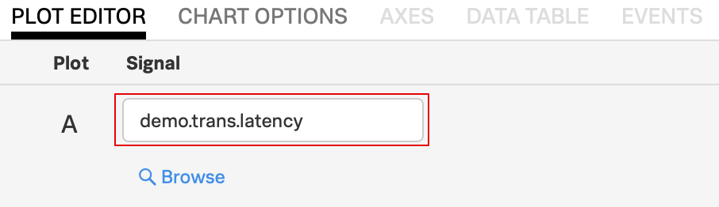

You will instantly see a number of Line plots, like below. The number `18 ts` indicates that we are plotting 18 metric time series in the chart.

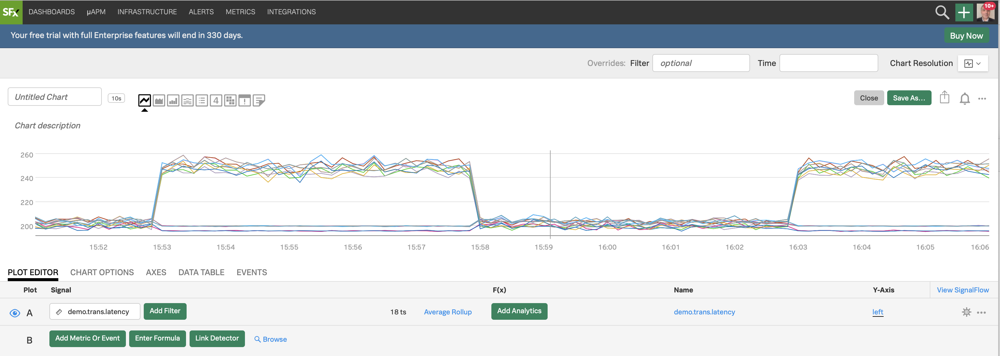

Click on the **DATA TABLE** tab

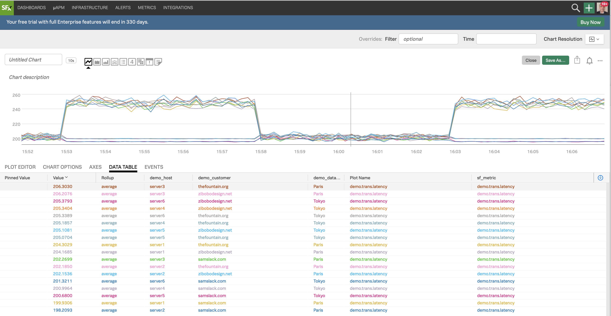

You see now 18 rows, each representing a metics time series with a number of columns. If you swipe over the plot horizontally you will see the metrics in these columns at different times.

In the `demo_datacenter` column you see that there are two data centers, Paris and Tokyo, for which we are getting metrics.

---

## 5. Filtering and Analytics

Let's now select the Paris datacenter to do some analytics - for that we will use a filter.

Let's go back to the **PLOT EDITOR** tab and click on Add filter, wait until it automatically populates, choose `demo_datacenter`, and then Paris

In the F(x) column, add the analytic function Percentile:Aggregation, and leave the value to 95 (click outside to confirm)

For info on the Percentile function and the other functions see [Analytics reference](https://docs.signalfx.com/en/latest/reference/analytics-docs/analytics-reference.html)

---

## 6. Using Timeshift analytical function

Let's now compare with older metrics. Click on `...` and then on Clone in the dropdown to clone that Signal

You will see a new row identical to A, called B, both visible and plotted

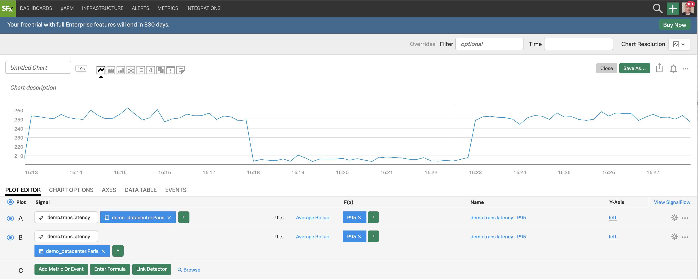

For the B Signal, In F(x) add the analytic function Timeshift and enter 7d (7 days = 1 week), and click outside to confirm

Click on the cogwheel on the far right, and choose a color, say pink, from Plot Color, to change color for the plot of B

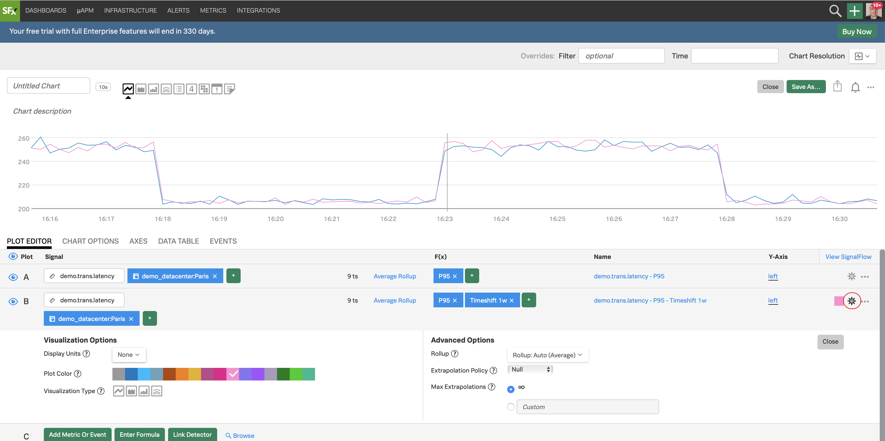

Click on Close

Click on the field next to Time and choose Past Day from the dropdown

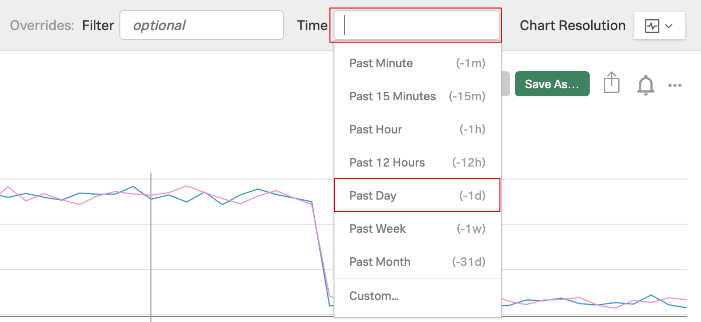

We now see datapoint for A for the last day (rolling) as a blue plot, and 7 days ago in pink

Click on Area chart icon

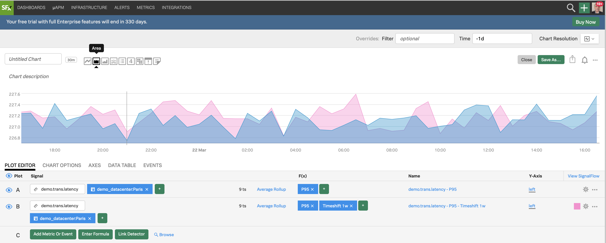

We now have a better view of our two plots

---

## 7. Using formulas

Let's now plot the difference of all metric values for a day with 7 days between

Click on Enter Formula then enter A-B (A minus B) and hide (deselect) all Signals using the eye, except C

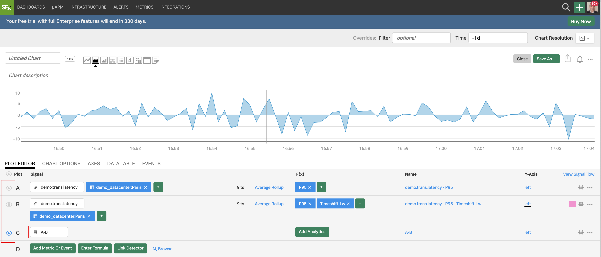

We now see only the difference of all metric values of A and B being plotted. We see that we have some negative values on the plot because a metric value of B has some times larger value than the metric value of A at that time.

If you click on DATA TABLE you can swipe horizontally along the X axis to see the metric values at different times.

Let's apply another function to get the values of C to positive values.

By doing so we will the difference between the metric values for a period of 24 hours with 7 days between. This difference can be used to see an alarming trend if we consider last week to be a baseline (the bigger the number - the more we deviate from the baseline) - but mainly we do this for you to get a bit more training on using functions!

In the **PLOT EDITOR** for C click on Add Analytics and choose Absolute Value

You will see the C plot now having only positive values

---

## 8. Overlaying metrics and events

Let's overlay metrics and events to our initial plot to see if there is any correlation with high latency. To discover and add new metrics to the chart from the ones that are being sent to SignalFx already, click on Browse on the bottom of the screen. In the Metrics sidebar on the right, enter `demo` and click on the search icon to search.

Observe that the Find Metrics option is pre selected

The metrics search is showing 3 metrics with demo in the name

Select `demo.trans.count` and click on the Add Plot green button

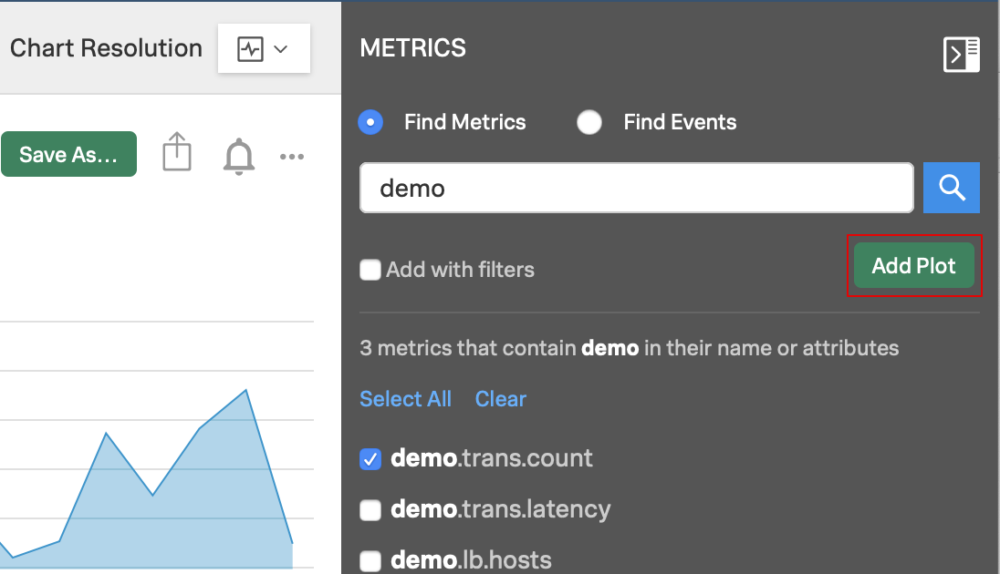

Click on the blue eye icon next to C to hide that Signal, and on the greyed eye icon for Signal A to show it

Filter the Paris datacenter and apply a function using Percentile Aggregation set to 95 and enter `-1h` in the Time frame for the entire chart.

We see that there is a correlation between latency and number of transactions! Hooray!
Likewise we could check Find Events and find events like deployment events etc. to correlate with.

Click on the icon to collapse the Metrics sidebar

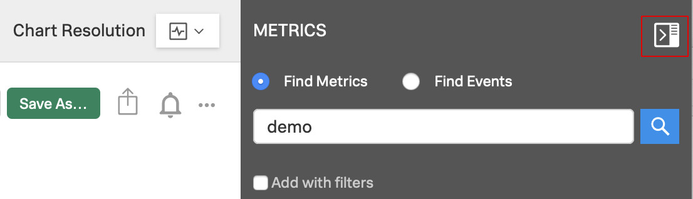

---

## 9. Introduction to SignalFlow

Let's take a look at SignalFlow - the analytics language of SignalFx that can be used to setup monitoring as code.

Click on View SignalFlow

You will see the SignalFlow code that composes the chart we were working on

SignalFlow is the analytics language of SignalFx. Between the many benefits it provides, it can be used to setup monitoring as code. In the next lab we will see it being used in action.
For more info on SignalFlow see
[Getting started with SignalFlow](https://docs.signalfx.com/en/latest/getting-started/concepts/analytics-signalflow.html#signalflow-analytics-language)

Click on View Builder to go back to the UI Signal builder

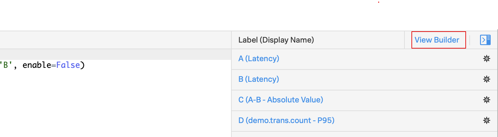

---

## 10. Adding charts to dashboards

Let's now save our chart. Click on Save as... and enter a name for your chart, use your initials like `[YOUR INITIALS] Latency Chart` and click OK

In the next window, find your email address in the list and select it, then click Ok

You will immediately be transported to the dashboard created under your selected group (make sure the group name on the top left is your email)

Last but not least, change the dashboard's name, by clicking the ... icon on the top right and selecting Dashboard Info

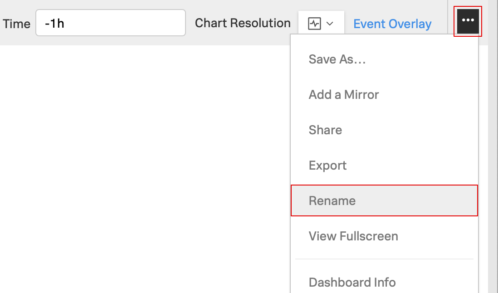

Enter a new name for your dashboard and click on Done

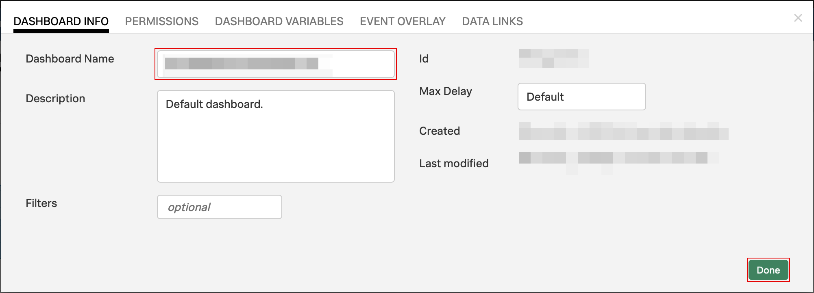

Congratulations! You have created your first chart and dashboard!

