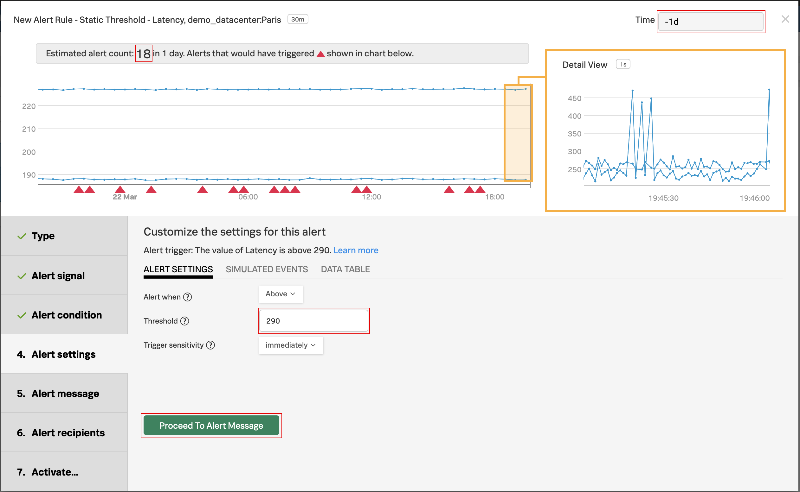
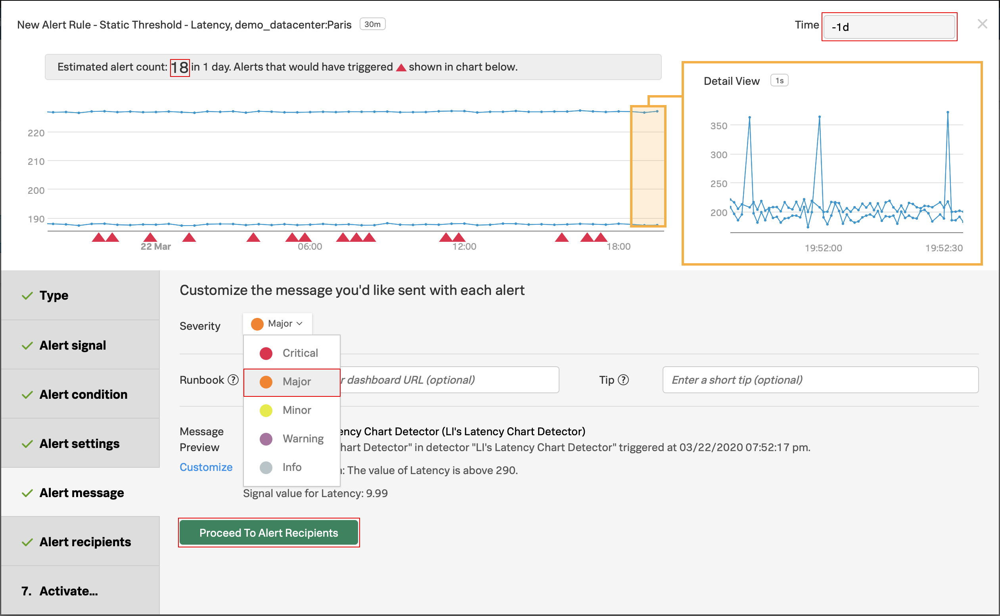
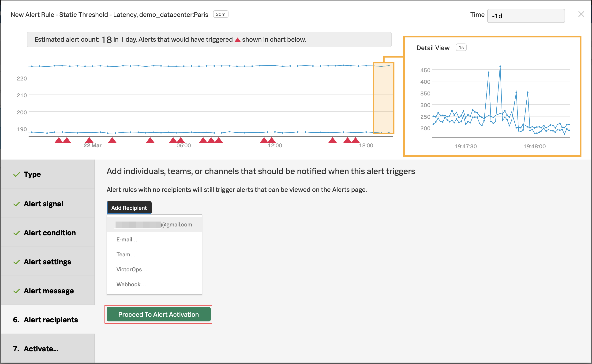
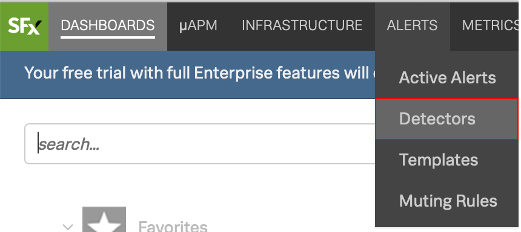

# Working with Detectors - Lab Summary

* Create a Detector from one of you charts
* Setting Alert conditions
* Running a pre-flight check
* Working with muting rules

{==

Minimum recommended time to complete - **15 minutes**

==}

---

## 1. Create a Detector from one of your charts

In **DASHBOARDS** click on your dashboard group (the one with your email address) and then on the dashboard name where the chart you created in the previous lab resides or search for your previously created dashboard's name, and click on that dashboard's name in the results.

Once you see the chart...
Click on the bell icon  on your chart and on New Detector From Chart - ADD YOUR INITIALS TO THE NAME (see next step).
We are going to create a new alert detector from the chart.

!!! important
    In the window that opens, add your initials in front of the proposed text, and click on Create Alert Rule.
    It should be something like this: LI's Latency Chart Detector.

In the detector window, inside Alert signal, the signal we will alert on is marked with a bell.
The bell in the 'Alert on' column indicates which Signal is being used to generate the alert. Click on Proceed to Alert Condition.

---

## 2. Setting Alert condition

In Alert Condition, click on Static Threshold and then on Proceed to Alert Settings.

In Alert Settings, enter the value "290" in the Threshold box and change Time on top right to past day.

---

## 3. Alert pre-flight check

Once you set an alert condition, SignalFx shows how many alerts you would get based on the current settings, and in the timeframe set on the upper right corner - in this case, the past day.

Immediately, the platform will start analyzing the signals with the current settings, and perform something we call a Pre-flight Check, This enables me to test the alert conditions using the historical data in the platform, to ensure the settings are logical and will not inadvertently generate an alert storm, removing the guess work from configuring alerts in a simple but very powerful way, only available using SignalFx.

We can see that based on the current settings, the amount of alerts we would’ve received in 1 day would've been around 18.

To read more about Detector Previews, please visit this link
[Setting up detectors](https://docs.signalfx.com/en/latest/detect-alert/set-up-detectors.html#previewing-the-results-of-a-detector)

---

## 4. Configuring the alert message

Click on Proceed to Alert Message. In Severity choose Major

Click on Proceed to Alert Recipients

Click on Add Recipient and then on your email displayed as the first option

That's the same as entering that email address
OR you can enter another email address by clicking on E-mail...

That's just one example of the many Notification Services SignalFx has available
You can check this out by going to the INTEGRATIONS tab of the top menu, and see Notification Services

---

## 5. Activating the alert

Click on Proceed to Alert Activation

In Activate...click on Activate Alert Rule

If you want to get alerts quicker you can click back on Alert Settings and lower the value from 290 to say 280.
If you change the Time to 1h you can see how many alerts you will be getting with the threshold you have chosen based on the metics from the last 1 hour.

Hover over **ALERTS** in the top menu and then click on Detectors

You will see you alert detector listed here.

Congrats! You have created your first alert detector and activated it!
