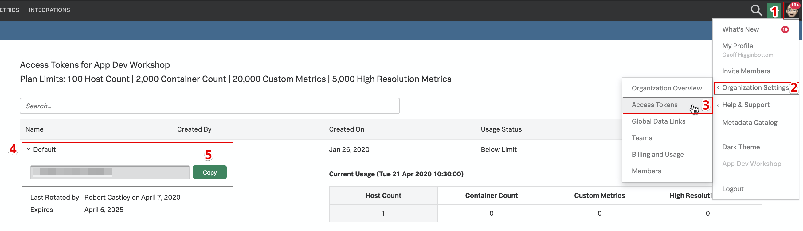
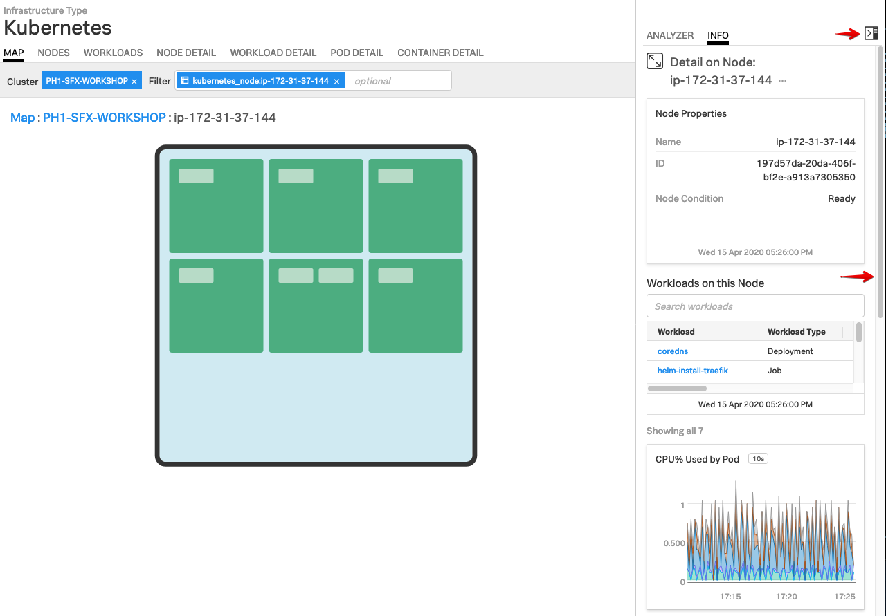

# Deploying the Smart Agent in Kubernetes (K3s)

* Use the SignalFx Helm chart to install the Smart Agent in K3s
* Explore your cluster in the Kubernetes Navigator

---

## 1. Obtain SignalFx Access Token

You will need to obtain your Access Token from the SignalFx UI once Kubernetes is running.

You can find your Access Token by clicking on your profile icon on the top right of the SignalFx UI. Then select **Organization Settings → Access Tokens**.

Expand the Default token, then click on **Show Token** to expose your token. Click the **Copy** button to copy to clipboard.

{: .zoom}

You will also need to obtain the name of the Realm for your SignalFx account.  Click on the profile icon again, but this time select **My Profile**.

The Realm can be found in the middle of the page within the Organizations section.  In this example it is `us1`.


---

## 2. Use Helm to deploy agent

Create the following variables to use in the proceeding helm install command:

=== "Input"

    ```
    export ACCESS_TOKEN=[ACCESS_TOKEN]
    export REALM=[REALM e.g. us1]
    export INITIALS=[YOUR_INITIALS e.g. RWC]
    export VERSION=[VERSION e.g. 5.1.2]
    ```

!!! note
    The latest version of the Smart Agent can be found on [GitHub](https://github.com/signalfx/signalfx-agent/releases)

Install the agent using the SignalFx Helm chart. Firstly, add the SignalFx Helm chart repository to Helm.

=== "Input"

    ```
    helm repo add signalfx https://dl.signalfx.com/helm-repo
    ```

Ensure the latest version of the SignalFx Helm repository

=== "Input"

    ```
    helm repo update
    ```

Install the Smart Agent Helm chart with the following commands:

=== "Input"

    ```
    : ${ACCESS_TOKEN:? needs to be set}
    : ${REALM:? needs to be set}
    : ${INITIALS:? needs to be set}
    : ${VERSION:? needs to be set}
    sed -i -e 's/\[INITIALS\]/'"$INITIALS"'/' ~/workshop/k3s/values.yaml
    helm install \
    --set signalFxAccessToken=$ACCESS_TOKEN \
    --set clusterName=$INITIALS-SFX-WORKSHOP \
    --set kubeletAPI.url=https://localhost:10250  \
    --set signalFxRealm=$REALM  \
    --set agentVersion=$VERSION \
    --set traceEndpointUrl=https://ingest.$REALM.signalfx.com/v2/trace \
    --set gatherDockerMetrics=false \
    signalfx-agent signalfx/signalfx-agent \
    -f ~/workshop/k3s/values.yaml
    ```

You can monitor the progress of the deployment by running `kubectl get pods` which should typically report a new pod is up and running after about 30 seconds.

Ensure the status is reported as Running before continuing.

=== "Input"

    ``` bash
    kubectl get pods
    ```

=== "Output"

    ```
    NAME                   READY   STATUS    RESTARTS   AGE
    signalfx-agent-66tvr   1/1     Running   0          7s
    ```

Ensure there are no errors by tailing the logs from the Smart Agent Pod. Output should look similar to the log output shown below.

Use the label set by the `helm` install to tail logs (You will need to press ++ctrl+c++ to exit). Or use the installed `k9s` terminal UI for bonus points!

=== "Input"

    ```bash
    kubectl logs -l app=signalfx-agent -f
    ```

=== "Output"

    ```text
    time="2020-03-15T11:30:28Z" level=info msg="Starting up agent version 5.0.0"
    time="2020-03-15T11:30:28Z" level=info msg="Watching for config file changes"
    time="2020-03-15T11:30:28Z" level=info msg="New config loaded"
    time="2020-03-15T11:30:28Z" level=info msg="Using log level info"
    time="2020-03-15T11:30:28Z" level=info msg="Fetching host id dimensions"
    time="2020-03-15T11:30:28Z" level=info msg="Trying to get fully qualified hostname"
    time="2020-03-15T11:30:28Z" level=info msg="Using hostname PH-k3s"
    time="2020-03-15T11:30:29Z" level=info msg="Using host id dimensions map[host:PH-k3s    kubernetes_node_uid:05ba9d7b-89d4-4c70-a3e9-4dc72923423a]"
    time="2020-03-15T11:30:29Z" level=info msg="Sending datapoints to https://ingest.us1.signalfx.com/v2/datapoint"
    time="2020-03-15T11:30:29Z" level=info msg="Sending events to https://ingest.us1.signalfx.com/v2/event"
    time="2020-03-15T11:30:29Z" level=info msg="Creating new monitor" discoveryRule= monitorID=10 monitorType=kubelet-stats
    time="2020-03-15T11:30:29Z" level=info msg="Creating new monitor" discoveryRule= monitorID=11 monitorType=kubernetes-cluster
    time="2020-03-15T11:30:29Z" level=info msg="Done configuring agent"
    ...
    time="2020-03-15T11:30:29Z" level=info msg="Serving internal metrics at localhost:8095"
        I0315 11:30:29.922577       1 leaderelection.go:242] attempting to acquire leader lease  default/signalfx-agent-leader...
        I0315 11:30:29.950448       1 leaderelection.go:252] successfully acquired lease default/signalfx-agent-leader
    time="2020-03-15T11:30:29Z" level=info msg="K8s leader is now node ph-k3s"
    time="2020-03-15T11:30:29Z" level=info msg="Starting K8s API resource sync"
    ...
    ```

---

## 3. Validate metrics in the UI

In the SignalFx UI, goto **INFRASTRUCTURE → Kubernetes Navigator → Cluster Map** and open the Kubernetes Navigator Cluster Map to ensure metrics are being sent.


---

Validate that your cluster is discovered and reporting by finding your cluster by searching for `[YOUR_INITIALS]-SFX-WORKSHOP` (in the workshop you will see many other clusters).


To examine the health of your node, first click on the blue cross  on your cluster.

This will drill down to the node level.  Next, open the side bar by clicking on the side bar button to open the Metrics side bar.

Once it is open, you can use the slider on the side to explore the various charts relevant to your cluster/node: CPU, Memory, Network, Events etc.


