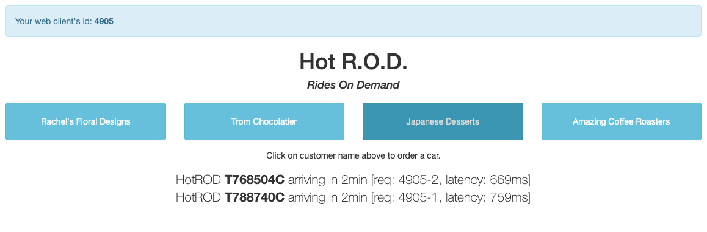

## Enabling µAPM
_An organisation needs to be pre-provisioned as a µAPM entitlement is required for the purposes of this module. Please contact someone from SignalFx to get a trial instance with µAPM enabled if you don’t have one already._

_To check if you have an organisation with µAPM enabled, just login to SignalFx and check that you have the µAPM tab on the top navbar next to Dashboards._

---

### 1. Create an instance running Kubernetes
This is already documented in [Deploying the Smart Agent in Kubernetes (K3s)](https://signalfx.github.io/app-dev-workshop/module3/k3s/).  

---

### 2. Deploy the Hotrod application into K3s
To deploy the Hotrod application into K3s apply the deployment
  
=== "Input"
    ```bash
    kubectl apply -f ~/workshop/apm/hotrod/k8s/deployment.yaml 
    ```
=== "Output"
    ```text
    deployment.apps/hotrod created
    service/hotrod created
    ```

To ensure the Hotrod application is running:

=== "Input"
    ```bash
    kubectl get pods
    ```
=== "Output"
    ```text
    NAME                      READY   STATUS    RESTARTS   AGE
    signalfx-agent-mmzxk      1/1     Running   0          110s
    hotrod-7cc9fc85b7-n765r   1/1     Running   0          41s
    ```

Create an environment variable for the IP address and port that the Hotrod application is exposed on:

```
HOTROD_ENDPOINT=$(kubectl get svc hotrod -n default -o jsonpath='{.spec.clusterIP}:{.spec.ports[0].port}')
```

---

### 3. Generate some traffic to the application using Apache Benchmark
```bash
ab -n10 -c10 "http://$HOTROD_ENDPOINT/dispatch?customer=392&nonse=0.17041229755366172"
```

Create some errors with an invalid customer number

```bash
ab -n10 -c10 "http://$HOTROD_ENDPOINT/dispatch?customer=391&nonse=0.17041229755366172"
```

---

### 4. Viewing the Hotrod application in your browser
In order to view the application in your web browser we need to find the LoadBalancer IP address and the port the application is listening on.

=== "Input"
    ```bash
    kubectl get svc
    ```

=== "Output"
    ```text
    NAME         TYPE           CLUSTER-IP    EXTERNAL-IP     PORT(S)          AGE
    kubernetes   ClusterIP      10.43.0.1     <none>          443/TCP          43m
    hotrod       LoadBalancer   10.43.32.97   192.168.64.35   8080:31521/TCP   40m
    ```

Make note of the `EXTERNAL-IP` (in the example above this is `192.168.64.35`). Then head over to your web browser and type in `http://{EXTERNAL-IP}:8080`, you should then be able to see the application running. Click on customer names to order a car:



---

Use the **Next** link in the footer below to continue the workshop
