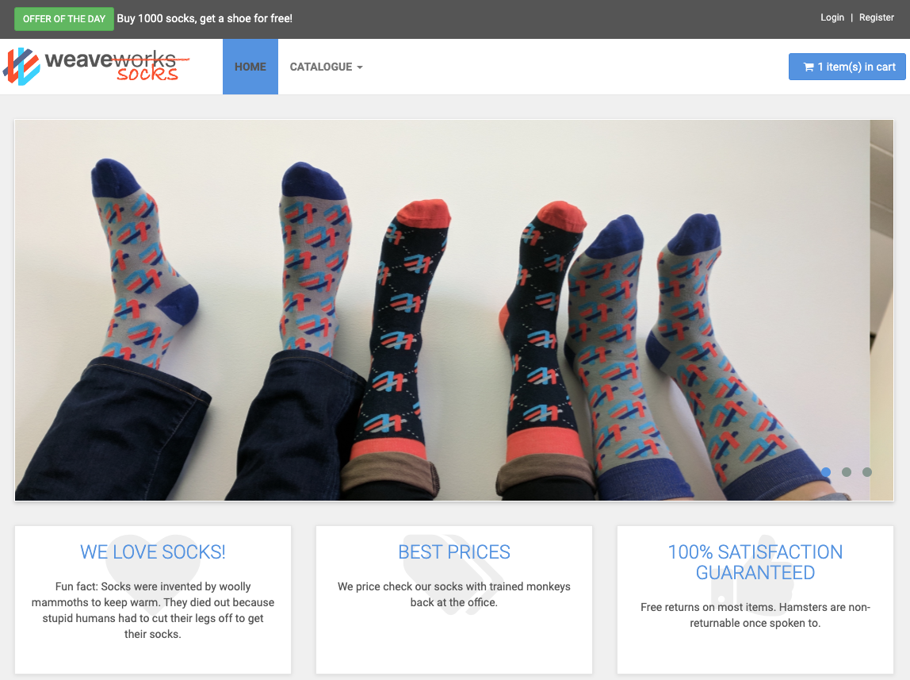
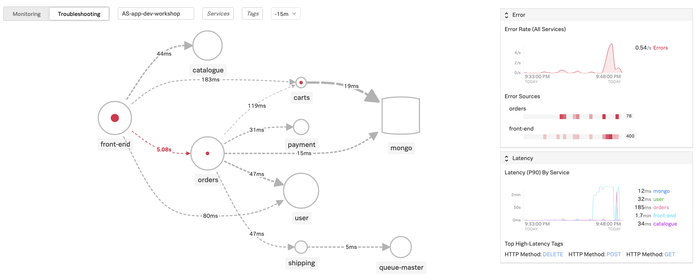

# Deploying Sock Shop in K3s

{==

Minimum recommended time to complete - **45 minutes**

==}

!!! important "Enabling µAPM"

    An Organization needs to be pre-provisioned as a µAPM entitlement is required for the purposes of this module. Please contact someone from SignalFx to get a trial instance with µAPM enabled if you don’t have one already.

    To check if you have an Organization with µAPM enabled, just login to SignalFx and check that you have the µAPM tab on the top navbar next to Dashboards.

!!! note
    The setup part is already documented in the [Preparation](../../module3/prep/) and [Deploy the Smart Agent in K3s](../../module3/k3s/) steps. Please ensure this instance is available and running before continuing.

    === "Input"

        ```
        multipass list
        ```

    === "Output"

        ```
        Name                    State             IPv4             Image
        rwc-k3s                 Running           192.168.64.17    Ubuntu 18.04 LTS
        ```

!!! Warning
    The Sock Shop application requires some horse power to run it, please ensure you are running a Multipass or EC2 instance that can handle it.

    **Sock Shop Multipass min. requirements:** 4 vCPU, 15Gb Disk, 8Gb Memory 
    **Sock Shop EC2 Instance min. requirements:** _t2.large_ 2 vCPU, 15Gb Disk, 8Gb Memory

---

## 1. Deploy the Sock Shop application into K3s

To deploy the Sock Shop application into K3s apply the deployment

=== "Input"

    ```bash
    cd ~/workshop/apm/sockshop
    kubectl create namespace sock-shop
    kubectl apply -f k8s/deployment.yaml
    ```

=== "Output"

    ```text
    namespace/sock-shop created
    deployment.apps/carts-db created
    service/carts-db created
    deployment.apps/carts created
    service/carts created
    deployment.apps/catalogue-db created
    service/catalogue-db created
    deployment.apps/catalogue created
    service/catalogue created
    deployment.apps/front-end created
    service/front-end created
    deployment.apps/orders-db created
    service/orders-db created
    deployment.apps/orders created
    service/orders created
    deployment.apps/payment created
    service/payment created
    deployment.apps/queue-master created
    service/queue-master created
    deployment.apps/rabbitmq created
    service/rabbitmq created
    deployment.apps/shipping created
    service/shipping created
    deployment.apps/user-db created
    service/user-db created
    deployment.apps/user created
    service/user created
    ```

---

## 2. Ensure Sock Shop is fully deployed

To monitor the deployment of Sock Shop using `k9s` to monitor:

=== "Input"

    ```
    k9s
    ```

Once in `k9s` press `0` to show all namespaces:


---

## 3. Take Sock Shop for a test drive

Sock Shop should be running in your cluster and exposes services via cluster IP and port. Obtain the ip address for the front-end service.

=== "Input"

    ```bash
    export SOCKS_ENDPOINT=$(kubectl get svc front-end -n sock-shop -o jsonpath='{.spec.clusterIP}:{.spec.ports[0].port}')
    ```

Then confirm the `SOCKS_ENDPOINT` environment variable has been set:

=== "Input"

    ```bash
    curl http://$SOCKS_ENDPOINT
    ```

=== "Output"

    ```html
    ...
    </script>
    </body>

    </html>
    ```

---

## 4. Viewing the SockShop application in your browser

(If you are using an EC2 instance, please skip to this section.)

To view the application in your web browser we need to find the LoadBalancer IP address and the port the application is listening on.

=== "Input"

    ```bash
    kubectl get svc -n sock-shop front-end
    ```

=== "Output"

    ```text
    NAME           TYPE           CLUSTER-IP      EXTERNAL-IP     PORT(S)          AGE
    front-end      LoadBalancer   10.43.247.97    192.168.64.35   8081:30001/TCP   34m
    ```

Make note of the `EXTERNAL-IP` (in the example above this is `192.168.64.35`). Then head over to your web browser and type in `http://[EXTERNAL-IP]:8081`, you should then be able to see the application running. Happy Shopping!



---

## 5. Apply load on Sock Shop

A load testing scenario is available for the Sock Shop application. To generate some load run the following command:

=== "Input"

    ```bash
    ./loadgen.sh -c 50 -r 3m
    ```

The parameter `-c` controls the amount of concurrent clients and `-r` the runtime of the load test. To apply continuous load set `-r` to the desired runtime. The load test runs as a job in the K8S cluster. Observe the progress:

=== "Input"

    ```bash
    kubectl -n sock-shop logs -f jobs/loadgen
    ```

If you want to abort a load test, delete the job:

=== "Input"

    ```bash
    kubectl -n sock-shop delete jobs/loadgen
    ```

---

## 6. Visualize and analyze trace data

Navigate to µAPM (*not* µAPM PG) and select Monitoring, then ensure you have selected your environment from the dropdown at the top, you should see something like this:


### Explore the User Interface

Review an automatically generated Service Dashboard. How do you correlate Service performance with Infrastructure?


### Troubleshoot a service

Let's stress the sock shop a bit. Increase the amount of clients running for the load test to something ludicrous, e.g.:

=== "Input"

    ```bash
    ./loadgen.sh -c 1000 -a 100 -r 5m
    ```

While the load test is running observe in SignalFx what happens with the services. Troubleshoot a service with a higher error rate. Also review the service dependencies.




Look at individual traces and span performance.


