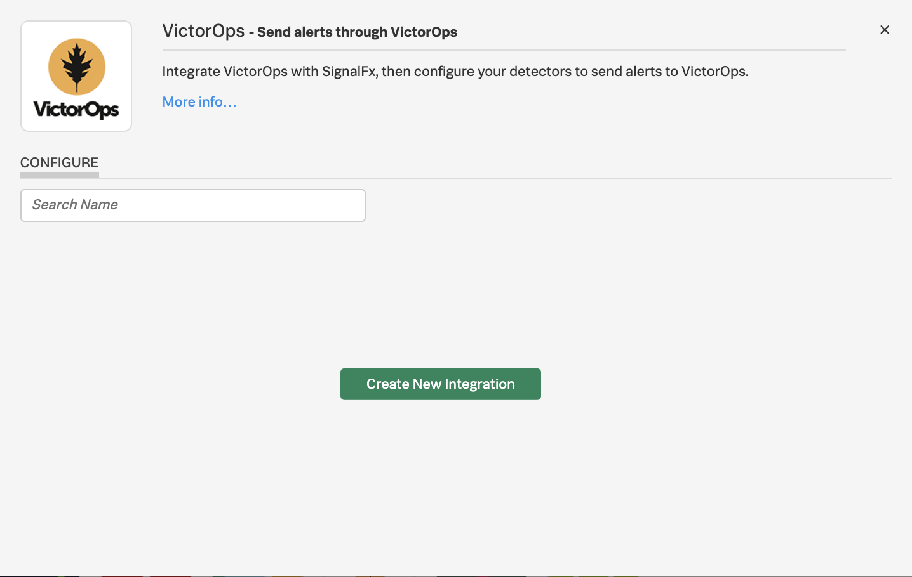

# VictorOps Integrations - Lab Summary

1. Configuring the Integration between VictorOps and SignalFx
2. Creating a test environment using Multipass
3. Testing the Integration

---
You are going to need to record a number of values during this module which we will export as variables in a later step so I suggest you create a `values document` to store the following values as you work through it.

=== "Values"
    ```bash
    export SFXVOPSID=
    export ACCESS_TOKEN=
    export REALM=
    export ROUTINGKEY=
    export INITIALS=

    Service_API_Endpoint=
    ```

## 1. Configuring the Integration between VictorOps and SignalFx

### 1.1. VictorOps Service API Endpoint

!!! warning
    The SignalFx Integration only needs to be enabled once per VictorOps instance, so you will probably find it has already been enabled, please **DO NOT** disable an already active integration when completing this lab.

In order to integrate SignalFx with VictorOps we need to first obtain the Service API Endpoint for VictorOps. Within the VictorOps UI navigate to `Integrations` main tab and then use the search feature to find the SignalFx Integration. If it is not already enabled, click the Enable Integration button to activate it.

You simply need to copy the Service API Endpoint, including the `$routing_key` into your `values document` using the `Service_API_Endpoint` parameter.  This will be used when configuring the VictorOps Integration within the SignalFx UI.

### 1.2. Enable VictorOps Integration within SignalFx

Login to your SignalFx account and navigate to Integrations and use the search feature to find the VictorOps integration. Assuming you are using the AppDev EMEA instance of VictorOps you will find the VictorOps Integration has already been configured so there is no need to create a new one.

However the process of creating a new Integration is simply to click on `Create New Integration` like in the image below, or if there are existing integrations and you want to add another one you would click `New Integration`.



...give it a descriptive `Name` then paste the `Service_API_Endpoint` value you copied in the previous step into the `Post URL` field, then save it.


!!! important
    SignalFx can integrate with multiple VictorOps accounts so it is important when creating one to use a descriptive name and to not simply call it VictorOps.  This name will be used within the SignalFx UI when selecting this integration, so ensure it is unambiguous

Once saved you need to copy the ID and save it in your `values document` using the `SFXVOPSID` parameter for use later in the module.


!!! warning
    Please do not create additional VictorOps integrations if one already exists, it will not break anything but simply creates extra clean up work after the workshop has completed.  The aim of this part of the lab was to show you how you would go about configuring the Integration if it was not already enabled.

## 2. Creating a Test Environment

### 2.1. Multipass

The easiest way to test VictorOps is to use Multipass to run some local test VMs which will be monitored by SignalFx.

If you do not already have Multipass installed you can download the installer from [here](https://multipass.run/).  Mac OS users can install it using Homebrew by running:

=== "Code"
    ```bash
    brew cask install multipass
    ```

### 2.2. SignalFx Details

We will use cloud-init to install the SignalFx Agent into the VMs but we first need to obtain the `Token` and `Realm` from your SignalFx account.

You can find your Access Token by clicking on the `settings` icon on the top right of the SignalFx UI, select `Organisation Settings` → `Access Tokens`, expand the Default token, then click on `Show Token` to expose your token, click the `Copy` button to copy it to your clipboard, then paste it into your `values document` using the `ACCESS_TOKEN` parameter.


You will also need to obtain the name of the Realm for your SignalFx account.  Click on the `account` icon again, but this time select `My Profile`.  The Ream can be found in the middle of the page within the Organizations section.  In this example it is `us1`. Again, make a note of this in your `values document` using the `REALM` parameter.


### 2.3. Local VMs using Multipass

The next step is to create a cloud-init file that will automatically install the SignalFx Agent when the VMs are created.  Create a `victorops.yaml` file using your preferred editor and populate it with the following, but replacing &lt;YOUR REALM&gt; & &lt;YOUR TOKEN&gt; with the values stored in your `values document`.

=== "victorops.yaml"

    ``` bash
    #cloud-config
    package_update: true
    package_upgrade: true

    runcmd:
    - curl -sSL https://dl.signalfx.com/signalfx-agent.sh > /tmp/signalfx-agent.sh
    - sudo sh /tmp/signalfx-agent.sh --realm <YOUR REALM> <YOUR TOKEN>
    ```

With the `victorops.yaml` file created, from the same directory where you created it run the following commands to create two VMs.  As in other modules prefix the name of each VM with your initials to make them unique within your SignalFx account. You may also want to first shutdown any other VMs you still have running from previous modules to free up resources.

!!! Tip
    Use two terminal windows to create the two VMs in parallel

1st VictorOps VM

=== "Input"

    ``` bash
    multipass launch \
    --name <YOUR INITIALS>-vo1 \
    --cloud-init victorops.yaml \
    --cpus=1 --disk=2G --mem=1G
    ```

=== "Output"

    ```
    multipass launch \
    --name gh-vo1 \
    --cloud-init victorops.yaml \
    --cpus=1 --disk=2G --mem=1G
    Launched: gh-vo1
    ```

2nd VictorOps VM

=== "Input"

    ``` bash
    multipass launch \
    --name <YOUR INITIALS>-vo2 \
    --cloud-init victorops.yaml \
    --cpus=1 --disk=2G --mem=1G
    ```

=== "Output"

    ```
    multipass launch \
    --name gh-vo2 \
    --cloud-init victorops.yaml \
    --cpus=1 --disk=2G --mem=1G
    Launched: gh-vo2
    ```

Once your two VMs have been created check within the SignalFx UI, Infrastructure Tab, and confirm they are reporting in correctly.  Allow a couple or minutes for the VMs to spin up, install updates and then install the SignalFx Agent etc.

If they fail to appear, double check your Token and Realm settings within your victorops.yaml file.  If errors are found these can easily be updated directly within the VM. Simply update the `token` or `api_url` and `ingest_url` files located within `/etc/signalfx`.

### 2.4. SignalFx Detector

We now need to create a new Detector within SignalFx which will use VictorOps as the target to send alerts to.  We will use Terraform to create the detector in a similar way to 'Module 4 - Monitoring as Code'.

If you have not completed Module 4, and do not have Terraform already installed, download and install it for your platform - `https://www.terraform.io/downloads.html` (min. requirement v. 0.12.18)

Copy and run the following code to download the VictorOps Workshop Detectors master zip file, unzip the file, then change into the `victorops-workshop-detectors-master` directory.

=== "Input"
    ```bash
    curl -LO https://github.com/signalfx/victorops-workshop-detectors/archive/master.zip
    unzip master.zip
    cd victorops-workshop-detectors-master
    ```

=== "Output"
    ```text
    % Total    % Received % Xferd  Average Speed   Time    Time     Time  Current
                                     Dload  Upload   Total   Spent    Left  Speed
    100   142  100   142    0     0    459      0 --:--:-- --:--:-- --:--:--   459
    100  4007    0  4007    0     0   5466      0 --:--:-- --:--:-- --:--:-- 17197
    Archive:  master.zip
    fcc95b101225ddb876d16106b5d7ece74a41f6c1
       creating: victorops-workshop-detectors-master/
      inflating: victorops-workshop-detectors-master/.DS_Store
      inflating: victorops-workshop-detectors-master/.gitignore
      inflating: victorops-workshop-detectors-master/README.md
      inflating: victorops-workshop-detectors-master/main.tf
       creating: victorops-workshop-detectors-master/modules/
      inflating: victorops-workshop-detectors-master/modules/.DS_Store
       creating: victorops-workshop-detectors-master/modules/host/
      inflating: victorops-workshop-detectors-master/modules/host/cpu.tf
      inflating: victorops-workshop-detectors-master/modules/host/variables.tf
      inflating: victorops-workshop-detectors-master/variables.tf
     extracting: victorops-workshop-detectors-master/versions.tf
    ➜  victorops-workshop-detectors-master
    ```

Create the following environment variables to use in the Terraform steps below.  The 1st three variables should be stored in your `values document` if you have been populating it as you have worked through this module.  You can populate the final two now then simply copy all five lines into your terminal window where you downloaded the terraform files in the previous step.

=== "Variables"
    ```bash
    export SFXVOPSID=<VictorOps Integration ID from Step 2>
    export ACCESS_TOKEN=<SignalFx Access Token from Step 2>
    export REALM=<SignalFx Realm from Step 2>
    export ROUTINGKEY=<YOUR_INITIALS>_PRI
    export INITIALS=<YOUR_INITIALS>
    ```

=== "Example"
    ```bash
    export SFXVOPSID=xxxxxxxxxxxx
    export ACCESS_TOKEN=xxxxxxxxxxxxxxx
    export REALM=us1
    export ROUTINGKEY=GH_PRI
    export INITIALS=GH
    ```

Initialise Terraform.

!!! note
    You will need to run this command each time a new version of the Terraform Provider is released. You can track the releases on [GitHub](https://github.com/terraform-providers/terraform-provider-signalfx/releases).

=== "Input"
    ```bash
    terraform init -upgrade
    ```

=== "Output"
    ```text
    Upgrading modules...
    - host in modules/host

    Initializing the backend...
    
    Initializing provider plugins...
    - Checking for available provider plugins...
    - Downloading plugin for provider "signalfx" (terraform-providers/signalfx) 4.19.1...
    
    The following providers do not have any version constraints in configuration,
    so the latest version was installed.
    
    To prevent automatic upgrades to new major versions that may contain breaking
    changes, it is recommended to add version = "..." constraints to the
    corresponding provider blocks in configuration, with the constraint strings
    suggested below.
    
    * provider.signalfx: version = "~> 4.19"
    
    Terraform has been successfully initialized!
    
    You may now begin working with Terraform. Try running "terraform plan" to see
    any changes that are required for your infrastructure. All Terraform commands
    should now work.
    
    If you ever set or change modules or backend configuration for Terraform,
    rerun this command to reinitialize your working directory. If you forget, other
    commands will detect it and remind you to do so if necessary.
    ```

Create a new Terraform Workspace which will track the state for this environment.  Workspaces allow you to run Terraform against different environments each with their own state data stored in the workspace.  In the following example we create a workspace called 'Workshop' but feel free to use whatever name you like.

=== "Input"
    ```text
    terraform workspace new Workshop
    ```

=== "Output"
    ```text
    Created and switched to workspace "Workshop"!

    You're now on a new, empty workspace. Workspaces isolate their state,
    so if you run "terraform plan" Terraform will not see any existing state
    for this configuration.
    ```

It is considered best practice to run a terraform plan to see what changes may get made and check for potential errors before running an apply as we did in Module 4, however as the first stage of apply is to plan we can safely skip that step and just run apply.  Check the plan output for errors before typing _**yes**_ to commit the apply.

=== "Input"
    ```text
    terraform apply -var="access_token=$ACCESS_TOKEN" -var="realm=$REALM" -var="sfx_prefix=$INITIALS" -var="sfx_vo_id=$SFXVOPSID" -var="routing_key=$ROUTINGKEY"
    ```

=== "Output"
    ```
    An execution plan has been generated and is shown below.
    Resource actions are indicated with the following symbols:
      + create

    Terraform will perform the following actions:
    
      # module.host.signalfx_detector.cpu_greater_90 will be created
      + resource "signalfx_detector" "cpu_greater_90" {
          + description       = "Alerts when CPU usage is greater than 90%"
          + id                = (known after apply)
          + max_delay         = 0
          + name              = "GH CPU greater than 90%"
          + program_text      = <<~EOT
                from signalfx.detectors.against_recent import against_recent
                A = data('cpu.utilization').publish(label='A')
                detect(when(A > threshold(90))).publish('CPU utilization is greater than 90%')
            EOT
          + show_data_markers = true
          + time_range        = 3600
          + url               = (known after apply)
    
          + rule {
              + detect_label          = "CPU utilization is greater than 90%"
              + disabled              = false
              + notifications         = [
                  + "VictorOps,ERI0R2GAIAA,GH_PRI",
                ]
              + parameterized_body    = <<~EOT
                    {{#if anomalous}}
                     Rule "{{{ruleName}}}" in detector "{{{detectorName}}}" triggered at {{timestamp}}.
                    {{else}}
                     Rule "{{{ruleName}}}" in detector "{{{detectorName}}}" cleared at {{timestamp}}.
                    {{/if}}
    
                    {{#if anomalous}}
                      Triggering condition: {{{readableRule}}}
                    {{/if}}
    
                    {{#if anomalous}}
                      Signal value: {{inputs.A.value}}
                    {{else}}
                      Current signal value: {{inputs.A.value}}
                    {{/if}}
    
                    {{#notEmpty dimensions}}
                      Signal details: {{{dimensions}}}
                    {{/notEmpty}}
    
                    {{#if anomalous}}
                      {{#if runbookUrl}}
                        Runbook: {{{runbookUrl}}}
                      {{/if}}
                      {{#if tip}}
                        Tip: {{{tip}}}
                      {{/if}}
                    {{/if}}
                EOT
              + parameterized_subject = "{{ruleSeverity}} Alert: {{{ruleName}}} ({{{detectorName}}})"
              + severity              = "Warning"
            }
        }
    
    Plan: 1 to add, 0 to change, 0 to destroy.
    
    Do you want to perform these actions in workspace "Workshop"?
      Terraform will perform the actions described above.
      Only 'yes' will be accepted to approve.
    
      Enter a value: yes
    
    module.host.signalfx_detector.cpu_greater_90: Creating...
    module.host.signalfx_detector.cpu_greater_90: Creation complete after 2s [id=EWHU-YAAAAA]
    
    Apply complete! Resources: 1 added, 0 changed, 0 destroyed.
    ```

---

You have now configured the Integrations between VictorOps and SignalFx so the final part of this module is to test the flow of alerts from SignalFx into VictorOps and see how you can manage the incident with both the VictorOps UI and Mobile App.
