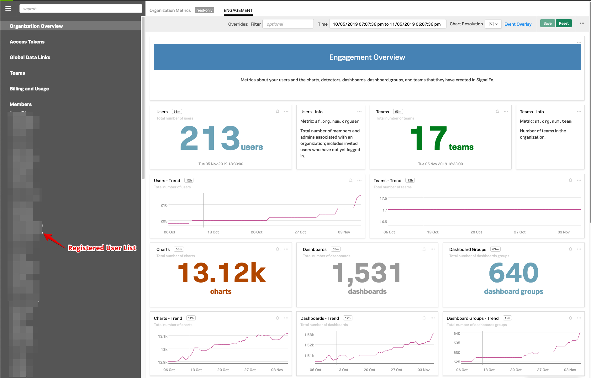
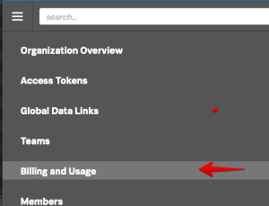
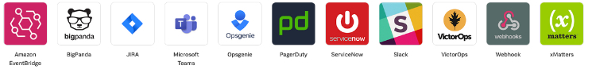

## Lab Summary

*  How to keep track of the usage of SignalFx in your organization.
*  Learn how to keep track of spend by exploring the Billing and Usage interface.
*  Create a team and add members to team
*  Discover how you can restrict usage for teams by creating separate access token's and set limits.

---

### 1. Let's see what has been created!

To see who is registered and what is being build inside your organization, right click on the *settings* icon on the top right of the SignalFx UI,

It may also look like this  ).
From the drop down, select the **Organizations Settings → Organization Overview** tab, this will provide 
you with the following dashboard that shows you how your SignalFx organization is being used:

On the right, you will see a list of registered users (blurred in the above screenshot), and the various 
charts that show you the number of registered users, chart's and dashboards created and growth trends,
The screenshot is taken from an actual organization, the workshop organization  your are looking at,
may have less data to work with.
Take a minute to explore the various charts in the Organization over view of the workshop instance.

***

## Step 2: Let's see what we've spend!
If you want to see what your spend is against your contract you can either select the  *settings* icon 
on the top right of the SignalFx UI again,

but this time select the **Organizations Settings → Usage and Billing** tab, or the faster way, 
select the **Usage and Billing** tab from the left pane!

Given this will recalculate the usage across your organization you may see a spinning
    
***

You should see a screen similar like the one below  that will give you an overview of the current usage, 
the average usage  and your entitlement per category : Nodes, Containers, Customer Metrics and 
High Resolution Metrics.  
For more information on what these are please read [ Billing and Usage information](https://docs.signalfx.com/en/latest/admin-guide/usage.html#viewing-billing-and-usage-information)
 

You can find the category count inside the 4 red boxes below the graphs and your entitlement 
per category is shown in red above each graph. 
The graph will also show you how much you are consuming at this point in time.

In the bottom chart, you can see the usage per category for the current period (shown in the 
drop-down box on the top right of the chart.) 
The blue line marked _Average usage_ indicates what SignalFx will use to calculate your average usage 
for the current period. 

!!! info

    As you can see from the screenshot, SignalFx does not use High water mark or p95% for cost calculation but the actual average usage, allowing you do performance testing or Blue/Green style deployments etc. etc. without risk of overage charges. " 

The Red box on the right  shows you information about your organizations and entitlement duration.

You can change the category type by the drop down on the top left of the chart.
Please take a minute to explore the different time periods & categories and their usage.

***

### 3. Let's see our teamwork!
To make sure that users directly see the dashboards and alerts that are relevant to them when they login to SignalFX, 
most organizations will use SignalFx's Teams mechanism to assign a user to a Team.
Usually this matches work related roles, for example, members of a Dev-ops or Product Management group would be assigned 
to the corresponding Teams in SignalFx.

Once an Team member is connected to SignalFx, they will be shown the Teams landing page, similar to the one shown below, In this case for the Product Management team.
Here, members see all the Dashboard, alerts that are assigned the team and  any other useful information so they can focus on what is relevant to their job.

The above landing page has three Dashboard groups assigned, shows there is a critical alert that had this team as an adressee and some text and urls with other topics of interest. 

***
   
To work with  to signalFx's Team UI click on the settings  ) icon on the right top of the page and select the **Organizations Settings → Teams** tab, or select the **Teams** tab from the left pane.
    

When the **Team** UI is selected you will be presented in the workshop with an empty Team's list 
  

***  
To add a new **Team** click on the green  button. This will present youy with the **Create New Team** Dialog.

Create your own team by naming it [YOUR-INITIALS]-Team and add yourself by searching for your name and 
selecting  the **Add** link behind your name. This should result in a dialog similar to the one below:

You can remove selected users by pressing  **remove** or the small **x** behind a name.
Make sure you have your group created with your initials and with yourself added as a member, then press done.

***   

This will bring you back to the **Teams** list that now show your Team and the one's created by others.
Note that the group(s) you are a member of has a gray **Member** icon in front of it.
If no members are assigned to your group, you should see a blue **Add members** link instead of the member count, 
clicking on that link  will get you to the **Edit Team** dialog where you can add yourself.   
This is the same dialog you get when pressing the 3 dots **...**   at the end of the Line with your team
and select **Edit Team**.

The 3 **...** menu give you the option to Edit a Team, Join or leave a Team or Delete a team.

***

You can set up specific Notification rules per team, click on the **NOTIFICATION POLICY** Button, 
this will open the notification edit menu.

By default the system offers you the ability to set up a general notification rule for your team.
Note the Email all members, This mean all members of this team will receive an email with the Alert information, regardless of the alert type.
You can add other recipients, by  clicking 

You can add a different email addresses to inform people outside SignalFx users like
 _alerts@your-company.com_ if that is way to inform people outside SignalFx. AAdding groups you would use when you also want to send an alert to an other team, like sending an alert on the Database of your application to the  general Database team along with one to your team.
   
However if you click on the link **Configure separate notification tiers for different severity alerts** you can configure every alert level differently.

As you can see in th above screenshot, you can set up different alert rules for the different alert level.
We have different rules set up for all the various Error levels, Showing you how Splunk's VictorOps offering would integrate with SignalFx.
Both at a Critical and Major alert, the alert gets forwarded to Splunk's VictorOps that will handle alerting the on call engineer and/or manager.
For the Minor alerts we send it to the Teams slack channel and for warning and info messages we just use an email

Below you see some of the Notification options you can install in your SignalFx Organization:

Take a moment to create some notification rules for you Team.

***

## Step 4: Let's control a teams usage!
If you wish to make sure certain teams or users cannot use more then a certain allotment of you overall  allotment of nodes, containers and Metrics' you can create multiple Access keys.

  
To work with SignalFx's Access Tokens UI click on the settings  ) icon on the right top of the page and select the **Organizations Settings → Access tokens** tab, or select the **Access Tokens** tab from the left pane.

This will open up the **Access Token** Interface.  It consist of a an overview of your Allotments for this organization and a list of Access Tokens that have been generated.
Every Organization wil have a Default token that is generated when  Organization is created.

Each Token is unique and can be assigned limits for the amount of  Nodes,containers Custom Metrics and High Resolution it can use.

The **Usage Status** Column shows if a token is used above or below its assigned limits. 

***

Let create a new token by clicking on  the  button.
This will provide you with the **Name Your Access Token** dialog.
Enter the new name of the new Token  by using your Initials  ie. PH-Token

After you press Ok,  you will be taken back to the **Access token** UI, here your new token should be present, among the ones created by others.

If you have made an error in your naming, want to disable/enable a token or set a Token limit, click on the 3 **...** menu button behind a token limit to open the manage token menu.

If you made a type you can use the Rename Token option to correct the name of your token.

***

If you need to make sure a token  cannot be used a to send Metrics in you can Disable a token.
Click on the Disable button to Disable the token, this means the token cannot be used for sending in data to SignalFX.  
The line with Your Token should turn greyed out to indicate that is been Disabled as you can see in the screenshot below.

    
Go ahead and click on the 3 **...** menu button to Disable and Enable your token.

***

Now Lets start limiting usage by clicking on Manage Token Limit in teh 3 **...** menu.
This will show the Manage Token Limit Dialog: 

In this Dialog you can set the limits per category.

Please go ahead and specify the limits as shown above for each usage metric.
For our lab use your own email address, and double check if you have the  number in you dialog as shown above.

Token limits are used to trigger an alert that notify one or more recipients when the usage has been above 90% of the limit for 5 minutes. To specify the recipients, click Add Recipient, then select the recipient or notification method you want to use. (Specifying recipients is optional but highly recommended.) The severity for token alerts is always Critical.

Click on **Update** to save your Access Tokens limits and The Alert Settings.

!!! Note
    When a token is at or above its limit in a usage category, new metrics for that usage category will not be stored and processed by SignalFx. This will make sure you there  will be no unexpected cost due to a team sending in data without restriction.

In your company you would distribute these new Access Tokens to various teams, controlling how much information/data they can send to SignalFx. This will allow you to fine tune the way you consume your SignalFx allotment and stop expensive surprises from happening

    
**Congratulations!** You have now  have completed the Service bureau module.