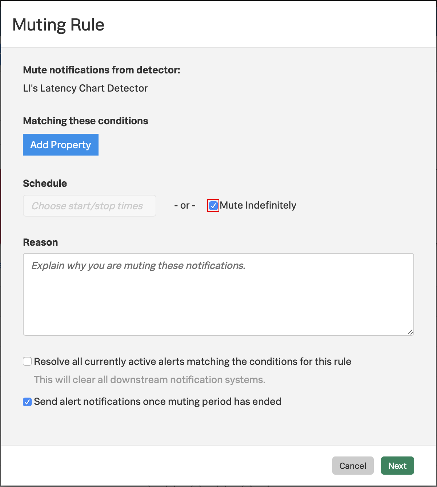
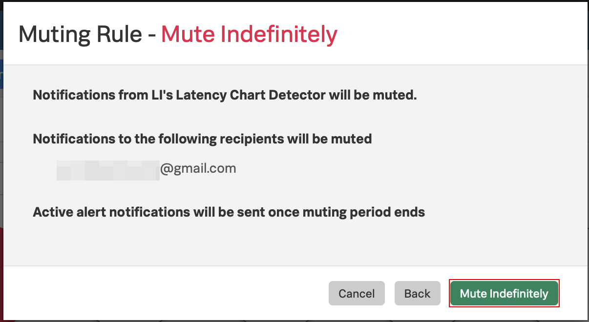
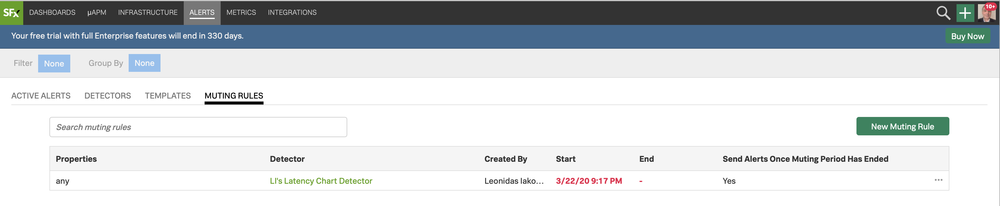

## Lab Summary
* Learn how to configure how to mute Alerts
  
---

### 1. Learn how to configure muting your alerts
There are times when you, for a period of time, don't want to be disturbed by notifications for some non critical alerts. For that you can use muting rules in SignalFx. Let's create one!

Hover over **ALERTS** in the menu and click on **Detectors**

 

If you created an alert detector in "Working with Detectors" you can click on the three dots `...` on the far right and click on **Create Muting Rule...**

 

In the Muting Rule window check Mute Indefinitely. This will mute the rule permanently, let's say for maintenance windows, until you come back here and uncheck this box.

 

Click Next and in the new window read the muting rule setup

 

Click on Mute Indefinitely to confirm. You won't be receiving any email notifications from you alert detector until you resume notifications again.

 

---

### 2. Resuming notifications

To Resume notifications, hover over **ALERTS** in the top menu and click on Muting Rules. You will see the name of the detector you muted notifications for under Detector.

 
 

---

Click on the thee dots `...` on the far right 

Click on Resume Notifications

 

Click on Resume to confirm and resume notifications for this detector

 

**Congratulations!** You have now resumed your alert notifications!

Continue the workshop with [Running the SmartAgent in Kubernetes](https://signalfx.github.io/app-dev-workshop/module1/k3s/)
