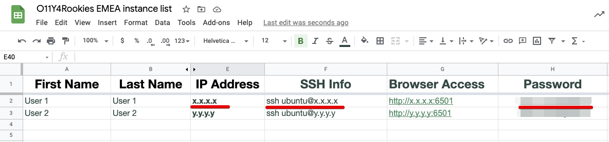
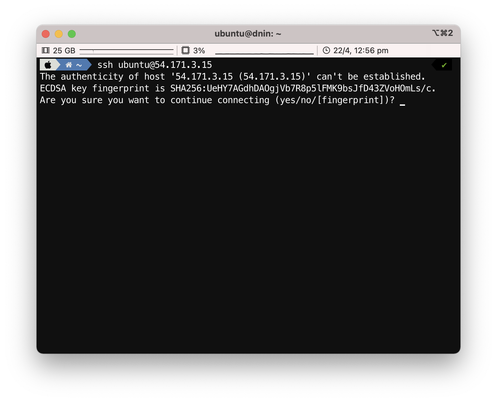
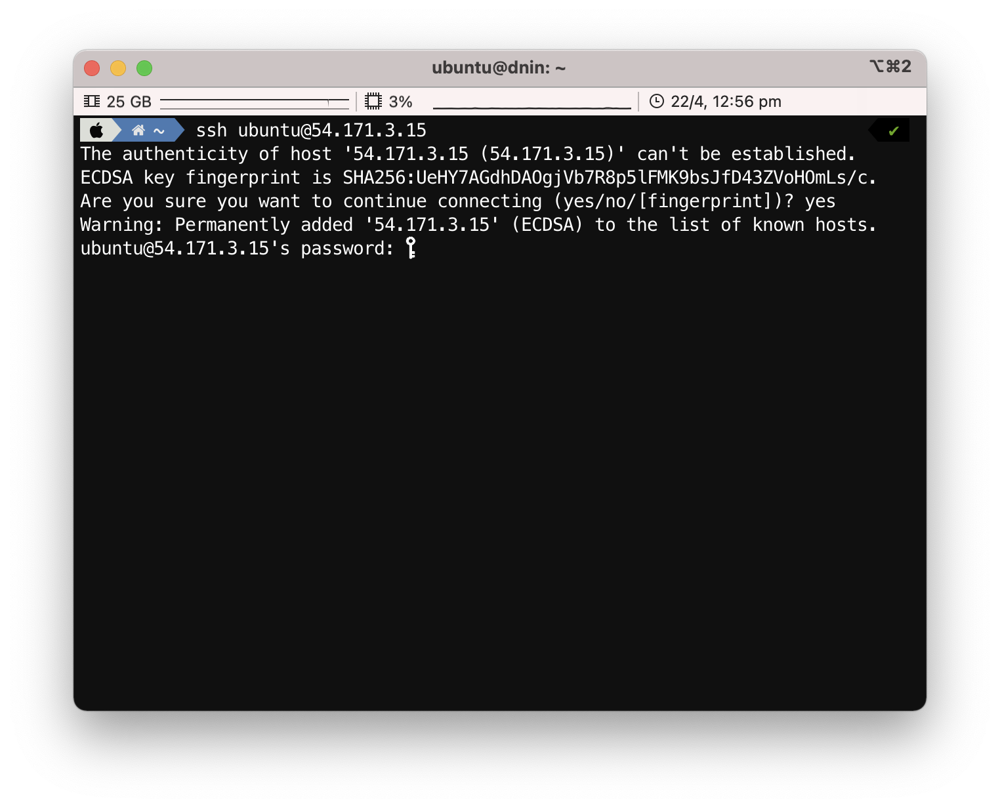
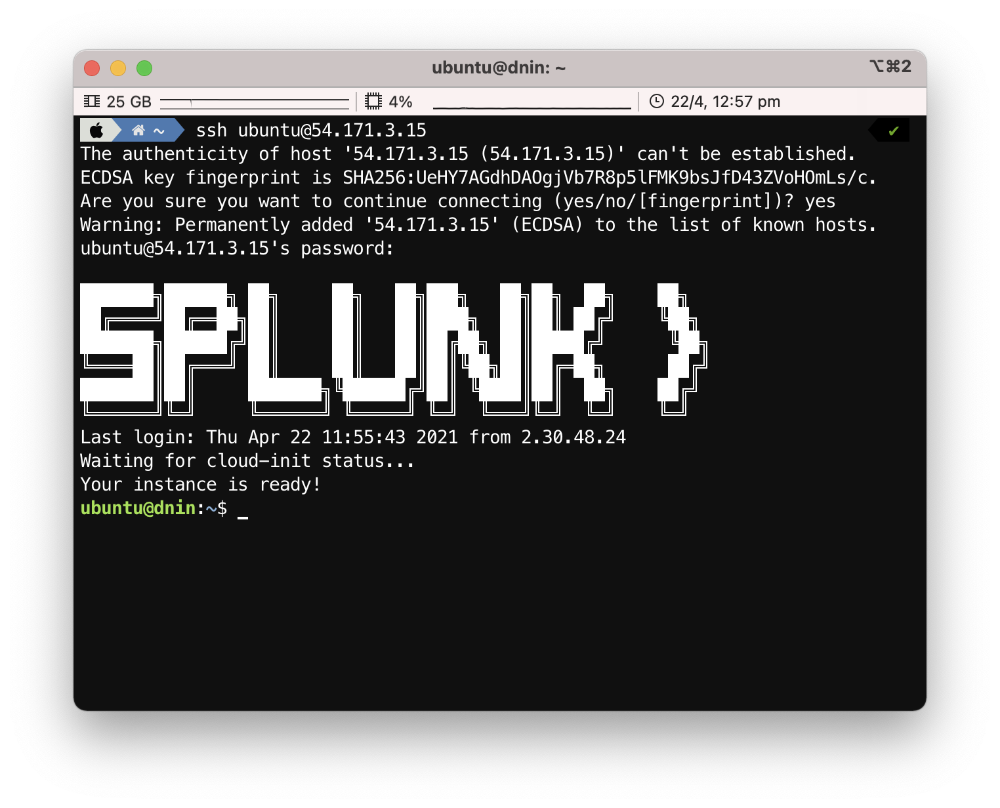
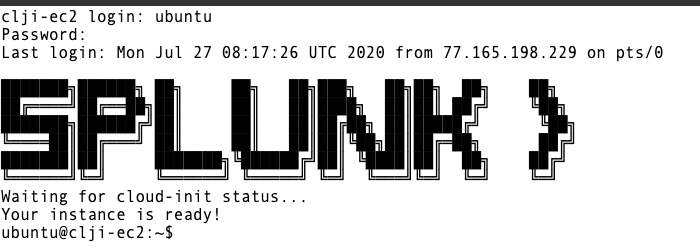
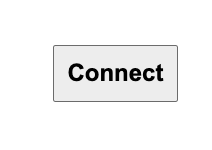

# How to connect to your workshop environment

1. How to retrieve the IP address of the AWS/EC2 instance assigned to you.
2. Connect to your instance using SSH, Putty[^1] or your web browser.
3. Verify your connection to your AWS/EC2 cloud instance.

---

## 1. AWS/EC2 IP Address

In preparation for the workshop, Splunk has prepared an Ubuntu Linux instance in AWS/EC2.

To get access to the instance that you will be using in the workshop please visit the URL to access the Google Sheet provided by the workshop leader.

Search for your AWS/EC2 instance by looking for your first  and last name name, as provided during registration for this workshop.

You find the IP address, the SSH command (for Mac OS, Linux and the latest Windows versions) and the password to use to connect to the workshop instance.

It also has the Browser Access URL that you can use in case you cannot connect via ssh or putty - see [EC2 access via Web browser](../connect-info/#web-browser-all)

!!! important
    Please use SSH or Putty  to gain acess to your EC2 instance if possible and
    make a note of the IP address as you will need this during the workshop.

## 2. SSH (Mac OS/Linux)

Most attendees will be able to connect to the workshop by using SSH from their Mac or Linux device.

To use SSH, open a terminal on your system and type `ssh ubuntu@x.x.x.x` (replacing x.x.x.x with the IP address found in Step #1).

When prompted **`Are you sure you want to continue connecting (yes/no/[fingerprint])?`** please type **`yes`**.

Enter the password provided in the Google Sheet from Step #1.

Upon successful login you will be presented with the Splunk logo and the Linux prompt.

At this point you are ready to continue and [start the workshop](../../otel/k3s/)

---

## 3. Putty (Windows)

If you do not have ssh preinstalled or if you are on a Windows system,  the best option is to install putty, you can find [here](https://www.putty.org/){: target=_blank}.

!!! important
    If you **cannot** install Putty, please go to [Web Browser (All)](../connect-info/#web-browser-all).

Open Putty and enter the in **Host Name (or IP address)** field the IP address provided in the Google Sheet.

You can optionally save your settings by providing a name and pressing **Save**.

To then login to your instance click on the **Open** button as shown above.

If this is the first time connecting to your AWS/EC2 workshop instance, you will be presented with a security dialog, please click **Yes**.

Once connected, login in as **ubuntu** and the password is the one provided in the Google Sheet.

Once you are connected successfully you should see a screen similar to the one below:

At this point you are ready to continue and [start the workshop](../../otel/k3s/)

---

## 4. Web Browser (All)

If you are blocked from using SSH (Port 22) or unable to install Putty you may be able to connect to the workshop instance by using a web browser.

!!! note
    This assumes that access to port 6501 is not restricted by your company's firewall.

Open your web browser and type **http:/x.x.x.x:6501** (where X.X.X.X is the IP address from the Google Sheet).

Once connected, login in as **ubuntu** and the password is the one provided in the Google Sheet.

Once you are connected successfully you should see a screen similar to the one below:

Unlike when you are using regular SSH, *copy and paste* does require a few extra steps to complete when using a browser session. This is due to cross browser restrictions.

When the workshop ask you to copy instructions into your terminal, please do the following:

*Copy the instruction as normal, but when ready to paste it in the web terminal, choose **Paste from browser** as show below:*

This will open a dialog box asking for the text to be pasted into the web terminal:

Paste the text in the text box as show, then press **OK** to complete the copy and paste process.

!!! note
    Unlike regular SSH connection, the web browser has a 60 second time out, and you will be disconnected, and a **Connect** button will be shown in the center of the web terminal.

    Simply click the **Connect** button and you will be reconnected and will be able to continue.

 

At this point you are ready to continue and [start the workshop](../../otel/k3s/).

---

## 5. Multipass (All)

If you are unable to access AWS, but you can install software locally, follow the instructions for [using Multipass](../../otel/multipass).

[^1]: [Download Putty](https://www.chiark.greenend.org.uk/~sgtatham/putty/)
