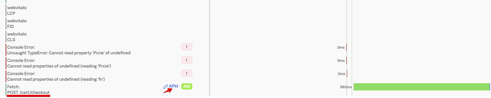
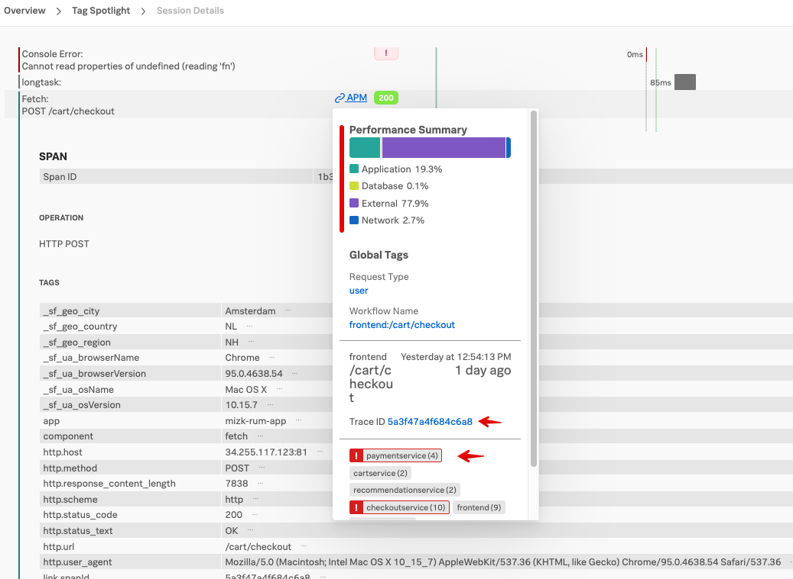
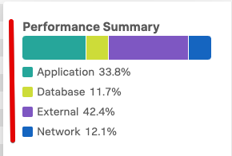
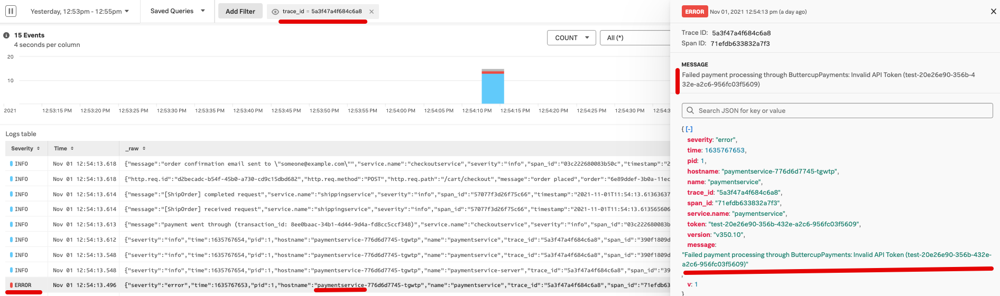

# Correlate between Splunk RUM and APM backend services

* Continue with the RUM Session information in the RUM UI
* See correlated APM traces and logs in the APM & Log Observer UI

---
## 1. Find the Backend service with an issue.

Click on the  to close the Span view.  
Now continue to scroll down and find the **POST /cart/checkout** line.

Click on the blue  link, this should pop a dialog showing information  on the backend services that where part of the checkout action taken by the end user.

In this popup, there are multiple sections available, providing you with a quick insight in the behavior of your backend services. For example the Performance Summary section will tell you where the time was spend during the backend call. 

In the above example you can see that more then 77,9% was spend in external services.

If you scroll down to the bottom of the dialog, so you can see the complete Trace and Services section like shown below:

in the Services map, you can see two services flagged red, the **Checkout** Service and the **Payment** Service in both in dark red. light red mean it received an error and dark red means an error originated from that service.

So already it is obvious there is a problem in the back end services. 

Let's investigate!

---
## 2.  Follow the Trace to the Backend service.
You can now click on the Trace Id link:  

This will bring you to Waterfall APM view that will show you what occurred in detail in call to the backend services. 
On the right you see the Trace Id: and again the Performance Summary, as we saw before. 
in the waterfall, you can identify the various backend services that where part of this call from the frontend.

As you can see there are red error indicators   
before the **Checkout** Service and the **Payment** Service.

Click on the  after the **paymentservice: grpc.hipstershop.PaymentService/Charge** line.

This will open the span detail page to show you the detail info about this service call.
You wil see that the call returned a **401** error code or *Invalid Request*. 

---
## 3.  Use the Related Content - Logs 
As the Splunk Observability cloud suite correlates traces metrics and logs automatically, teh system will show you in the related content bar at the bottom of the page, the corresponding logs for this trace.

Click on the Log link to see the logs.

When the log s are show, notice that the filter at the top of the page contains the logs for the trace. 
Next select one of the  lines indicating an error for the payment service. 
This should open the log message on the right.

It clearly shows the reason why the payment service fails: we are using an invalid token towards the service:   
***Failed payment processing through ButtercupPayments: Invalid API Token (test-20e26e90-356b-432e-a2c6-956fc03f5609)**

---
## 4.  Conclusion.

In the workshop, you have seen how to add RUM functionality to you website.  
We investigate the performance of your Website using RUM Metrics. 
Using the Tag profile, you have searched for your own session, and with the session waterfall, you identified two problems: 
* A Java script error that caused you price calculation to be zero. 
* An issue in the payment backend service that caused payments to fail. 

Using the ability to correlate RUM traces with the Backend APM trace and Logs you have found te reason for the payment failure.

This concludes the RUM workshop.
