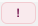
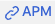

# Correlate Between Splunk RUM and APM

* Continue with the RUM Session information in the RUM UI
* See correlated APM traces and logs in the APM & Log Observer UI

---
## 1.  Validating the 

Click on the  to close the Span view.  
Continue to scroll down and find the ***POST /cart/checkout** line.

Click on the blue  link, this should pop a dialog showing the  
backend services that where part of the checkout action taken by the end user.

