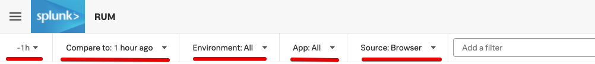
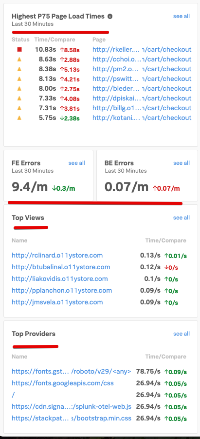
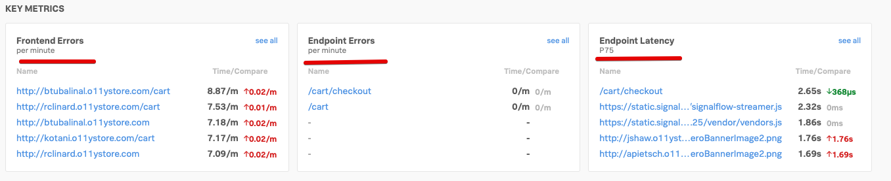

# Analyzing RUM Metrics

* See RUM Metrics and Session information in the RUM UI
* See correlated APM traces in the RUM & APM UI

---
## 1. Visit the RUM overview pages

Visit and login into your Splunk IMT/APM/RUM Website.

From the top left hamburger menu  select **RUM** from the side menu.

This will bring you to the RUM user interface.

---
## 2. Explore the RUM Browser Overview Page
### 2.1. Header

The RUM UI consists of 6 major sections. 
The first is the selection header, where you can set/filter a number of options:

* A drop down for the time window you're reviewing (You are looking at the past hour in this case)
* A drop down to select the Comparison window (You are comparing current performance on a rolling window   - in this case compared to 1 hour ago)
* A drop down with the available Environments to view:  (Choose the one provided by the workshop host or *All* like in the example)
* A drop down list with the Various Web apps (You can use the one provided by the workshop host or use *All*)
* ***Optionally*** a drop down to select Browser or Mobile metrics (*Might not be available in your workshop*)

### 2.2. Overview Pane

The next section is the overview pane:
This pane will give you a quick indication to the pages with highest increase in load times (75 percentile or higher)  
The **Highest P75 Page Load Times** window will show you in a quick view if the load time of your top pages has increased or has an error.

In the example here you can see that the first page has an error due to the red square, and you can see that the load time has drastically increased by more than 8 seconds.

You also see an overview of the number of Front end Error and Backend Errors  per minute.

The last two panes show you the **Top Page Views** and the **Top Providers**.

### 2.3. Custom Event Pane

The Custom Event View is the location where you will find the metrics for any event you may have added yourself to the web pages you are monitoring.
These are often added to pieces of custom code that are not part of a framework or an event you created so you can better understand the flow though your application.
We support **Event Request rate**, **Event Error Rates** and **Event Latency** metrics.

### 2.4. Key Metrics Pane

The Key Metrics View is the location where you will find the metrics for the number of
**Frontend Errors** per second, **Endpoint Errors** per second an the **Endpoint Latency**.
These Metrics are very useful to guide you to the location of an issue if you are experiencing problems with your site.

### 2.5. Web Vitals Pane

The Web Vitals view is the location where you go if you wish to get insight into the experience you are delivering to your End users based on Web Vitals metrics.
Web Vitals is an initiative by Google to provide unified guidance for quality signals that are essential to delivering a great user experience on the web and focuses on three key parameters:

* Largest Contentful Paint (LCP): measures loading performance. To provide a good user experience, LCP should occur within 2.5 seconds of when the page first starts loading.
* First Input Delay (FID): measures interactivity. To provide a good user experience, pages should have a FID of 100 milliseconds or less.
* Cumulative Layout Shift (CLS): measures visual stability. To provide a good user experience, pages should maintain a CLS of 0.1. or less.

### 2.6. Other Metrics Pane
 The Other Metrics Pane is the location where you find an other set of performance metrics, with a focus on initial load time of you page or showing you task that are longer then others. 

* **Time To First Byte (TTFB)**, Time to First Byte (TTFB) measures how long it takes for a client's browser to receive the first byte of the response from the server. The longer it takes for the server to process the request and send a response, the slower your visitors' browsers start displaying your page.
* **Long Task Length**, a performance metric that can be used help developers to understand the bad user experience on the website, or can be an indication of a problem.
* **Long Task Count**, A metric to indicate how often a long task occurs, again used for exploring user experiences or problem detection. 

---
## 3. Explore the RUM Mobile Overview Page

Splunk RUM supports Native Mobile RUM, for Apple iPhone and Android Phones.
You can use this to see the End-user experience of your native Smartphone app.

The above screen is to show you the various metrics and data Splunk Mobile RUM can track. For example:

* **Custom events**, similar to the Browser version.
* **App Errors** , with *App Errors* & *Crashes* per minute.
* **App Lifecycle Performance**, with *Cold Startup Time*, *Hot Startup Time* per OS.
* **Request/Response**, similar to the Browser version.

At this point we will not go deeper into Mobile RUM, due to the need to run either a native app on a phone, or run an emulation.
 
We can provide more information in a deep dive demo if needed.
