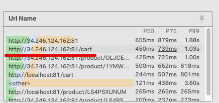
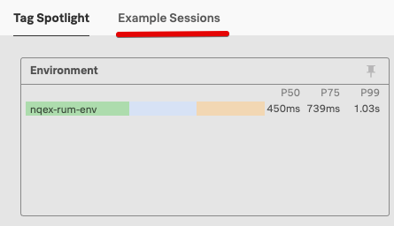
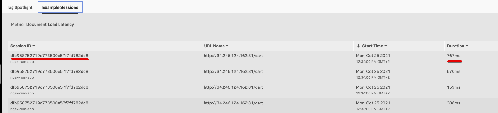
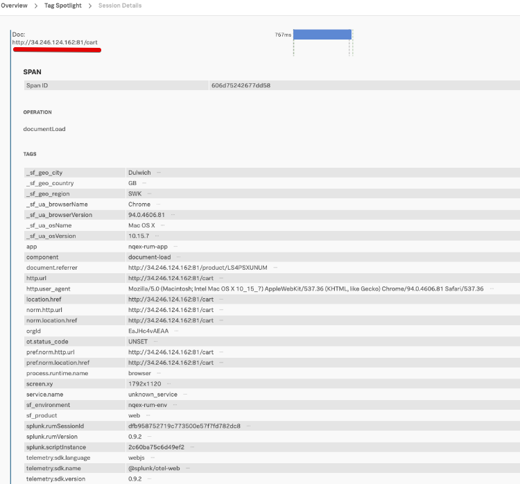

# Analyzing RUM Sessions

* Dive into RUM Session information in the  RUM UI
* See correlated APM traces and logs in the APM & Log Observer UI

---
## 1. Again select the cart URL

After you have focussed the time slot with the time selector, you need to reselect the *cart* url from **Url Name** view, as shown below:

---
## 2. Drill down in the Sessions

After you have analyzed the  information and drilled down via the Tag Spotlight to a sub set of the traces, , you can view the actual session as it was run by the end-users browser.
 
You do this by clicking on the link **Example Sessions** as shown below:

This will give you a list of sessions that matched both the time filter and the subset selected in the Tag Profile.

Select one  by clicking on the session ID, It is a good idea to select one that has the longes duration.

Once you have selected the session, you will be taken to the session details page. you will see an overview of the Tags used in this session

Scroll to the top of the Page, the first part of this page will give you an over view of the duration  events and other relevant information about the session
 
[RUM-Session-info](../images/rum/Session-info.png)

