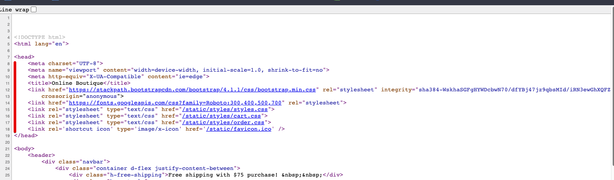
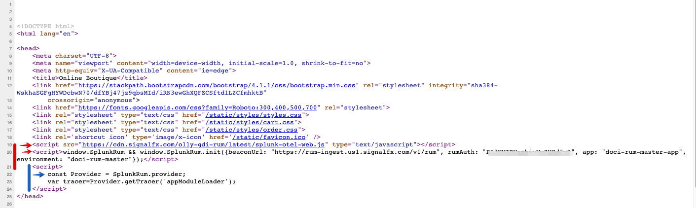

# Example of RUM Beacon enablement in your Website

* Check the original HEAD section of your Online-boutique webpage (or use the examples here) in your browser
* Find the Web address of your workshop hosts Online Boutique 
* Compare the changes made to the hosts Online-Boutique and compare with the base one.

---
## 1. Review the original code of your Online-Boutique

If you have access to and EC2 instance and have previously installed the Online Boutique you can view it  on port 81 of the EC2 instance's IP address. </br> 
The IP address is the one you used to SSH into the instance at the beginning of the workshop.

Open your web browser and go to `http://{==EC2-IP==}:81/` where you will then be able to see the Online Boutique running, otherwise use the screenshots in this workshop guide. 


Follow the instructions for your preferred browser below:

---
### 1.1 Chrome, FireFox  & Microsoft Edge Users - Check the Web page source.
In Chrome & Firefox or Microsoft Edge you can right click on the Online-Boutique site, you will have an option to **"View Page Source"** </br>


Selecting it will show you the HTML page source code in a separate Tab.</br>


If successful you can skip to [2 -  Review the unchanged HEAD section.](../RUM-Setup/#2-review-the-unchanged-head-section) 

---
### 1.2 Safari Users - Check the Web page source .
For Safari users, you may have to enable the extra menu in Safari by selecting **'Preferences'** under *Safari* in the OS X menu bar </br>


Then in the dialog that pops up, under the **'Advanced'** pane select the checkbox that says **'Show Develop menu in menu bar. '**  and close the Dialog box</br> 


You can now right click on the Online-Boutique and you now will have an option **'Show Page Source'**. </br>


If you select that option on the Online-Boutique you will see the HTML source code as show below:</br>


If successful you can skip to [2 -  Review the unchanged HEAD section.](../RUM-Setup/#2-review-the-unchanged-head-section) 

---
### 1.3 Internet Explorer Users - Check the Web page source .
For Internet Explorer 11 Users, you may have trouble with this exercise as it will require a specific version of the Splunk Open Telemetry Java Script for Web/RUM </br>
However you will be able to see the changes required by right clicking on the Online-Boutique site, you see an option to **"View Source"** </br>


If you select that option on the Online-Boutique you will see the HTML source code as show below:</br>


---
## 2 -  Review the unchanged HEAD section.
The changes for RUM will be placed in the HEAD section of your Web page, Below are the original lines as you should have it in your local Base version. 

There is no reference of the Splunk or Open Telemetry Beacon (The function that is used to send RUM traces ) 

---
## 3. Find the web (URL) of your Workshop Host's Online Boutique

The Online Boutique we are going to use for RUM is viewable on port 81 of the Workshop host EC2 instance's IP address and will be provide to you at this point.</br>

We are all connecting to the Online Boutique of the workshops host for this RUM session.

Open a new web browser and go to `http://{==WORKSHOP-HOST-EC2-IP==}:81/` where you will then be able to see the RUM enabled Online Boutique running.

And again view the source of the HTML Page as described in the previous section:

---
## 4.  Review the Changes made to enable RUM in the HEAD section of the hosts Online-Boutique Web page.
The changes for RUM are placed in the HEAD section of the hosts Web page, Below is the hosts updated HEAD section with the changes required to enable RUM: 

The following two lines have been added to the HEAD section of the host Web page,

=== "RUM addition to HEAD section"

    ```text
    <script src="https://cdn.signalfx.com/o11y-gdi-rum/latest/splunk-otel-web.js" type="text/javascript"></script>
    <script>window.SplunkRum && window.SplunkRum.init({beaconUrl: "https://rum-ingest.eu0.signalfx.com/v1/rum", 
            rumAuth: "1wCqZVUWIP5XSdNjPoQRFg", app: "ksnq-rum-app", environment: "ksnq-rum-env"});</script>

    ```
*   The first part is to indicate where to download the Splunk Open Telemetry Java script file from: *https://cdn.signalfx.com/o11y-gdi-rum/latest/splunk-otel-web.js*
    (This can also loaded locally if so required)
*   The second line defines the location where to send the traces to in the beacon url: *{beaconUrl: "https://rum-ingest.eu0.signalfx.com/v1/rum",*
*   It also adds an Access Token to :  *rumAuth: "1wCqZVUWIP5XSdNjPoQRFg",*
    (this of course is an example you can create multiple RUM Access Tokens for all your applications)
*   And adds identification tags like the application Name and environment for us to use in the SPLUNK RUM UI:  *app: "ksnq-rum-app", environment: "ksnq-rum-env"}* 

!!! Info ""
    In this example the app name is **ksnq-rum-app**,</br>This will be different in the Workshop, Check with your host what the app name and environment to use in the RUM session will be and make a note ot it!


The above two lines is all that is required to enable RUM on your web site:
