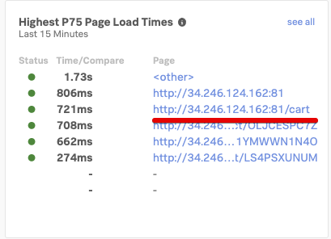
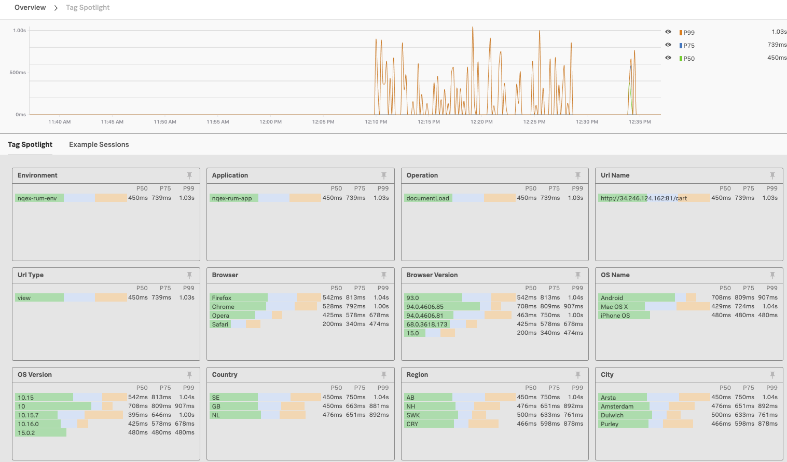
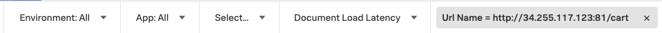
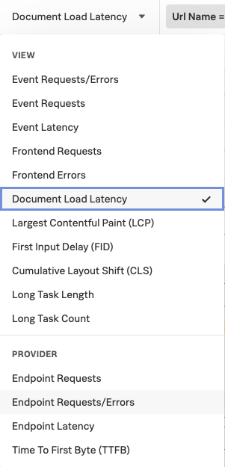
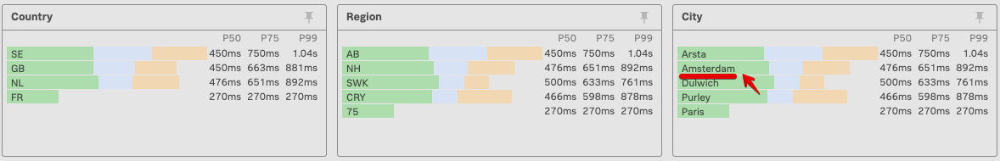
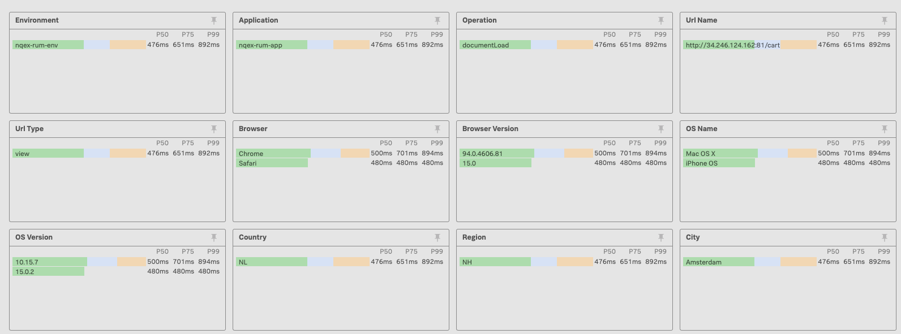
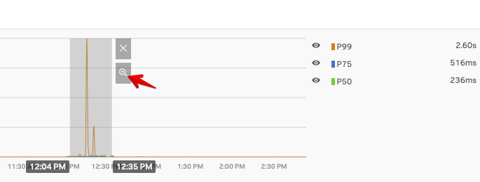

# Analyzing RUM Tags in the Tag Spotlight view

* Look into the Metrics views for the various endpoints and use the Tags sent via the Tag spotlight for deeper analysis

---
## 1. Find an url for the Cart endpoint

From the RUM Overview page, please select the url for the **Cart** endpoint to dive deeper into the information available for this endpoint.

Once you have selected and clicked on the blue url, you will find yourself in the **Tag Spotlight** overview

Here you will see all of the tags that have been sent to Splunk RUM as part of the RUM traces. The tags displayed will be relevant to the overview that you have selected.  These are generic Tags created automatically when the Trace was sent, and additional Tags you have added to the trace as part of the configuration of your website.

!!! Additional Tags
    We are already sending two additional tags, you have seen them defined in the *Beacon url* that was added to your website:  *app: "[nodename]-rum-app", environment: "[nodename]-rum-env"* in the first section of this workshop!
    You can add additional tag in a similar way.

In our example we have selected the **Document Load Latency** view as shown here:

You can select any of the following Tag views, each focused on a specific metric.

---
## 2. Explore the information in the Tag Spotlight view

The Tag spotlight is designed to help you identify  problems, either through the chart view,, where you may quickly identify outliers or via the TAGs.

In the **Document Load Latency** view, if you look at the **Browser**, **Browser Version** & **OS Name** Tag views,you can see the various browser types and versions, as well as for the underlying OS.

This makes it easy to identify problems related to specific browser or OS versions, as they would be highlighted.

In the above example you can see that Firefox had the slowest response,  various Browser versions ( Chrome) that have different response times  and the slow response of the Android devices.

A further example are the regional Tags that you can use to identify problems related to ISP or locations etc. Here you should be able to find the location you have been using to access the Online Boutique. Drill down by selecting  the town or country you are accessing the Online Boutique from by clicking on the name as shown below (City of Amsterdam):

This will select only the traces relevant to the city selected as shown below:

By selecting the various Tag you build up a filter, you can see the current selection  below

To clear the filter and see every trace click on **Clear All** at the top right of the page.

If the overview page  is empty or shows , no traces have been received in the selected timeslot.
You need to increase the time window at the top left.  You can start with the *Last 12 hours* for example.

You can then use your mouse to select the time slot you want like show in the view below and  activate that time filter by clicking on the little spyglass icon.

