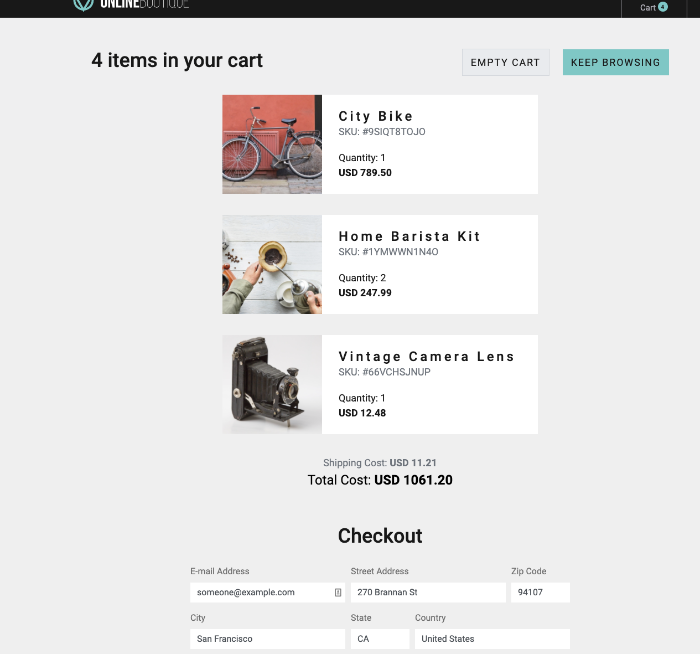

# Showcase of RUM with the Online Boutique

* Find the Web address of your workshop hosts Online Boutique
* Generate traffic by shopping for bargains on your workshop host Online Boutique web shop.
* See RUM Metrics and Session information in the  RUM UI
* See correlated APM traces in the RUm & APM UI

---
## 1. Find the web (URL) of your Workshop Host's Online Boutique

As discussed in the previous section  we are going to use the Online Boutique of the Workshop host EC2 instance's IP address. 

We are all connecting to the Online Boutique of the workshops host for this RUM session as this will create more traffic from multiple locations, making the data more realistic.

Open a new web browser and go to `http://{==WORKSHOP-HOST-EC2-IP==}:81/` where you will then be able to see the RUM enabled Online Boutique running.

---
## 2. Generate traffic

The goal of this exercise is for you to browse the workshop host Online Boutique and buy different products and differently quantities. So we will have  multiple sessions to investigate 
Take your time to examine and buy the various products and put them in your cart:

Doesn't that HOME BARISTA KIT look tempting?...   Your time for shopping start now....

---
## 3. Check the RUM Traces Splunk RUM
Visit and login into your Splunk IMT/APM/RAM Website.  
From the top left hamburger menu  select **RUM** from the side menu. 
This will bring you to the RUM user interface.

