# Teams - Lab Summary

* Introduction to Teams
* Create a Team and add members to Team
* Discover how you can restrict usage for Teams by creating separate access tokens and set limits.

---

## 1. Introduction to Teams

To make sure that users see the dashboards and alerts that are relevant to them when using SignalFX, most organizations will use SignalFx's Teams feature to assign a member to one or more Teams.

Ideally, this matches work related roles, for example, members of a Dev-Ops or Product Management group would be assigned to the corresponding Teams in SignalFx.

When a user logs into SignalFx, they can choose which Team Dashboard will be their home page and they will typically select the page for their primary role.

In the example below, the user is a member of the Development, Operations and Product Management Teams, and is currently viewing the Dashboard for the Operations Team.

This Dashboard has specific Dashboard Groups for NGINX, Infra and K8s assigned but any Dashboard Group can be linked to a Teams Dashboard.

They can use the menu along the top left to quickly navigate between their allocated teams, or they can use the **ALL TEAMS** dropdown on the right to select specific Team Dashboards, as well as quickly accessing **ALL Dashboards** using the adjacent link.

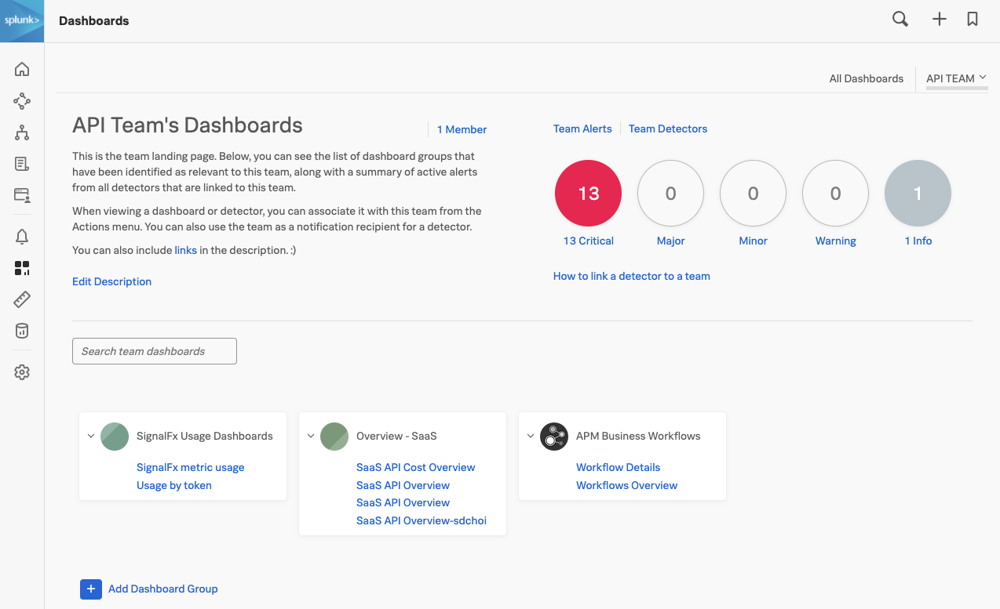{: .zoom}

Alerts can be linked to specific Teams so the Team can monitor only the Alerts they are interested in, and in the above example they currently have 1 active Critical Alert.

The Description for the Team Dashboard can be customized and can include links to team specific resources (using Markdown).

---

## 2. Creating a new Team

To work with to SignalFx's Team UI click on the **Settings** icon on the top right of the SignalFx UI.

{: .zoom}

Select the **Organizations Settings → Teams** tab, or select the **Teams** tab from the left pane.

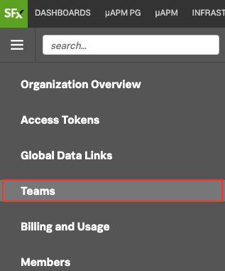

When the **Team** UI is selected you will be presented with the list of current Teams.

To add a new **Team** click on the **Create New Team**{: .label-button .sfx-ui-button-blue} button. This will present you with the **Create New Team** dialog.

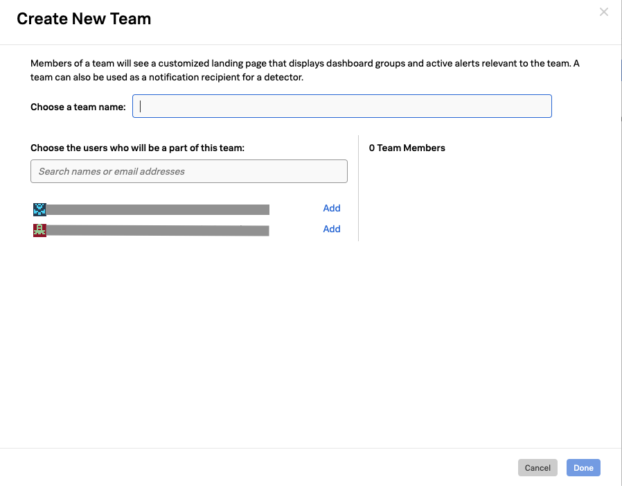{: .shadow}

Create your own team by naming it `[YOUR-INITIALS]-Team and` add yourself by searching for your name and selecting the **Add** link next to your name. This should result in a dialog similar to the one below:

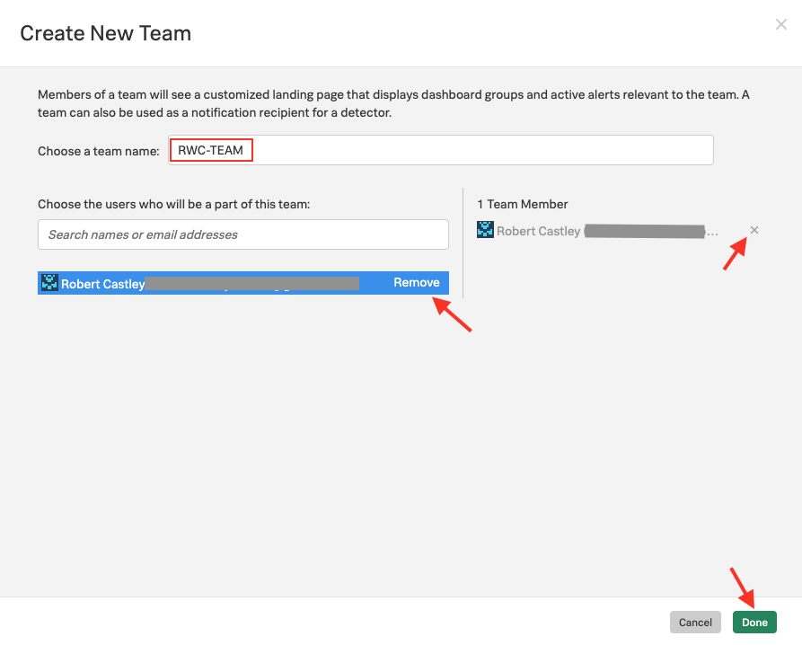{: .shadow}

You can remove selected users by pressing  **Remove** or the small **x**.

Make sure you have your group created with your initials and with yourself added as a member, then click **Done**.

This will bring you back to the **Teams** list that will now show your Team and the one's created by others.

!!! note
    The Teams(s) you are a member of have a grey **Member** icon in front of it.

If no members are assigned to your Team, you should see a blue **Add Members** link instead of the member count, clicking on that link will get you to the **Edit Team** dialog where you can add yourself.

This is the same dialog you get when pressing the 3 dots **...** at the end of the line with your Team and selecting **Edit Team**

The **...** menu gives you the option to Edit, Join, Leave or Delete a Team (leave and join will depend on if you are currently a member).

---

## 3. Adding Notification Rules

You can set up specific Notification rules per team, click on the **NOTIFICATION POLICY** tab, this will open the notification edit menu.

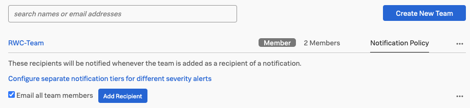{: .zoom}

By default the system offers you the ability to set up a general notification rule for your team.

!!! note
    The **Email all team members** option means all members of this Team will receive an email with the Alert information, regardless of the alert type.

### 3.1 Adding recipients

You can add other recipients, by clicking **Add Recipient**{: .label-button .sfx-ui-button-blue}. These recipients do not need to be SignalFx users.

However if you click on the link **Configure a single policy for alerts of any severity** you can configure every alert level independently.

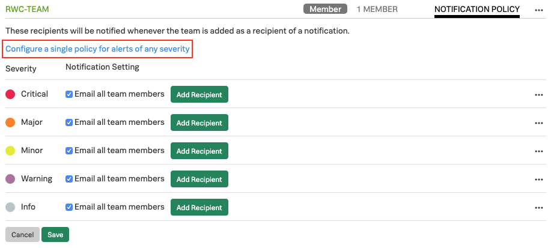{: .zoom}

Different alert rules for the different alert levels can be configured, as shown in the above image.

Critical and Major are using [Splunk's VictorOps](https://victorops.com/){: target=_blank} Incident Management solution. For the Minor alerts we send it to the Teams Slack channel and for Warning and Info we send an email.

### 3.2 Notification Integrations

In addition to sending alert notifications via email, you can configure SignalFx to send alert notifications to the services shown below.

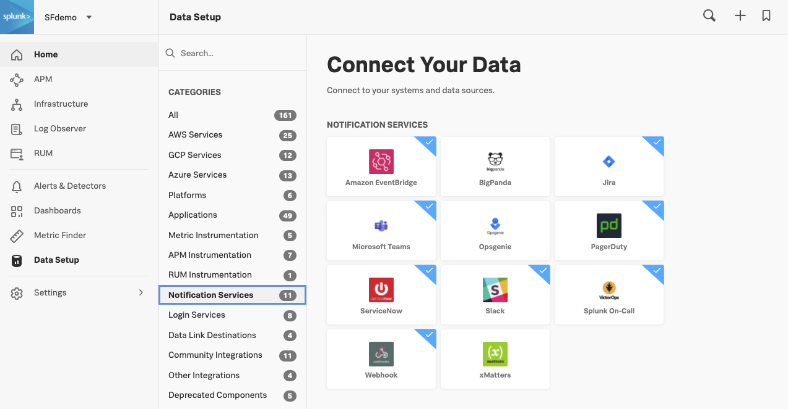{: .zoom}

Take a moment to create some notification rules for you Team.

---

## 4. Controlling a Team's usage

If you wish to control the consumption of Hosts, Containers, Custom Metrics and High Resolution Metrics, you can create multiple Access Tokens and allocate them to different parts of your organization.

Assuming you are still within the Organization Overview section, simply select the **Access Tokens** tab from the left pane.

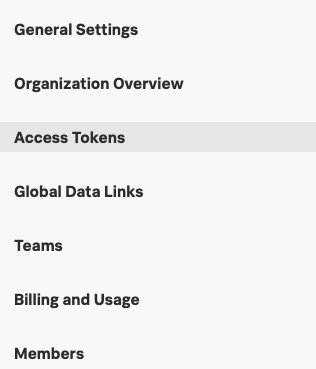

However to get to this section from anywhere click on **Settings** (icon at the top right top of the page) and select **Organizations Settings → Access tokens**

The **Access Tokens** Interface provides an overview of your Allotments in the form of a list of Access Tokens that have been generated. Every Organization will have a **Default** token generated when they are first setup, but there will typically be multiple Tokens configured.

Each Token is unique and can be assigned limits for the amount of Hosts, Containers, Custom Metrics and High Resolution Metrics it can consume.

The **Usage Status** Column quickly shows if a token is above or below its assigned limits.

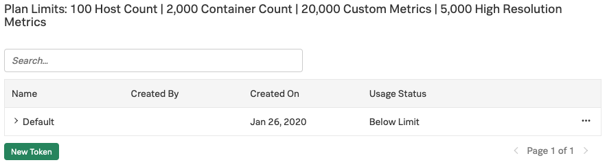{: .zoom}

### 4.1 Creating a new token

Let create a new token by clicking on  the **New Token**{: .label-button .sfx-ui-button-blue} button. This will provide you with the **Name Your Access Token** dialog.

Enter the new name of the new Token by using your Initials e.g. RWC-Token

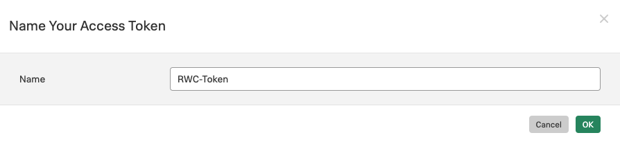{: .shadow}

After you press Ok,  you will be taken back to the **Access Token** UI, here your new token should be present, among the ones created by others.

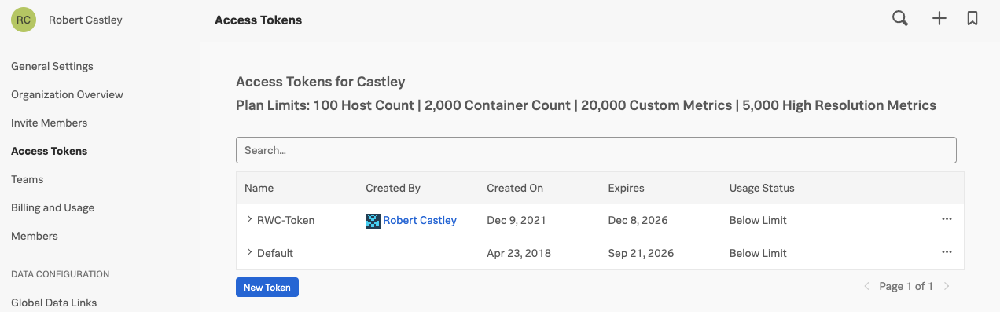{: .zoom}

If you have made an error in your naming, want to disable/enable a token or set a Token limit, click on the ellipsis (**...**) menu button behind a token limit to open the manage token menu.

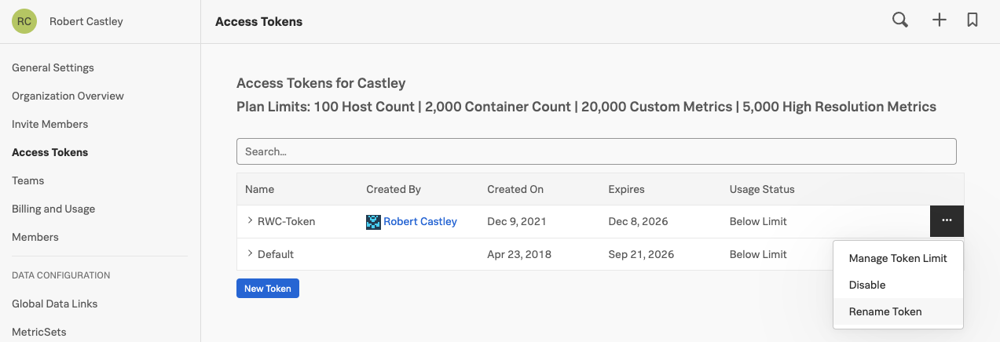{: .zoom}

If you made a typo you can use the Rename Token option to correct the name of your token.

### 4.2 Disabling a token

If you need to make sure a token cannot be used to send Metrics in you can Disable a token.

Click on the Disable button to Disable the token, this means the token cannot be used for sending in data to SignalFX.

The line with Your Token should become greyed out to indicate that is has been Disabled as you can see in the screenshot below.

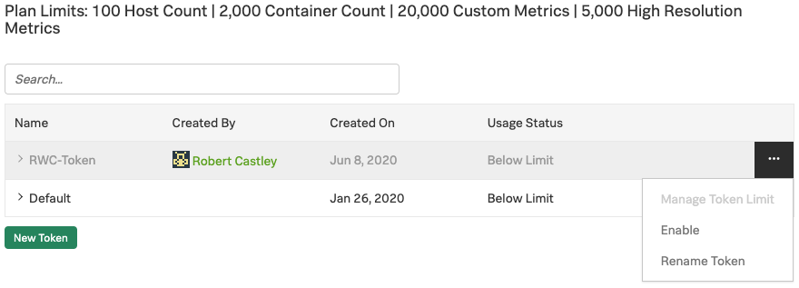{: .zoom}

Go ahead and click on the ellipsis (**...**) menu button to Disable and Enable your token.

### 4.3 Manage token usage limits

Now Lets start limiting usage by clicking on Manage Token Limit in the 3 **...** menu.

This will show the Manage Token Limit Dialog:

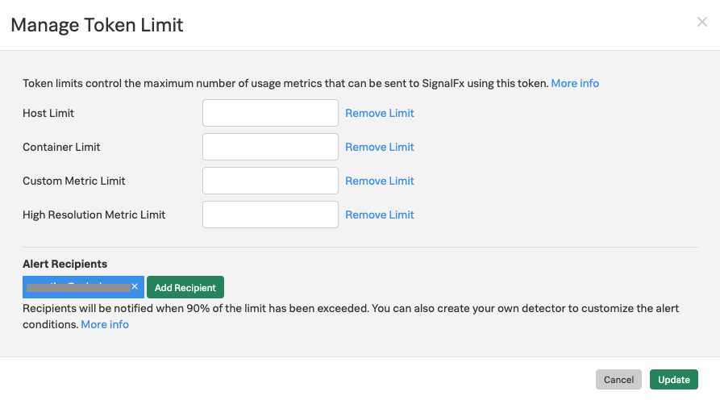{: .shadow}

In this Dialog you can set the limits per category.

Please go ahead and specify the limits as follows for each usage metric:

| Limit | Value |
| ----- | ----- |
| Host Limit | 5 |
| Container Limit | 15 |
| Custom Metric Limit | 20 |
| High Resolution Metric Limit | 0 |

For our lab use your own email address, and double check that you have the correct numbers in your dialog box as shown in the table above.

Token limits are used to trigger an alert that notify one or more recipients when the usage has been above 90% of the limit for 5 minutes.

To specify the recipients, click **Add Recipient**{: .label-button .sfx-ui-button-blue}, then select the recipient or notification method you want to use (specifying recipients is optional but highly recommended).

The severity for token alerts is always Critical.

Click on **Update**{: .label-button .sfx-ui-button-blue} to save your Access Tokens limits and The Alert Settings.

!!! note "Going above token limit"
    When a token is at or above its limit in a usage category, new metrics for that usage category will not be stored and processed by SignalFx. This will make sure you there  will be no unexpected cost due to a team sending in data without restriction.

!!! note "Advanced alerting"
    If you wish to get alerts before you hit 90%, you can create additional detectors using whatever values you want. These detectors could target the Teams consuming the specific Access Tokens so they can take action before the admins need to get involved.

In your company you would distribute these new Access Tokens to various teams, controlling how much information/data they can send to SignalFx.

This will allow you to fine tune the way you consume your SignalFx allotment and prevent overages from happening.

**Congratulations!** You have now have completed the Service Bureau module.
