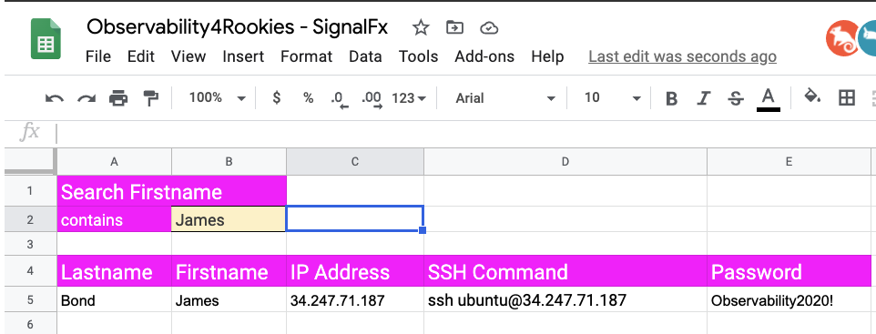

# How to connect to your workshop environment

1. How to retrieve the IP address of the AWS/EC2 instance assigned to you.
2. Connect to your instance using SSH, Putty[^1] or your web browser.
3. Verify your connection to your AWS/EC2 cloud instance.

---

## Find your AWS/EC2 IP Address

In preparation for the workshop, SignalFx has prepared an Ubuntu Linux instance in AWS/EC2.

To get access to the instance that you will be using in the workshop please visit the URL provided by the workshop leader.

Search for your AWS/EC2 instance by entering your first name as provided during registration for this workshop.

{: .zoom}

The search result will provide you with the IP address, the SSH command and the password to use to connect to the workshop instance.

!!! important
    Please make a note of the IP address as you will need this during the workshop.

## SSH (Mac OS/Linux)

Most attendees will be able to connect to the workshop by using SSH from their Mac or Linux device.

To use SSH, open a terminal on your system and type `ssh ubuntu@x.x.x.x` (replacing x.x.x.x with the IP address found in Step #1. In the example above this is `ssh ubuntu@3.127.80.222`)

{: .zoom}

When prompted **Are you sure you want to continue connecting (yes/no/[fingerprint])?** please type **yes**

{: .zoom}

When prompted to enter a password please use the once provided in the spreadsheet in Step #1.

Upon successful login you will be represented with the Splunk logo and Linux prompt.

{: .zoom}

At this point you are ready to continue and [start the workshop](https://signalfx.github.io/observability-workshop/latest/smartagent/k3s/)

---

## Putty (Windows users only)

If you do not have ssh preinstalled or if you are on a Windows system,  the best option is to install putty, you can find [here](https://www.putty.org/){: target=_blank}.

If you **cannot** install putty, please go to section 4 Connect to your instance using a browser. This may offer an alternative way of [access the workshop](../connect-info/#4-connect-to-your-instance-using-a-browser).

Find the putty app, (on your desktop or your app library) and click on it to start it.

{: .zoom}

This will bring up the setting page, here you will enter the ip address you found in the spreadsheet in section 1.
In the example below it is **3.127.80.222**
You can save you settings by giving it a name and press **Save**  (in the example we gave it a name workshop)  

{: .zoom}

To log in to you instance click on the **Open** button as shown above.
If this is teh first time connecting to your cloud workshop instance, you may be  presented with a security dialog, please hit  **Yes**  to continue

{: .zoom}

This will bring you to the login screen, the user name for the login is **ubuntu**, and the password is the password you found in the spreadsheet in section 1.

Once you are connected successfully you should see a screen similar to the one below:

{: .zoom}

At this point you are ready to continue and [start the workshop](https://signalfx.github.io/observability-workshop/latest/smartagent/k3s/)

---

## Web Browser (All)

If you are restricted and you cannot instal an ssh application like putty on your system,  you may be able to connect to the workshop instance by using a browser.   This assumes that access to port 6501 is nor restricted by your companies fire wall.

Open you favorite modern browser and type HTTP//X.X.X.X:6501  (where X.X.X.X is the ip address you found in the spreadsheet used in section 1.)

{: .zoom}

Once you have connected correctly  you should receive an login in prompt similar like the screen below.

{: .zoom}

To connect please enter the user name **ubuntu** followed by the password found in the spreadsheet used in section 1.
This should result in the welcome page of the workshop as show below:

{: .zoom}

Due to additional security requirements of browser technology please read the next section:

---

### Copy & Paste in browser

Unlike when you are using regular SSH, *copy and paste* does require a few extra steps to complete when using a browser session. This is due to cross browser restrictions.

When the workshop ask you to copy instructions into your terminal, please do the following:

*Copy the instruction as normal, but when ready to paste it in the web terminal, choose **Paste from browser** as show below:*

{: .zoom}

This will open a dialog box asking for the text to be pasted into the web terminal:

{: .zoom}

Paste the text in the text box as show, then press **OK** to complete the copy and paste process.

!!! note
    Unlike regular SSH connection, the web browser has a 60 second time out, and you will be disconnected, and a **Connect** button will be shown in the center of the web terminal.

    Simply click the **Connect** button and you will be reconnected and will be able to continue.

 {: .zoom}

At this point you are ready to continue and [start the workshop](https://signalfx.github.io/observability-workshop/latest/smartagent/k3s/)

[^1]: [Download Putty](https://www.chiark.greenend.org.uk/~sgtatham/putty/)
