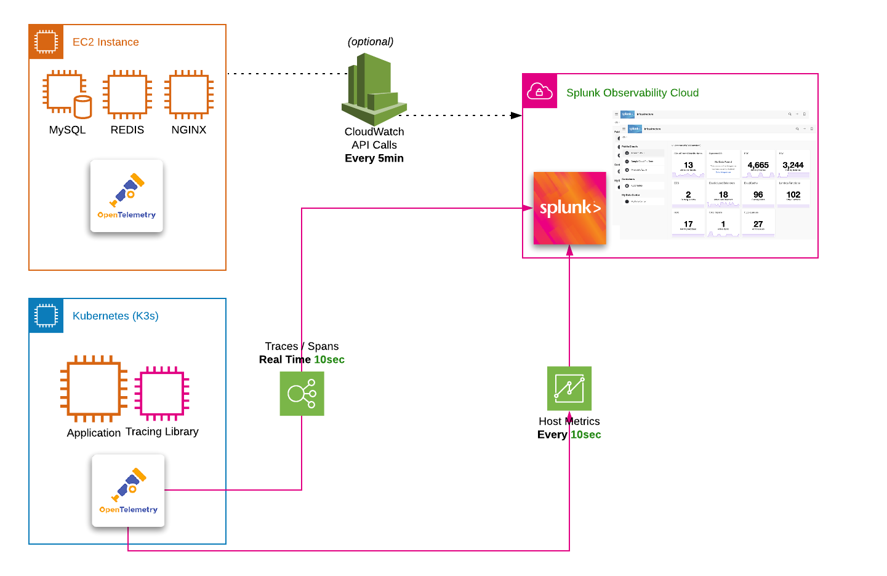

# Introduction

During this _**technical**_ workshop you will build out an environment based on a lightweight [Kubernetes](https://k3s.io/) deployment.

In order to simplify the workshop modules, a pre-configure VM is provided either via [Multipass](https://multipass.run) or a AWS/EC2 instance.

The instance is pre-configured with all the software required to install the Smart Agent in Kubernetes, deploy a NGNIX ReplicaSet[^1] and finally deploy a microservices application which has been instrumented to send Traces and Spans using Jaeger[^2].

The workshop also introduces you to dashboarding, editing and creating charts, creating detectors to fire alerts, Monitoring as Code[^3] and the SignalFx Service Bureau[^3]

{: .zoom}

By the end of this technical workshop you will have a good understanding of some of the key features and capabilities of the SignalFx platform.

[^1]: [Kubernetes ReplicaSet](https://kubernetes.io/docs/concepts/workloads/controllers/replicaset/)
[^2]: Jaeger, inspired by Dapper and OpenZipkin, is a distributed tracing system released as open source by Uber Technologies. It is used for monitoring and troubleshooting microservices-based distributed systems
[^3]: [Monitoring as Code and Service Bureau](https://www.splunk.com/en_us/blog/it/monitoring-observability-enterprise-service.html)
