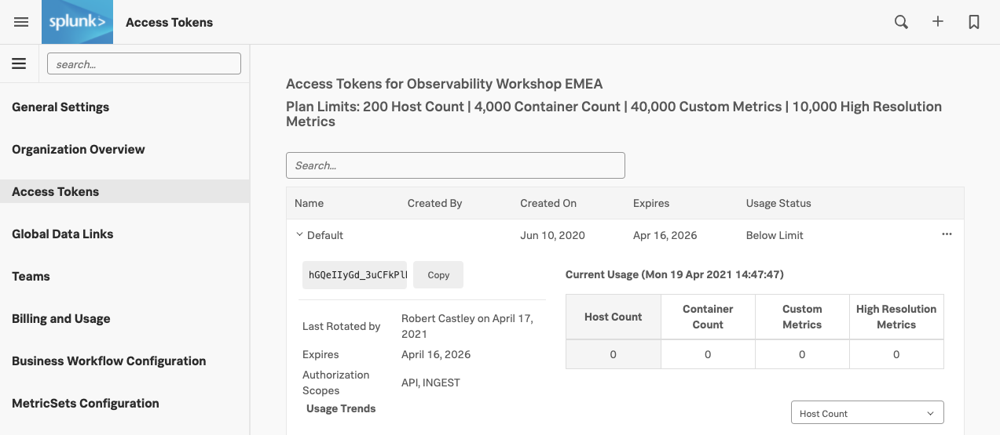
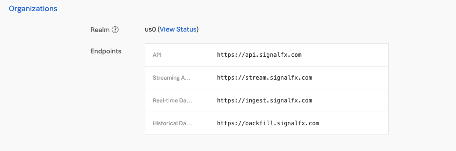
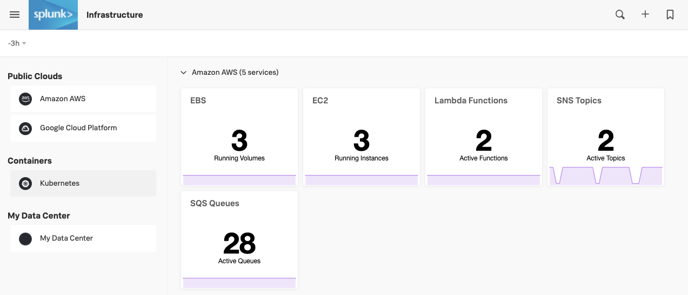
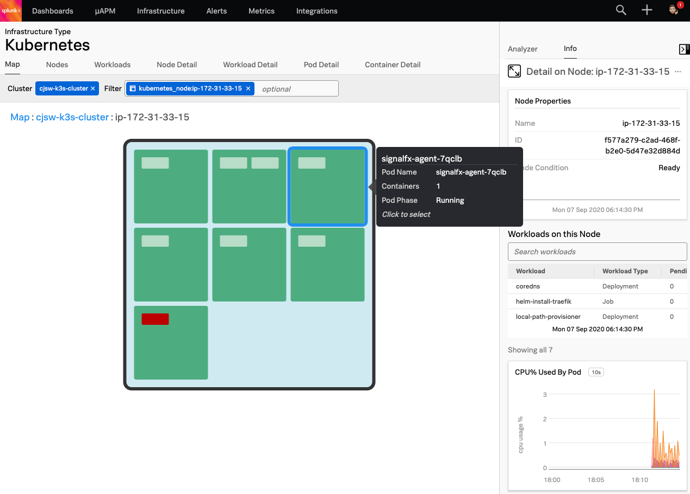

# Deploying the Smart Agent in Kubernetes (K3s)

* Use the SignalFx Helm chart to install the Smart Agent in K3s
* Explore your cluster in the Kubernetes Navigator

---

## 1. Obtain SignalFx Access Token

You will need to obtain your Access Token[^1] from the SignalFx UI once Kubernetes is running.

You can find your Access Token by clicking on your profile icon on the top right of the SignalFx UI. Then select **Organization Settings → Access Tokens**.

Expand the Default token, then click on **Show Token** to expose your token. Click the **Copy**{: .label-button  .sfx-ui-button-grey} button to copy to clipboard.

{: .zoom}

You will also need to obtain the name of the Realm for your SignalFx account.  Click on the profile icon again, but this time select **My Profile**.

The Realm can be found in the middle of the page within the Organizations section.  In this example it is `us1`.



---

## 2. Use Helm to deploy agent

Create the following variables to use in the proceeding helm install command, replacing the highlighted `{==VARIABLE==}` with the appropriate values. For instance, if your realm is `us1`, you would run `export REALM=us1` and for `eu0` run `export REALM=eu0`.

=== "Shell Command"

    ```
    export ACCESS_TOKEN={==Replace with your ACCESS_TOKEN==}
    export REALM={==Replace with your REALM==}
    ```

Install the agent using the SignalFx Helm chart. Firstly, add the SignalFx Helm chart repository to Helm.

=== "Shell Command"

    ```
    helm repo add signalfx https://dl.signalfx.com/helm-repo && helm repo update
    ```

Install the Smart Agent Helm chart with the following commands, do **NOT** edit this:

=== "Shell Command"

    ```
    helm install \
    --set signalFxAccessToken=$ACCESS_TOKEN \
    --set clusterName=$(hostname)-k3s-cluster \
    --set kubeletAPI.url=https://localhost:10250 \
    --set signalFxRealm=$REALM  \
    --set traceEndpointUrl=https://ingest.$REALM.signalfx.com/v2/trace \
    --set gatherDockerMetrics=false \
    signalfx-agent signalfx/signalfx-agent \
    -f ~/workshop/k3s/values.yaml
    ```

You can monitor the progress of the deployment by running `sudo kubectl get pods` which should typically report a new pod is up and running after about 30 seconds.

Ensure the status is reported as Running before continuing.

!!! info
    If you make an error installing the Smart Agent you can start over by deleting the erroneous install using:

    ```
    helm delete signalfx-agent
    ```

=== "Shell Command"

    ```text
    sudo kubectl get pods
    ```

=== "Output"

    ```
    NAME                   READY   STATUS    RESTARTS   AGE
    signalfx-agent-66tvr   1/1     Running   0          7s
    ```

Ensure there are no errors by tailing the logs from the Smart Agent Pod. Output should look similar to the log output shown in the Output tab below.

Use the label set by the `helm` install to tail logs (You will need to press ++ctrl+c++ to exit). Or use the installed `k9s` terminal UI for bonus points!

=== "Shell Command"

    ```text
    sudo kubectl logs -l app=signalfx-agent -f
    ```

=== "Output"

    ```text
    signalfx-agent time="2020-05-27T20:52:10Z" level=info msg="Starting up agent version 5.2.1"                                                                                                     │
    signalfx-agent time="2020-05-27T20:52:10Z" level=info msg="Watching for config file changes"                                                                                                    │
    signalfx-agent time="2020-05-27T20:52:10Z" level=info msg="New config loaded"                                                                                                                   │
    signalfx-agent time="2020-05-27T20:52:10Z" level=info msg="Using log level info"                                                                                                                │
    signalfx-agent time="2020-05-27T20:52:10Z" level=info msg="Fetching host id dimensions"                                                                                                         │
    signalfx-agent time="2020-05-27T20:52:10Z" level=info msg="Trying to get fully qualified hostname"                                                                                              │
    signalfx-agent time="2020-05-27T20:52:10Z" level=info msg="Using hostname sedj"                                                                                                                 │
    signalfx-agent time="2020-05-27T20:52:12Z" level=info msg="Using host id dimensions map[host:sedj kubernetes_node_uid:ea3bf9ff-3f04-4485-9702-6e7097b261dd]"                                    │
    signalfx-agent time="2020-05-27T20:52:12Z" level=info msg="Sending datapoints to https://ingest.us0.signalfx.com/v2/datapoint"                                                                  │
    signalfx-agent time="2020-05-27T20:52:12Z" level=info msg="Sending events to https://ingest.us0.signalfx.com/v2/event"                                                                          │
    signalfx-agent time="2020-05-27T20:52:12Z" level=info msg="Sending trace spans to https://ingest.us0.signalfx.com/v2/trace"                                                                     │
    signalfx-agent time="2020-05-27T20:52:12Z" level=info msg="Setting cluster:sedj-k3s-cluster property on host:sedj dimension"                                                                    │
    signalfx-agent time="2020-05-27T20:52:12Z" level=info msg="Creating new monitor" discoveryRule= monitorID=1 monitorType=cpu                                                                     │
    signalfx-agent time="2020-05-27T20:52:12Z" level=info msg="Creating new monitor" discoveryRule= monitorID=2 monitorType=filesystems                                                             │
    signalfx-agent time="2020-05-27T20:52:12Z" level=info msg="Creating new monitor" discoveryRule= monitorID=3 monitorType=disk-io                                                                 │
    signalfx-agent time="2020-05-27T20:52:12Z" level=info msg="Creating new monitor" discoveryRule= monitorID=4 monitorType=net-io                                                                  │
    signalfx-agent time="2020-05-27T20:52:12Z" level=info msg="Creating new monitor" discoveryRule= monitorID=5 monitorType=load                                                                    │
    signalfx-agent time="2020-05-27T20:52:12Z" level=info msg="Creating new monitor" discoveryRule= monitorID=6 monitorType=memory                                                                  │
    signalfx-agent time="2020-05-27T20:52:12Z" level=info msg="Creating new monitor" discoveryRule= monitorID=7 monitorType=host-metadata                                                           │
    signalfx-agent time="2020-05-27T20:52:12Z" level=info msg="Creating new monitor" discoveryRule= monitorID=8 monitorType=processlist                                                             │
    signalfx-agent time="2020-05-27T20:52:12Z" level=info msg="Creating new monitor" discoveryRule= monitorID=9 monitorType=vmem                                                                    │
    signalfx-agent time="2020-05-27T20:52:12Z" level=info msg="Creating new monitor" discoveryRule= monitorID=10 monitorType=kubelet-stats                                                          │
    signalfx-agent time="2020-05-27T20:52:12Z" level=info msg="Creating new monitor" discoveryRule= monitorID=11 monitorType=kubernetes-cluster                                                     │
    signalfx-agent time="2020-05-27T20:52:12Z" level=info msg="Creating new monitor" discoveryRule= monitorID=12 monitorType=signalfx-forwarder                                                     │
    signalfx-agent I0527 20:52:12.796150       1 leaderelection.go:242] attempting to acquire leader lease  default/signalfx-agent-leader...                                                        │
    signalfx-agent time="2020-05-27T20:52:12Z" level=info msg="Creating new monitor" discoveryRule= monitorID=13 monitorType=kubernetes-events                                                      │
    signalfx-agent time="2020-05-27T20:52:12Z" level=info msg="Done configuring agent"                                                                                                              │
    signalfx-agent time="2020-05-27T20:52:12Z" level=info msg="Serving internal metrics at localhost:8095"                                                                                          │
    signalfx-agent I0527 20:52:12.813288       1 leaderelection.go:252] successfully acquired lease default/signalfx-agent-leader                                                                   │
    signalfx-agent time="2020-05-27T20:52:12Z" level=info msg="K8s leader is now node sedj"                                                                                                         │
    signalfx-agent time="2020-05-27T20:52:12Z" level=info msg="This instance is now the leader and will send events" monitorType=kubernetes-events                                                  │
    signalfx-agent time="2020-05-27T20:52:12Z" level=info msg="Starting K8s API resource sync"                                                                                                      │
    ```

---

## 3. Validate metrics in the UI

In the SignalFx UI, goto **Infrastructure → Kubernetes Navigator → Cluster Map** and open the Kubernetes Navigator Cluster Map to ensure metrics are being sent.

{: .zoom}

---

Validate that your cluster is discovered and reporting by finding your cluster (in the workshop you will see many other clusters). To find your cluster name run the following command and copy the output to your clipboard:

=== "Shell Command"
  
    ```text
    echo $(hostname)-k3s-cluster
    ```


To examine the health of your node, first click on the blue cross  on your cluster.

This will drill down to the node level.  Next, open the side bar by clicking on the side bar button to open the Metrics side bar.

Once it is open, you can use the slider on the side to explore the various charts relevant to your cluster/node: CPU, Memory, Network, Events etc.



[^1]: Access Tokens (sometimes called Org Tokens) are long-lived organization-level tokens. By default, these tokens persist for 5 years, and thus are suitable for embedding into emitters that send data points over long periods of time, or for any long-running scripts that call the SignalFx API.
