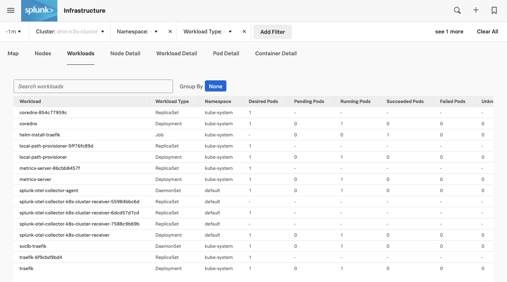
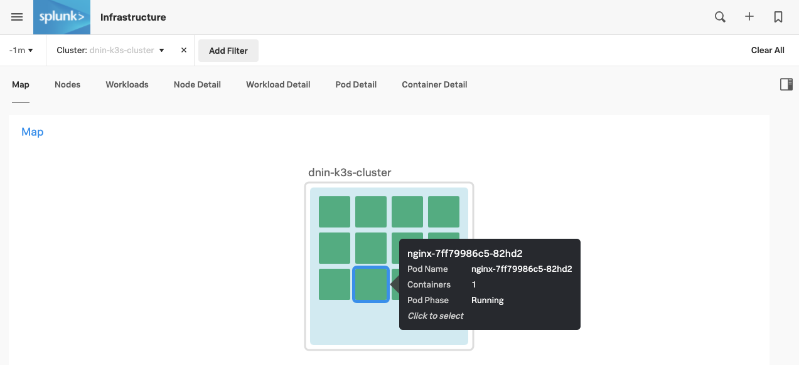
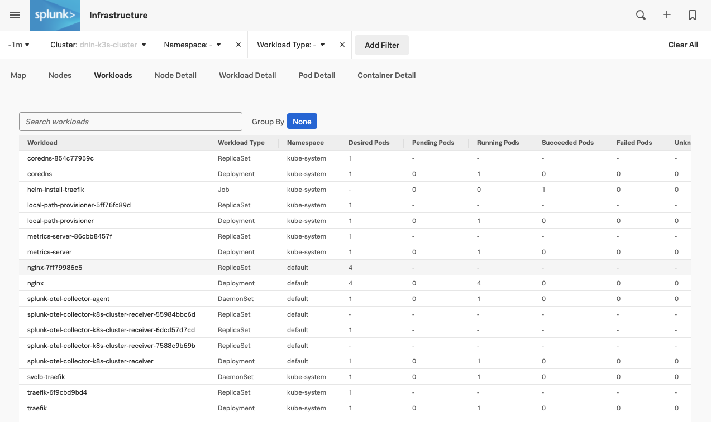
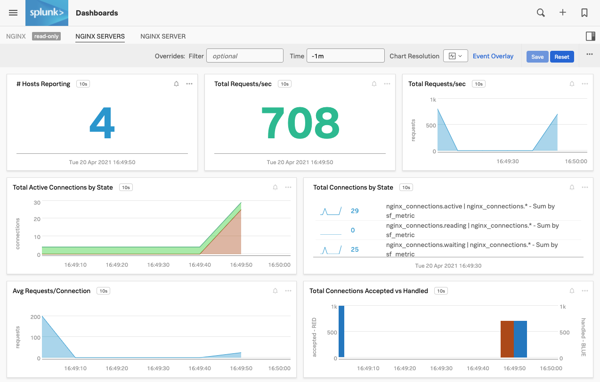

# Deploying NGINX in K3s - Lab Summary

* Deploy a NGINX ReplicaSet into your K3s cluster and confirm the auto discovery of your NGINX deployment.
* Run a benchmark test to create metrics and confirm them streaming into SignalFX!

---

## 1. Start your NGINX

Remain in the Multipass or AWS/EC2 shell session and change into the `nginx` directory:

=== "Input"

    ```bash
    cd ~/workshop/k3s/nginx
    ```

Verify the number of pods running in the SignalFx UI by selecting the **WORKLOADS** tab. This should give you an overview of the workloads on your cluster.

{: .zoom}

Note the single agent container running per node among the default Kubernetes pods. This single container will monitor all the pods and services being deployed on this node!

Now switch back to the default cluster node view by selecting  the **MAP** tab and select your cluster again.
  
---

## 2. Create NGINX deployment

Create the NGINX `configmap` using the `nginx.conf` file:

=== "Input"

    ```text
    kubectl create configmap nginxconfig --from-file=nginx.conf
    ```

=== "Output"

    ```
    configmap/nginxconfig created
    ```

Then create the deployment:

=== "Input"

    ```
    kubectl create -f nginx-deployment.yaml
    ```

=== "Output"

    ```
    deployment.apps/nginx-deployment created
    ```

Validate the deployment has been successful and that the NGINX pods are running.

If you have the SignalFx UI open you should see new Pods being started and containers being deployed.

It should only take around 20 seconds for the pods to transition into a Running state. In the SignalFx UI you should have a cluster that looks like below:

{: .zoom}

If you select the **WORKLOADS** tab again you should now see that there is a new replica set and a deployment added for NGINX:

{: .zoom}

---

Let's validate this in your shell as well:

=== "Input"

    ```text
    kubectl get pods
    ```

=== "Output"

    ```text
    NAME                               READY   STATUS    RESTARTS   AGE
    signalfx-agent-n7nz2               1/1     Running   0          11m
    nginx-deployment-f96cf6966-jhmjp   1/1     Running   0          21s
    nginx-deployment-f96cf6966-459vf   1/1     Running   0          21s
    nginx-deployment-f96cf6966-vrnfc   1/1     Running   0          21s
    nginx-deployment-f96cf6966-7z4tm   1/1     Running   0          21s
    ```

Before running a benchmark against NGINX (to generate metrics) we need to expose port 80 (HTTP)

=== "Input"

    ```text
    kubectl create service nodeport nginx --tcp=80:80
    ```

=== "Output"

    ```text
    service/nginx created
    ```

Run `kubectl get svc` then make a note of the `CLUSTER-IP` address that is allocated to the NGINX service.

=== "Input"

    ```text
    kubectl get svc
    ```

=== "Output"

    ```text
    NAME         TYPE         CLUSTER-IP     EXTERNAL-IP   PORT(S)        AGE
    kubernetes   ClusterIP    10.96.0.1      <none>        443/TCP        9m3s
    nginx        NodePort    {==10.110.36.62==}   <none>        80:30995/TCP   8s
    ```

---

## 3. Run Siege Benchmark

Using the NGINX `{==CLUSTER-IP==}` address reported from above, use the Siege Load Testing command (`siege`) to generate some traffic to light up your SignalFx NGINX dashboard. Run this a couple of times!

=== "Input"

    ```text
    siege -b -r 50 -c 20 --no-parser http://{==CLUSTER-IP ADDRESS==}/ 1>/dev/null
    ```

=== "Output"

    ```text
    ** SIEGE 4.0.5
    ** Preparing 20 concurrent users for battle.
    The server is now under siege...

    Transactions:		        1000 hits
    Availability:		      100.00 %
    Elapsed time:		        1.17 secs
    Data transferred:	       20.05 MB
    Response time:		        0.02 secs
    Transaction rate:	      854.70 trans/sec
    Throughput:		       17.14 MB/sec
    Concurrency:		       19.77
    Successful transactions:        1000
    Failed transactions:	           0
    Longest transaction:	        0.16
    Shortest transaction:	        0.01
    ```

Validate you are seeing metrics in the UI by going to **Dashboards → NGINX → NGINX Servers**

!!! tip
    You can again apply the filter `kubernetes_cluster: HOSTNAME-app-dev-workshop` to focus on only your metrics. Replace HOSTNAME with the actual hostname of your instance.

{: .zoom}
