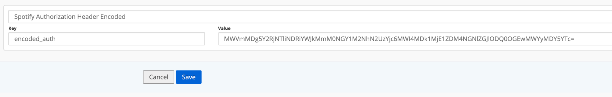
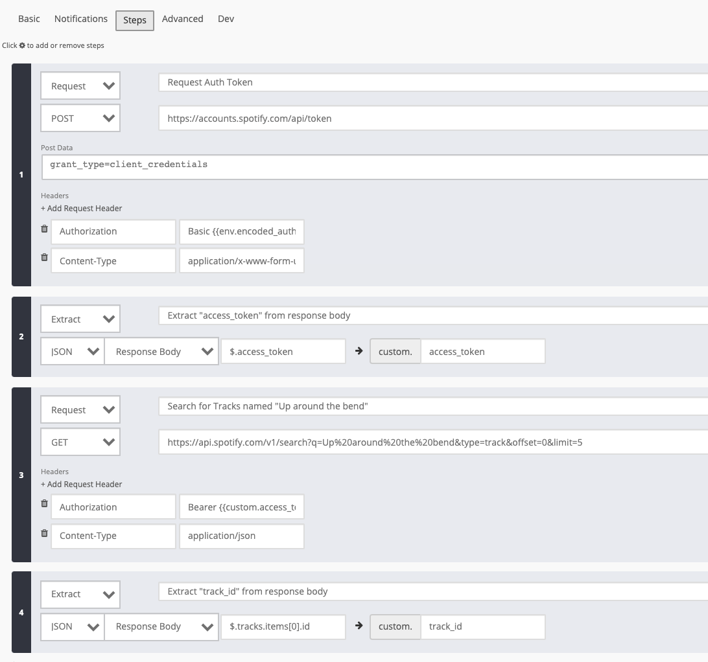
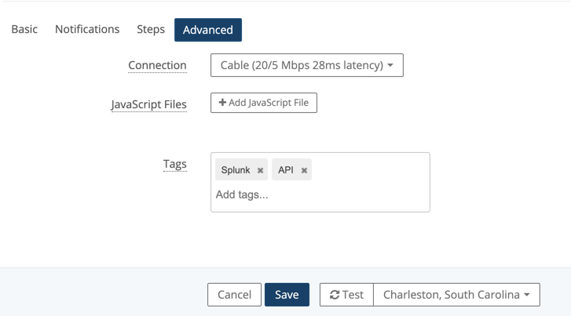
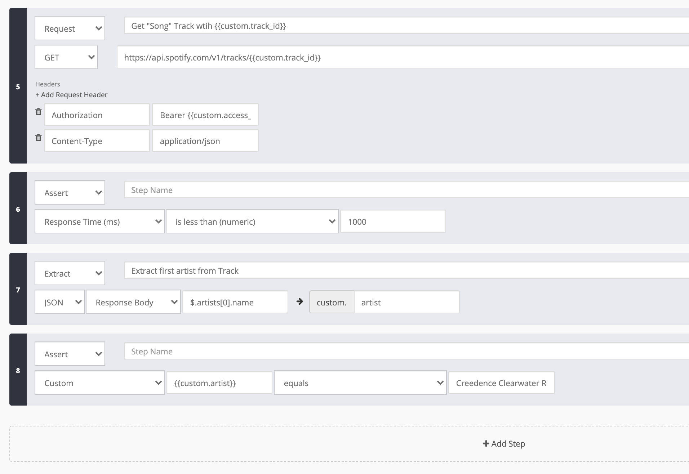

# Lab Overview

The API Check provides a flexible way to check the functionality and performance of API endpoints. The shift toward API-first development has magnified the necessity to monitor the back-end services that provide your core front-end functionality. Whether you're interested in testing the multi-step API interactions or you want to gain visibility into the performance of your endpoints, the API Check can help you accomplish your goals.

## Create a Global Variable

View the global variable that we'll use to perform our API check. Click on **Global Variables** under **Admin Tools**. View the global variable that we'll use to make the spotify API transaction

## Create an API Check

Create a new API Check and name it `<your initials>` followed by Splunk REST API Check for example: **AP - Spotify API**

Take a second to explore the notification tab after you've named your check

Add the following API Check Steps:

 

Available Variables to choose from:

[**Request Step**](https://help.rigor.com/hc/en-us/articles/115004583747-API-Check-Request-Step)

- A Request Step makes an HTTP request to some endpoint and collects data from that interaction. Unlike other check types, API Checks do not require an initial URL to start the check. All HTTP requests are configured within Request Steps.

[**Extract Step**](https://help.rigor.com/hc/en-us/articles/115004582607-API-Check-Extract-Step)

- An Extract Step extracts data out of JSON, XML, or HTML formatted data.

- To extract data out of JSON, supply three things:

- The source containing the JSON,

- The JSONPath expression to extract out the data, and

- The name of the custom variable that you want to save to.

- The source can be any JSON, but most likely will come from the response body. The source could also come from a response header or can be a custom value. The source must be well-formed JSON.

[**Save Step**](https://help.rigor.com/hc/en-us/articles/115004743868-API-Check-Save-Step)

- A Save Step stores some data to be reused later in the check. To save data, supply the source and the name of the custom variable to save to. The source can be selected from the presets, including response headers, or by providing a custom value.

- Some additional use cases are appending bits of information to easily reuse in other steps and saving the results from one request to be reused after another request is made.

- It is important to remember that request variables are only available after a request is made. If you try to save a value from a request but haven't made a request yet, then an empty string will be saved.

[**Assert Step**](https://help.rigor.com/hc/en-us/articles/115004742408-API-Check-Assert-Step)

- An Assert Step makes an assertion on two values. To make an assertion, supply two parameters along with the comparison that you would like to perform between the two.

[**Comparisons**]()

- We currently support 3 types of comparisons: **string**, **numeric**, and **regular expression**.

- For **string** and **numeric** comparisons, values are coerced to the comparison type before the comparison is made.

- For a **regular expression** comparison, the first parameter is a string and the second parameter is a regular expression.

Tag your API Check with Splunk and API and SAVE it

## Test your REST API Check

Press got back into the edit configuration and press 'test' at the bottom of the page to ensure there are no errors

Slide the window up to view details about the successful run

Now, let's add some more functionality to the monitor. Slide the detailed window back down and add steps 5-8

**BONUS**: use step 6 to assert that the following response came back in a timely manner (1000 ms) 

Once the steps are added, test & save the monitor.

## Resources

- [How to Create an API Check](https://help.rigor.com/hc/en-us/articles/115004817308-How-to-Create-an-API-Check)

- [API Check Overview](https://help.rigor.com/hc/en-us/articles/115004952508-API-Check-Overview)

- [How Do I Use Business Transactions?](https://help.rigor.com/hc/en-us/articles/360049442854-How-Do-I-Use-Business-Transactions)
