# Lab Overview

- **Splunk Synthetic** formally [Rigor](https://rigor.com/) is a powerful monitoring service that monitors the availability of any website, mobile app, API, or system on the Internet with Uptime Checks and sends real-time alerts.

- This Lab walks your through using Chrome Selenium IDE extension to create a synthetic transaction against a Splunk demo instance and creating a Rigor Real Browser Check (RBC). In addition you get to learn other Rigor checks like REST API checks and Uptime Checks.

## **1 Prerequisites**

1. Login with your username and password to [https://monitoring.rigor.com/](https://monitoring.rigor.com/) & [https://optimization.rigor.com](https://optimization.rigor.com) and make sure you are assigned to your own account for example: **SE Bootcamp - \<username>**. if you don't have a username yet contact Andrew Patterson over slack or email apatterson\@splunk.com

2. Edit your Rigor account personal information and adjust your timezone and email notifications. Rigor will start sending you notifications, you can turn them off at the monitoring level.

 
3. Add the [Selenium IDE](https://chrome.google.com/webstore/detail/selenium-ide/mooikfkahbdckldjjndioackbalphokd?hl=en-US) extension to your **Chrome** Browser

4. Click on the extension and you should see the following screen:


5. Test your access to the Splunk instance for this Lab

**Synthetic Monitoring Lab 1 Instances (example)**

**Test your username/password provided and login to your instance.**

# Task 2 - Splunk Real Browser Checks (RBC)

**Estimated duration:**30 Minutes

## 

## **2.1 Create NEW Selenium IDE Recording**

**What is Selenium IDE**

- Selenium IDE is an open source record and playback test automation for the web.

- Selenium is a portable framework for testing web applications.

- Selenium provides a playback tool for authoring functional tests without the need to learn a test scripting language (Selenium IDE).

- It also provides a test domain-specific language (Selenese) to write tests in a number of popular programming languages, including C#, Groovy, Java, Perl, PHP, Python, Ruby and Scala.

- The tests can then run against most modern web browsers.

- Selenium runs on Windows, Linux, and macOS.

- It is open-source software released under the Apache License 2.0.

1. Record a web transaction using Selenium to check on broomstogo.com

Name the project "**AP - Brooms to Go - Task 2**"
>
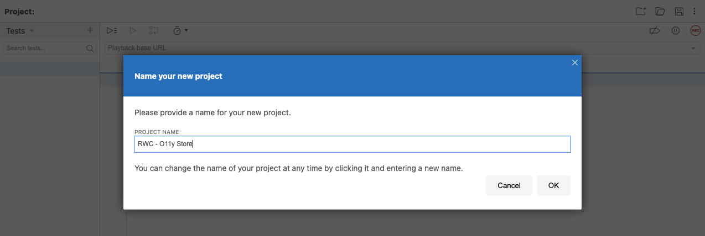

2. Enter [https://www.broomstogo.com](https://www.broomstogo.com) as your Base URL.

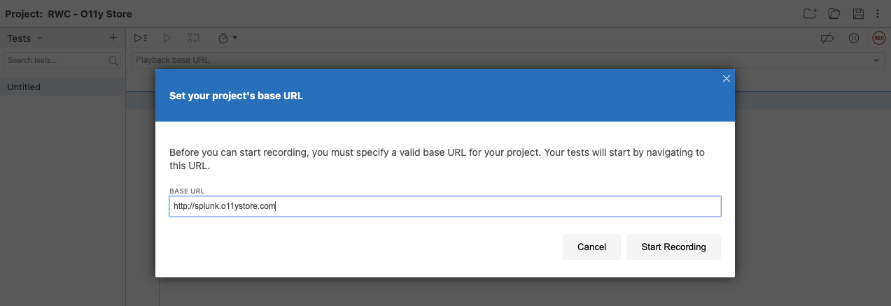

3. Press "Start Recording" A new window should open up with broomstogo.com - Press "Catalog", Pick a product, and then add it to the cart, and then press "checkout"

4. Close the window and then stop the recording by navigating back to Selenium IDE and name the test: "**AP - Checkout Flow (Desktop)**"

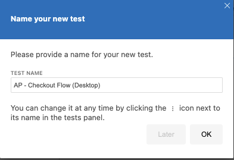

**Your Selenium IDE Project will look something like this:**


5. Test your recording by pressing on the play button, make sure your recording is successfully completing the transaction

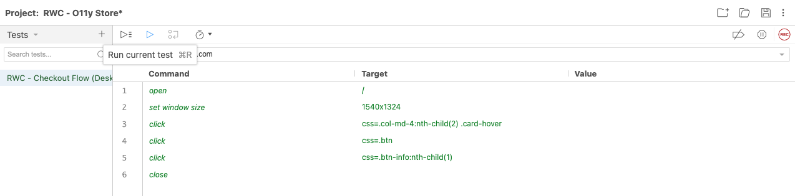

6. Save your Selenium IDE Project to your Downloads folder


## 

## **2.2 Create NEW Rigor Desktop RBC for Splunk**

1. Login to Rigor using [https://monitoring.rigor.com](https://monitoring.rigor.com)

2. Click on Real Browse, create a new RBC and Adjust the **New RBC** name to your **initials** followed by **initial - Checkout Flow (Desktop)** for example: **initial - Checkout Flow (Desktop)**


>
Click on "**From File**" and select your recording then click on Import
>


3. Set the **Frequency** to **5 Minutes**

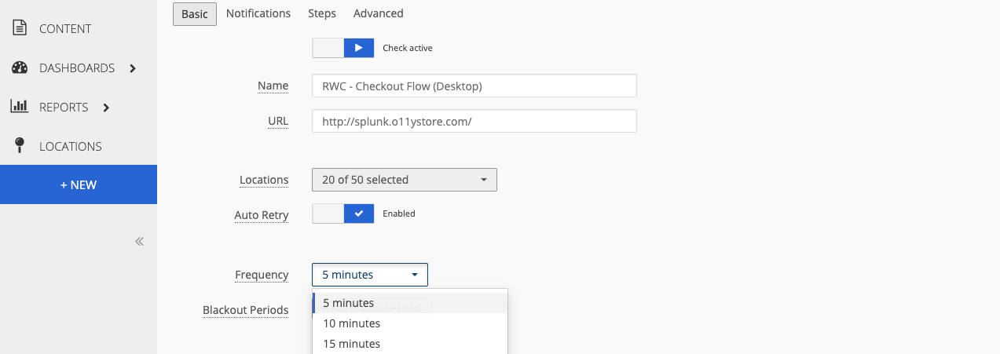

4. Click on Steps and make the following adjustments to your recording

provide a friendly name to Steps 1, 2, 3 & 4


Adjust Step 3 to use a JSPath Selector, in order to retrieve the selector this can be accomplished using Chrome developer tools. Follow the numbered UI clicks in the screenshot and use a right mouse click operation to "**Copy selector**", paste it into Step 3 as shown in the above screenshot.

Here is the actual selector you need to Login into Splunk

 ```javascript
 document.querySelector(\"#AddToCart\--product-template\")
 ```


**Tip 1:** use \'**command + f**\' in inspector to ensure that there is only one instance of the selector you are using. 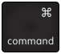

**Tip 2:** As you are creating the steps think about how to go about using the "[Business Transaction](https://help.rigor.com/hc/en-us/articles/360049442854-How-Do-I-Use-Business-Transactions)" feature in Rigor which is very powerful. *"Business Transactions are a combined group of contiguous steps in a Real Browser script that are to be measured as a whole. These transactions logically group similar parts of a flow together, so that users can view the performance of multiple steps and page(s) grouped under one Business Transaction."*

5. Click on "**Test**" to test your recording, make sure to click on "**After**" in Step 4 to validate the monitor was able to get to the checkout screen.


6. Add a **"Return to Cart"** Step 5 to your recording

Use the "**CSS**" Selector, here is the actual selector you need to return to the cart

 ```html
 body \div \div \div \main \div.step \form \div.step\_\_footer \a \span
 ```


7. Save your Real Browser Monitor and validate your monitor is working i.e. producing successful checks


>

>
**Tip:** you can force to run your monitor now using **Run Now**
>


8. Change your view to **Segment by location** and observe the difference. You can turn off/on locations by clicking on them.

**Question:** Which Location has the poorest **Response Time**?
>
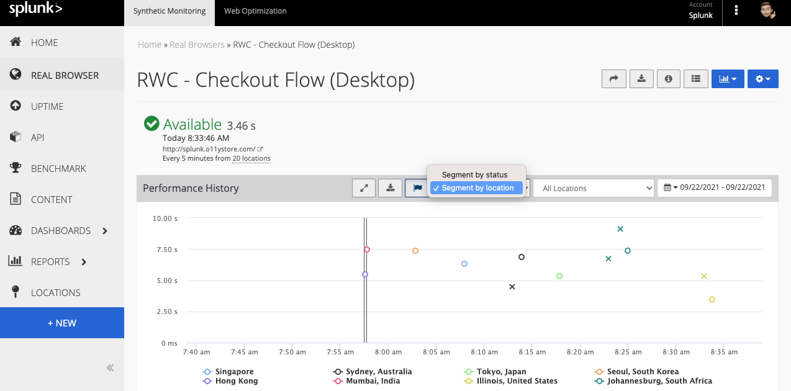

9. Click on one of the successful circles to drilldown into that Run:

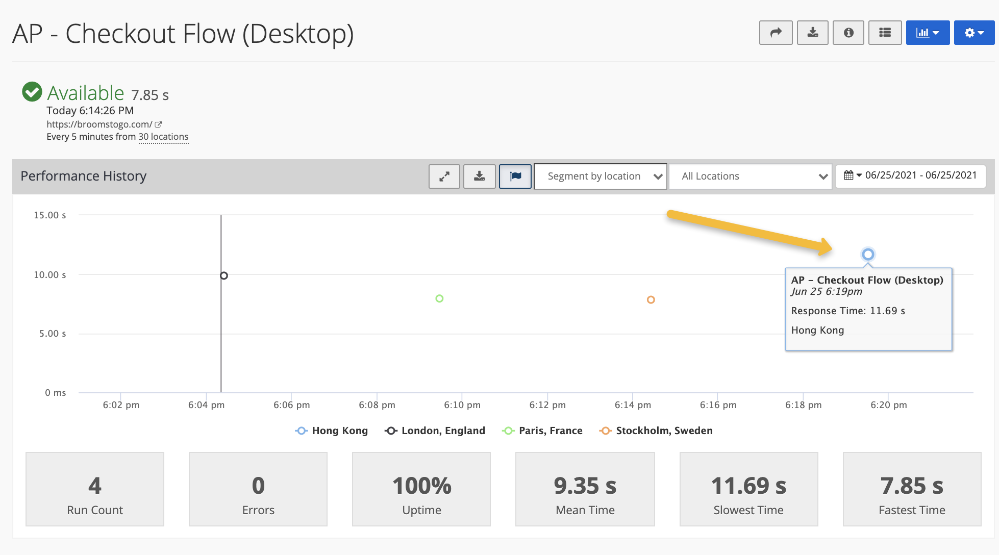

10. Take a moment to explore the metrics with the "Configure Metrics" dropdown

 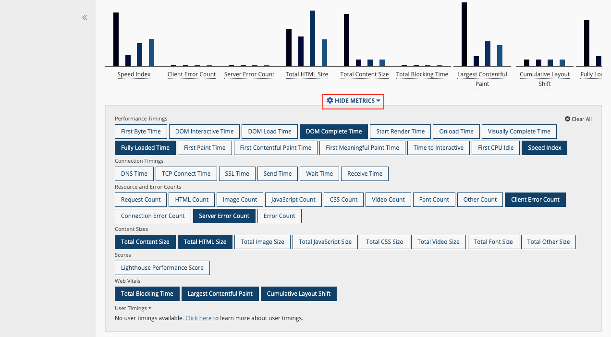

11. Click "Page 2" in the dropdown, and scroll down to view the **Filmstrip** and the **Waterfall Chart.**

 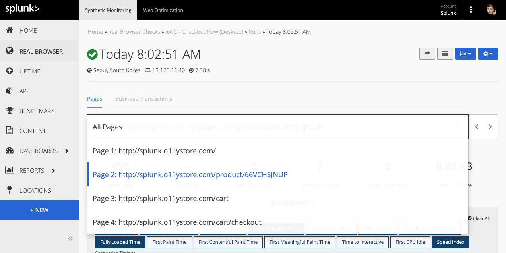

12. Click on **Click Here to Analyze with Optimization** which will prompt to login to your Rigor Optimization Account. If you **don't have this option**, navigate to this page: https://optimization.rigor.com/s/2194959?tid=ov&sh=3AF8C48AADD6D3E5F5DAA8B4B7BB7F45

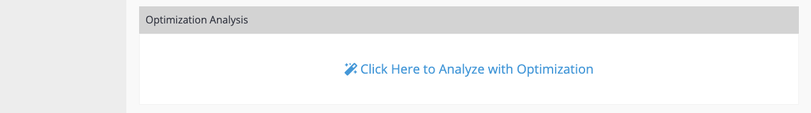

13. Click the "**Best Practices Score**" tab. Scroll down, and review all the findings

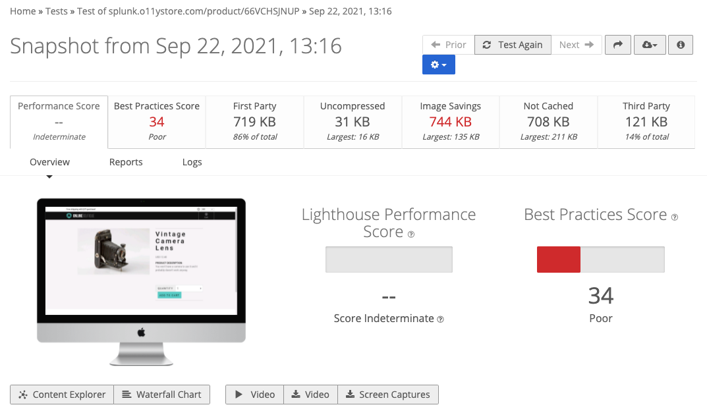
>
Spend some time to review the findings. Click into any line item

### 

## 

## **2.5 Create NEW Rigor Mobile RBC for Splunk**

Clone the RBC you created above and name it, for example: **AP - Checkout Flow (Tablet)**

Update the following three settings and create your new RBC.

##   

Test & Validate the new monitor

**Tip 2:** As you are creating the steps try using the "[Business Transaction](https://help.rigor.com/hc/en-us/articles/360049442854-How-Do-I-Use-Business-Transactions)" feature in Rigor. *"Business Transactions are a combined group of contiguous steps in a Real Browser script that are to be measured as a whole. These transactions logically group similar parts of a flow together, so that users can view the performance of multiple steps and page(s) grouped under one Business Transaction."*

## **2.7 Resources**

- [Getting Started With Selenium IDE](https://help.rigor.com/hc/en-us/articles/115004652007?flash_digest=b1ef7d1a07b68d5279ee5fef8adb87fb878cf010)

- [Rigor Scripting Guide](http://www2.rigor.com/scripting-guide)

- [How Can I Fix A Broken Script?](https://help.rigor.com/hc/en-us/articles/115004443988-How-Can-I-Fix-A-Broken-Script)

- [Introduction to the DOM](https://developer.mozilla.org/en-US/docs/Web/API/Document_Object_Model/Introduction) (Document Object Model (DOM)

- [Selenium IDE](https://www.selenium.dev/selenium-ide/)

# Task 3 - Splunk REST API Checks 

**Estimated duration:**20 Minutes

## **3.1 Create NEW Global Variable**

View the global variable that we'll use to perform our API check

**Click on Global Variables under "Admin Tools":**

View the global variable that we'll use to make the spotify API transaction

 

## **3.2 Create NEW API Check**

1. Create a new API Check and name it \<your initialsfollowed by Splunk REST API Check for example: **AP - Spotify API**

 

1. Take a second to explore the notification tab after you've named your check

**Add the following API Check Steps:**

 

**Available Variables to choose from:**

 

[**[Request Step]**](https://help.rigor.com/hc/en-us/articles/115004583747-API-Check-Request-Step)

- A Request Step makes an HTTP request to some endpoint and collects data from that interaction. Unlike other check types, API Checks do not require an initial URL to start the check. All HTTP requests are configured within Request Steps.

[**[Extract Step]**](https://help.rigor.com/hc/en-us/articles/115004582607-API-Check-Extract-Step)

- An Extract Step extracts data out of JSON, XML, or HTML formatted data.

- To extract data out of JSON, supply three things:

  - The source containing the JSON,

  - The JSONPath expression to extract out the data, and

  - The name of the custom variable that you want to save to.

- The source can be any JSON, but most likely will come from the response body. The source could also come from a response header or can be a custom value. The source must be well-formed JSON.

[**[Save Step]**](https://help.rigor.com/hc/en-us/articles/115004743868-API-Check-Save-Step)

- A Save Step stores some data to be reused later in the check. To save data, supply the source and the name of the custom variable to save to. The source can be selected from the presets, including response headers, or by providing a custom value.

- Some additional use cases are appending bits of information to easily reuse in other steps and saving the results from one request to be reused after another request is made.

- It is important to remember that request variables are only available after a request is made. If you try to save a value from a request but haven't made a request yet, then an empty string will be saved.

[**[Assert Step]**](https://help.rigor.com/hc/en-us/articles/115004742408-API-Check-Assert-Step)

- An Assert Step makes an assertion on two values. To make an assertion, supply two parameters along with the comparison that you would like to perform between the two.

**Comparisons**

- We currently support 3 types of comparisons: **string**, **numeric**, and **regular expression**.

- For **string** and **numeric** comparisons, values are coerced to the comparison type before the comparison is made.

- For a **regular expression** comparison, the first parameter is a string and the second parameter is a regular expression.

4. Tag your API Check with Splunk and API and SAVE it

 

## **3.3 Test your REST API Check**

Press got back into the edit configuration and press 'test' at the bottom of the page to ensure there are no errors

 

Slide the window up to view details about the successful run

 

 

Now, let's add some more functionality to the monitor. Slide the detailed window back down and add steps 5-8

**BONUS**: use step 6 to assert that the following response came back in a timely manner (1000 ms) 

Once the steps are added, test & save the monitor.

## **3.5 Resources**

- [How to Create an API Check](https://help.rigor.com/hc/en-us/articles/115004817308-How-to-Create-an-API-Check)

- [API Check Overview](https://help.rigor.com/hc/en-us/articles/115004952508-API-Check-Overview)

- [How Do I Use Business Transactions?](https://help.rigor.com/hc/en-us/articles/360049442854-How-Do-I-Use-Business-Transactions)
