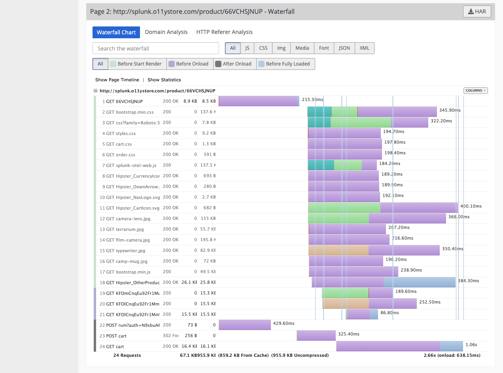

# Splunk Synthetics, 導入

**Splunk Synthetic Monitoring** は、唯一の完全な観測可能スイートである Splunk Observability Cloud の一部として、可用性と Web パフォーマンスの最適化のための最も包括的かつ詳細な機能を提供します。

API、サービスエンドポイント、エンドユーザー体験の監視を簡単にセットアップすることができます。Splunk Synthetic Monitoring では、基本的な稼働時間やパフォーマンスの監視にとどまらず、問題の発見と修正、Web パフォーマンスの最適化、顧客に最高のユーザーエクスペリエンスを提供することに重点を置くことができます。

Splunk Synthetic Monitoring を使用すると、次のことが可能になります。

- 重要なユーザーフロー、ビジネストランザクション、API エンドポイントにおける問題を迅速に検出し、解決することができます。
- インテリジェンスなウェブ最適化エンジンにより、ウェブパフォーマンスの問題が顧客に悪影響を与えることを防止します。
- さらに、すべてのページリソースとサードパーティの依存関係のパフォーマンスを向上させることができます。

## ラボの概要

このラボでは、[Chrome Selenium IDE](https://chrome.google.com/webstore/detail/selenium-ide/mooikfkahbdckldjjndioackbalphokd?hl=ja) 拡張機能を使用して Splunk のデモインスタンスに対するSyntheticトランザクションを作成し、Splunk Synthetic Monitoring の Real Browser Check (RBC) を作成する方法を説明します。さらに、REST API Checks や Uptime Check のような他の Splunk Synthetic Monitoring の機能についても学びます。

## 前提条件

[https://monitoring.rigor.com](https://monitoring.rigor.com) と [https://optimization.rigor.com](https://optimization.rigor.com) のユーザー名とパスワードでログインできることを確認してください。また、**O11y Workshop** のように、自分のアカウントに割り当てられていることを確認してください。

Splunk Synthetic Monitoring アカウントの個人情報を編集し、タイムゾーンとメール通知を設定します。Splunk Synthetic Monitoring はデフォルトで通知の送信を開始しますが、モニターの設定レベルで通知をオフにすることができます。

[Chrome Selenium IDE](https://chrome.google.com/webstore/detail/selenium-ide/mooikfkahbdckldjjndioackbalphokd?hl=en-US) 拡張機能を **Chrome** ブラウザに追加してください。インストール後、拡張機能をクリックすると、以下の画面が表示されます。

## Selenium IDE を使う

これで、Selenium IDEを使ってウェブトランザクションを記録し、[http://splunk.o11ystore.com](http://splunk.o11ystore.com) をチェックすることができるようになりました。

**Record a new test in a new project** をクリックし、プロジェクト名を **[YOUR_INITIALS] - O11y Store** （例: RWC - O11y Store）とします。

!!! question "Selenium IDEとは何ですか？"
    - Selenium IDEは、Webサイトの記録・再生・テスト自動化を行うオープンソースプロジェクトです。
    - Selenium はWebアプリケーションをテストするためのポータブルなフレームワークです。
    - Selenium はテストスクリプト言語 (Selenium IDE) を学ぶ必要なしに機能テストを作成するためのプレイバックツールを提供します。
    - また、C#、Groovy、Java、Perl、PHP、Python、Ruby、Scala など、多くの一般的なプログラミング言語でテストを書くためのテストドメイン固有の言語 (Selenese) も提供します。
    - テストは、ほとんどの最新のウェブブラウザで実行することができます。
    - Seleniumは、Windows、Linux、macOS上で動作します。
    - Apache License 2.0の下で公開されているオープンソースソフトウェアです。

ベースURLには [http://splunk.o11ystore.com](http://splunk.o11ystore.com) を入力してください。

Start Recording{: .label-button .sfx-ui-button-grey} をクリックすると、新しいウィンドウが開いて [splunk.o11ystore.com](http://splunk.o11ystore.com) と表示されます。 **Vintage Camera Lens** をクリックし、**Add To Cart** をクリックし、**Place Order** をクリックします。

ウィンドウを閉じてから、Selenium IDEの画面に戻り、記録を停止します。最後に、**[YOUR_INITIALS] - Checkout Flow (Desktop)**（例: RWC - Checkout Flow (Desktop)）のように、テストに名前を付けます。

あなたのSelenium IDEプロジェクトは、次のようになります。

Runボタンを押して記録をテストし、正常に完了することを確認します。

最後に、Selenium IDE プロジェクトをダウンロードフォルダに `Workshop.side` という名前で保存します。

## Real Browser Checkを作成する

[https://monitoring.rigor.com](https://monitoring.rigor.com) を開き、Splunk Synthetic Monitoring にログインします。 **REAL BROWSER** をクリックし、 **+New**{: .label-button .sfx-ui-button-blue} をクリックします。

"**From File**" をクリックし、記録したファイルを選択し、 Import をクリックします。

**Frequency** を **5 Minutes** に設定します。

Steps をクリックし、それぞれのステップにわかりやすい名前を付けます（例: Step1（Click Camera）、Step2（Add to Cart）、Step3（Place Order））。

!!! note "名前欄の日本語の利用"
    技術的な制約により、ステップ名などはアルファベットのみお使いいただけます。

次に、 **+ Add Step** をクリックします。この新しいステップでは、モニターにいくつかのバリデーションを追加します。これは、チェックアウトが正常に完了したことを確認するためのものです。

**Name** に **Confirm Order** を入力し、 **Action** を **Wait for text present** に変更し、 **Value** に **Your order is complete!** を入力してください。これで、**Start Url** から始まると4つのステップを設定することができました。

!!! info "Tip"
    ステップを作成する際に、Splunk Synthetic Monitoring の [Business Transaction](https://help.rigor.com/hc/en-us/articles/360049442854-How-Do-I-Use-Business-Transactions) 機能をどのように利用するか考えてみてください。この機能は非常に強力です。 *「ビジネストランザクションは、全体として測定されるリアルブラウザスクリプトの連続するステップの結合されたグループです。これらのトランザクションは、フローの類似部分を論理的にグループ化し、ユーザーは複数のステップとページを1つのビジネストランザクションにグループ化してパフォーマンスを表示することができます。」*

**Advanced** をクリックし、 **Viewport Size** が **Default desktop: 1366 x 768** に設定されていることを確認します。

"**Test**" をクリックし、モニターをテストします。テストが正常に終了したら、ステップ4の "**AFTER**" をクリックして、モニターが注文完了のスクリーンショットに到達できたことを確認してください。

**Create**{: .label-button .sfx-ui-button-blue} をクリックし、Real Browser Check を保存します。5〜10分後、モニターが正常に動作していることを確認します。

!!! Info "Tip"
    **Run now** を使用すると、モニターを強制的に実行することができます。

    

表示方法を **Segment by location** に変更して、違いを観察してください。Location をクリックすることで、オフ/オンを切り替えることができます。

!!! question "Question?"
    どのロケーションの **Response Time** がもっとも悪いですか？

緑の丸の一つをクリックすると、そのRunにドリルダウンすることができます。

**CONFIGURE METRICS/HIDE METRICS** ドロップダウンで、メトリクスを眺めることができます。

ドロップダウンから **Page 2** をクリックし、下にスクロールして **Filmstrip** と **Waterfall Chart** を表示します。

**Click Here to Analyze with Optimization** をクリックすると、Splunk Synthetic Monitoring Optimization アカウントにログインするよう促されます。 **このオプションがない場合**、この [page](https://optimization.rigor.com/s/2373818/?sh=3AF8C48AADD6D3E5F5DAA8B4B7BB7F45) に移動してください。

"**Best Practices Score**" のタブをクリックします。下にスクロールし、すべての調査結果を確認してみましょう。

さらに深く、調査結果を確認してみましょう。任意の行をクリックしてみてください。

## モバイルチェックを作成する

上記で作成した RBC をコピーします。

名前を、例えば **RWC - Checkout Flow (Tablet)** のように変更します。

**Advanced** タブで、以下の3つの設定を更新し、新しいモバイルRBCを作成します。

新しいモニターのテストして、動作を確かめましょう。

## リソース

- [Getting Started With Selenium IDE](https://help.rigor.com/hc/en-us/articles/115004652007?flash_digest=b1ef7d1a07b68d5279ee5fef8adb87fb878cf010)

- [Splunk Synthetic Monitoring Scripting Guide](http://www2.rigor.com/scripting-guide)

- [How Can I Fix A Broken Script?](https://help.rigor.com/hc/en-us/articles/115004443988-How-Can-I-Fix-A-Broken-Script)

- [Introduction to the DOM](https://developer.mozilla.org/en-US/docs/Web/API/Document_Object_Model/Introduction) (Document Object Model (DOM)

- [Selenium IDE](https://www.selenium.dev/selenium-ide/)
