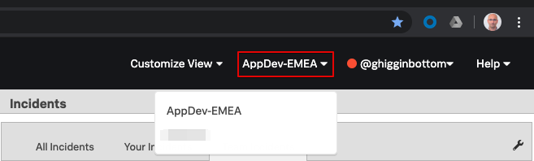
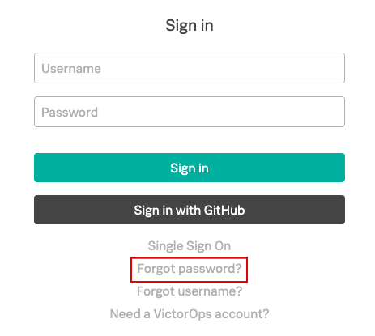

# VictorOps Getting Started - Lab Summary

1. Activate your login
2. Configure your Profile
3. Create your Team
4. Configure Rotations
5. Configure Escalation Policies
6. Create Routing Keys

---

## Activate your login

You should have received an invitation to Activate your VictorOps account via e-mail, click the _Activate Account_ link and follow the prompts.

If you did not receive an invitation it is probably because you already have a VictorOps login, linked to a different organisation.

If so login to to that Org, then use the organisation dropdown next to your username in the top left to switch to the AppDev-EMEA Org.

If you have forgotten your password go to the sign-in page and use the forgotten password link to reset your password.

{: .center}

---

## Configure Your Profile

Once you are logged in to VictorOps you now need to set up your profile.

Click on your login name in the top right hand corner and chose **Profile** from the drop down.

### Contact Methods

Confirm your contact methods are listed correctly and add any additional phone numbers and e-mail address you wish to use.

### Mobile Devices

To install the VictorOps app for your smartphone search your phones App Store for VictorOps to find the appropriate version of the app.

The publisher should be listed as VictorOps Inc.

[{: .appstore}](ttps://apps.apple.com/us/app/victorops/id696974262) [{: .appstore}](https://play.google.com/store/apps/details?id=com.victorops.androidclient&hl=en)

Configuration help guides are available:

* [Apple](https://help.victorops.com/knowledge-base/ios-application/)
* [Android](https://help.victorops.com/knowledge-base/android-devices-victorops/)

Install the App and login, then refresh the Profile page and your device should now be listed under the devices section.

Click the **Test push notification** button and confirm you receive the test message.

### Personal Calendar

This link will enable you to sync your VictorOps on-call schedule with your calendar, however as you do not have any allocated shifts yet this will currently be empty.

You can add it to your calendar by copying the link into your preferred application and setting it up as a new subscription.
