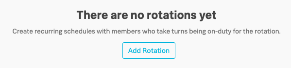
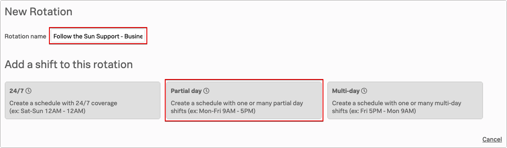
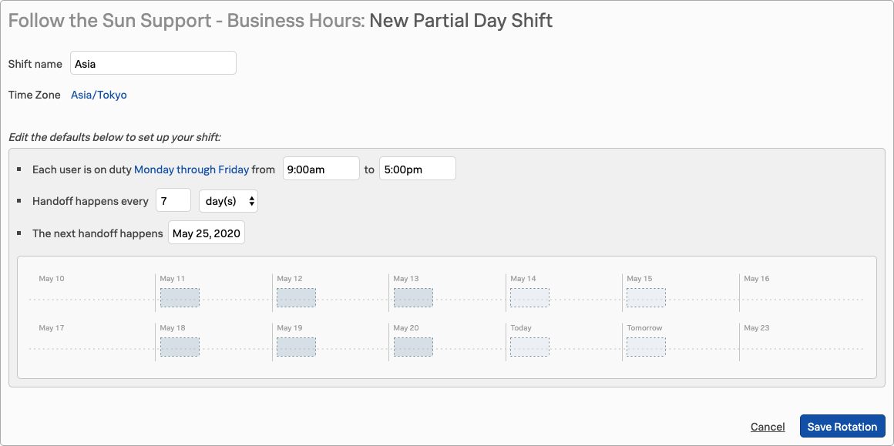
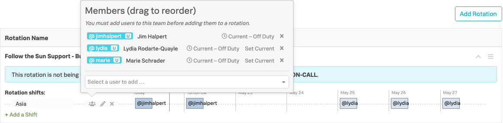
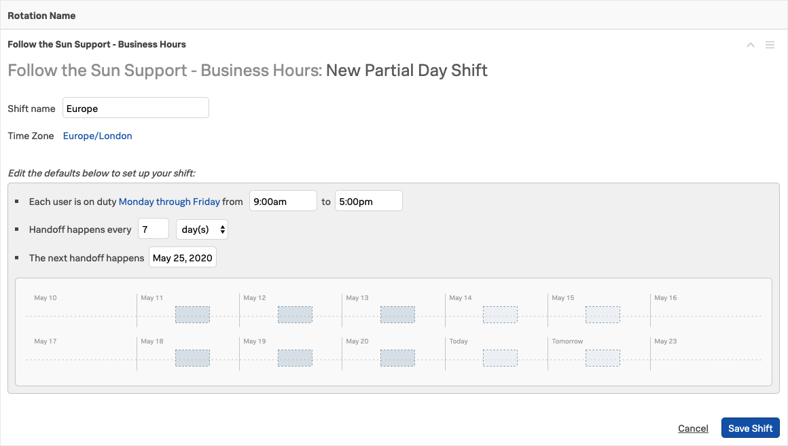
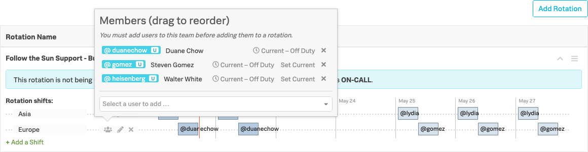
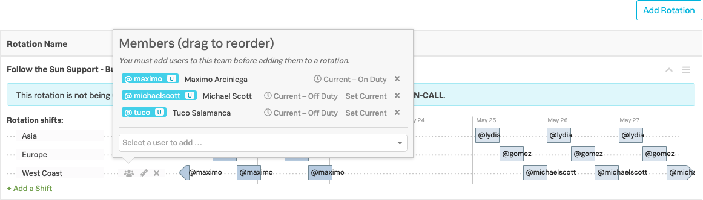
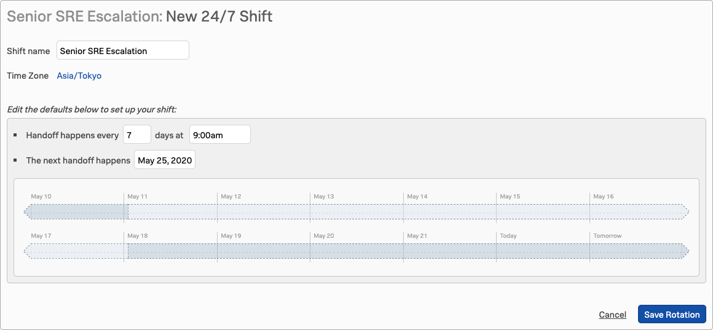
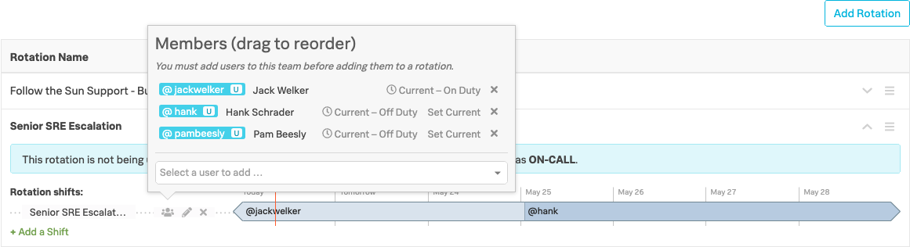

# Configure Rotations

Navigate to the **Rotations** tab on the **Teams** sub menu, you should have no existing Rotations so we need to create some.

The 1st Rotation you will create is for a follow the sun support pattern where the members of each shift provide cover during their normal working hours within their time zone.

The 2nd will be a Rotation used to provide escalation support by more experienced senior members of the team, based on a 24/7, 1 week shift pattern.

## Follow the Sun Support - Business Hours

Click **Add Rotation**

{: .center}

Enter a name of "*Follow the Sun Support - Business Hours*" and Select **Partial day** from the three available shift templates.

{: .zoom}

* Enter a Shift name of "*Asia*"
* Time Zone set to "*Asia/Tokyo*"
* Each user is on duty from "*Monday through Friday from 9.00am to 5.00pm*"
* Handoff happens every "*7 days*"
* The next handoff happens - Select the next Monday using the calendar
* Click **Save Rotation**

{: .zoom}

You will now be prompted to add Members to this shift; add the Asia members who are jimhalpert, lydia and marie, but only if you're using the AppDev-EMEA Organisation for this workshop.

If you're using your own Organisation refer to the specific list provided separately.

{: .zoom}

Now add an 2nd shift for Europe by again clicking **+Add a shift → Partial Day**

* Enter a Shift name of "*Europe*"
* Time Zone set to "*Europe/London*"
* Each user is on duty from "*Monday through Friday from 9.00am to 5.00pm*"
* Handoff happens every "*7 days*"
* The next handoff happens - Select the next Monday using the calendar
* Click **Save Shift**

{: .zoom}

You will again be prompted to add Members to this shift; add the Europe members who are duanechow, gomez and heisenberg, but only if you're using the AppDev-EMEA Organisation for this workshop.

If you're using your own Organisation refer to the specific list provided separately.

{: .zoom}

Now add a 3rd shift for West Coast USA by again clicking `+Add a shift` - `Partial Day`

* Enter a Shift name of "*West Coast*"
* Time Zone set to "*US/Pacific*"
* Each user is on duty from "*Monday through Friday from 9.00am to 5.00pm*"
* Handoff happens every "*7 days*"
* The next handoff happens - Select the next Monday using the calendar
* Click **Save Shift**

{: .zoom}

You will again be prompted to add Members to this shift; add the West Coast members who are maximo, michaelscott and tuco, but only if you're using the AppDev-EMEA Organisation for this workshop.

If you're using your own Organisation refer to the specific list provided separately.

{: .zoom}

The first user added will be the 'current' user for that shift.

You can re-order the shifts by simply dragging the users up and down, and you can change the current user by clicking `Set Current` on an alternate user

You will now have three different Shift patterns, that provide cover 24hr hours, Mon - Fri, but with no cover at weekends.

We will now add another Rotation for our Senior SRE Escalation cover.

---

## Senior SRE Escalation

* Click **Add Rotation**
* Enter a name of "*Senior SRE Escalation*"
* Select `24/7` from the three available shift templates
* Enter a Shift name of "*Senior SRE Escalation*"
* Time Zone set to "*Asia/Tokyo*"
* Handoff happens every "*7 days at 9.00am*"
* The next handoff happens [select the next Monday from the date picker]
* Click **Save Rotation**

{: .zoom}

You will again be prompted to add Members to this shift; add the 24/7 members who are jackwelker, hank and pambeesly, but only if you're using the AppDev-EMEA Organisation for this workshop.

If you're using your own Organisation refer to the specific list provided separately.

{: .zoom}

That completes the configuration of the Rotations, we now need to configure the Escalation Policies and Routing Keys.
