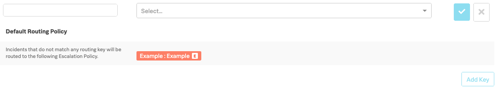
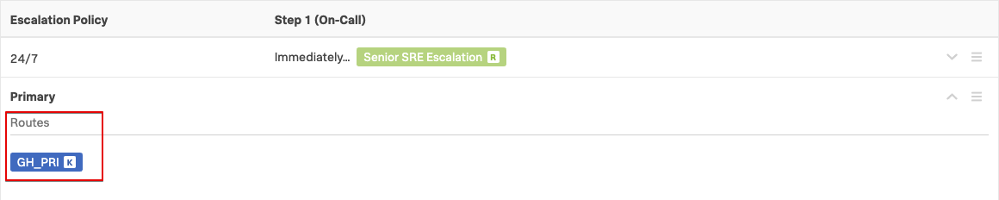

# Create Routing Keys

Routing Keys map the incoming alert messages from your monitoring system to an Escalation Policy which in turn sends the notifications to the appropriate team.

## 1. Instance ID

Each participant requires a unique Routing Key so we use the Hostname of the EC2 Intance you were allocated, or the Hostname of the VM you created using Multipass.  We are only doing this to ensure your Routing Key is unique and we know all Hostnames are unique.  In a production deployment the Routing Key would typically reflect the name of a System or Service being monitored.

When you created your VM you generated a random Instance ID, and we will use this same ID when creating your Routing Key.  

To get your Hostname from within the shell session connected to your VM run the following command:

=== "Shell Command"

    ```text
    echo ${HOSTNAME}
    ```

=== "Example Output"

    ```text
    vmpe
    ```

Make a note of this Hostname or copy to your clipboard.

## 2 Create Routing Keys

Navigate to **Settings** on the main menu bar, you should now be at the **Routing Keys** page.

You are going to create the following two Routing Keys using the naming conventions listed in the following table, but replacing {==HOSTNAME==} with the value from above and replace {==TEAM_NAME==} with the team you were allocated or created earlier.

| Routing Key | Escalation Policies |
| --- | --- |
| {==HOSTNAME==}_PRI | {==TEAM_NAME==} : Primary |
| {==HOSTNAME==}_WR | {==TEAM_NAME==} : Waiting Room |

There will probably already be a number of Routing Keys configured, but to add a new one simply scroll to the bottom of the page and then click **Add Key**

In the left hand box, enter the name for the key as per the table above.  In the **Routing Key** column, select your Teams **Primary** policy from the drop down in the **Escalation Polices** column.  You can start typing your Team Name to filter the results.

{: .zoom}

!!! note
    If there are a large number of participants on the workshop, resulting in an unusually large number of Escalation Policies sometimes the search filter does not list all the Policies under your Team Name.  If this happens instead of using the search feature, simply scroll down to your team name, all the policies will then be listed.

Repeat the above steps for both Keys, {==xxxx_PRI==} and {==xxxx_WR==}, mapping them to your Teams Primary and Waiting Room policies.

You should now have two Routing Keys configured, similar to the following:

{: .zoom}

!!! tip
    You can assign a Routing Key to multiple Escalation Policies if required by simply selecting more from the list

If you now navigate back to **Teams → [Your Team Name] → Escalation Policies** and look at the settings for your **Primary** and **Waiting Room** polices you will see that these now have **Routes** assigned to them.

{: .zoom}

The **24/7** policy does not have a Route assigned as this will only be triggered via an **Execute Policy** escalation from the **Primary** policy.

---

This completes the initial getting started steps for VictorOps, the next step will be to configure the Integration between VictorOps and SignalFx.
