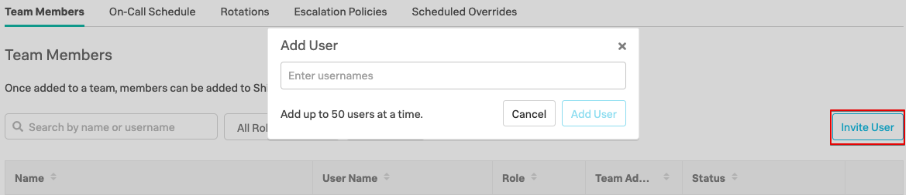

# Create Your Team for VictorOps

Navigate to the **Teams** tab on the main toolbar, you should find you have had a team created for you as part of the workshop setup, however if this did not happen, you may need to create a new one.

Select **Add Team**, then enter your team name using the format described by your workshop presenter, this will tpyically be in the format of "StudentID_Workshop" and then save by clicking the **Add Team** button.

You now need to add other users to your team.  If you are running this workshop using the Splunk provided environment, the following accounts are available for testing.

If you are running this lab in your own environment, you will have been provided a list of usernames you can use in place of the table below.

These users are dummy accounts who will not receive notifications when they are on call.

| Name | Username | Shift |
| --- | --- | --- |
| Duane Chow | duanechow | Europe |
| Steven Gomez | gomez | Europe |
| Walter White | heisenberg | Europe |
| Jim Halpert | jimhalpert | Asia |
| Lydia Rodarte-Quayle | lydia | Asia |
| Marie Schrader | marie | Asia |
| Maximo Arciniega | maximo | West Coast |
| Michael Scott | michaelscott | West Coast |
| Tuco Salamanca | tuco | West Coast |
| Jack Welker | jackwelker | 24/7 |
| Hank Schrader | hank | 24/7 |
| Pam Beesly | pambeesly | 24/7 |

Add the users to your team, using either the above list or the alternate one provided to you. The value in the **Shift** column can be ignored for now, but will be required for a later step.

Click the **Invite User** button on the right hand side, then either start typing the usernames (this will filter the list), or copy and paste them into the dialogue box.

Once all users are added click the **Add User** button.

{: .zoom}

To make a team member a Team Admin, simply click the :fontawesome-regular-edit: icon in the right hand column, pick any user and make them an Admin.

!!! tip
    For large team management you can use the APIs to streamline this process
