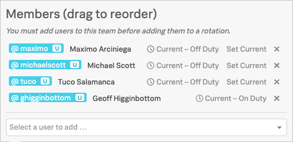

# Generate Incidents

## On-Call

Before generating any incidents you should assign yourself to the current Shift within your **Follow the Sun Support - Business Hours** Rotation and also place yourself **On-Call**.

* Click on the **Schedule** link within your **Team** in the **People** section on the left
* Or navigate to **Teams → [Your Team] → Rotations**
* Expand the **Follow the Sun Support - Business Hours** Rotation
* Click on the **Manage members** icon (the figures) for the current active shift depending on your timezone
* Use the **Select a user to add...** dropdown to add yourself to the shift
* Then click on **Set Current** to make yourself the current **on-call** user within the shift
* You should now get a **Push Notification** to your phone informing you that **You Are Now On-Call**

{: .center}

### 2.2 Trigger Alert

Log into your first VM you created during step [2. Creating a Test Environment](../../vo_integrations/#2-creating-a-test-environment) in VictorOps Integrations

=== "Input"

    ```
    multipass shell [YOUR INITIALS]-vo1
    ```

=== "Example"

    ```
    multipass shell gh-vo1
    ```

=== "Output"

    ```
    Welcome to Ubuntu 18.04.4 LTS (GNU/Linux 4.15.0-96-generic x86_64)
    
     * Documentation:  https://help.ubuntu.com
     * Management:     https://landscape.canonical.com
     * Support:        https://ubuntu.com/advantage
    
      System information as of Wed Apr 22 11:13:48 BST 2020
    
      System load:  0.0               Processes:             105
      Usage of /:   88.7% of 1.96GB   Users logged in:       0
      Memory usage: 19%               IP address for enp0s2: 192.168.64.13
      Swap usage:   0%
    
      => / is using 88.7% of 1.96GB
    
     * Kubernetes 1.18 GA is now available! See https://microk8s.io for docs or
       install it with:
    
         sudo snap install microk8s --channel=1.18 --classic
    
     * Multipass 1.1 adds proxy support for developers behind enterprise
       firewalls. Rapid prototyping for cloud operations just got easier.
    
         https://multipass.run/
    
     * Canonical Livepatch is available for installation.
       - Reduce system reboots and improve kernel security. Activate at:
         https://ubuntu.com/livepatch
    
    0 packages can be updated.
    0 updates are security updates.
    
    
    Last login: Tue Apr 21 17:29:23 2020 from 192.168.64.1
    To run a command as administrator (user "root"), use "sudo <command>".
    See "man sudo_root" for details.
    
    ubuntu@gh-vo1:~$
    ```

Force the CPU to spike to 100% by running the following command:

=== "Input"

    ```
    openssl speed -multi $(grep -ci processor /proc/cpuinfo)
    ```

=== "Output"

    ```
    Forked child 0
    +DT:md4:3:16
    +R:19357020:md4:3.000000
    +DT:md4:3:64
    +R:14706608:md4:3.010000
    +DT:md4:3:256
    +R:8262960:md4:3.000000
    +DT:md4:3:1024
    ```

This will result in an Alert being generated by SignalFx which in turn will generate an Incident within VictorOps within a maximum of 10 seconds.

This is the default polling time for the SignalFx Agent we installed (it can be reduced to 1 second if required).
