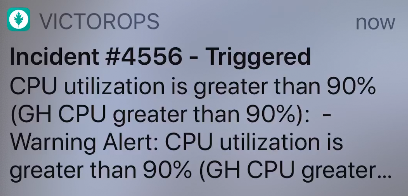
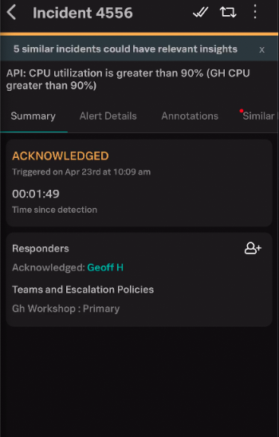
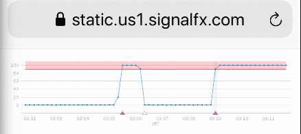
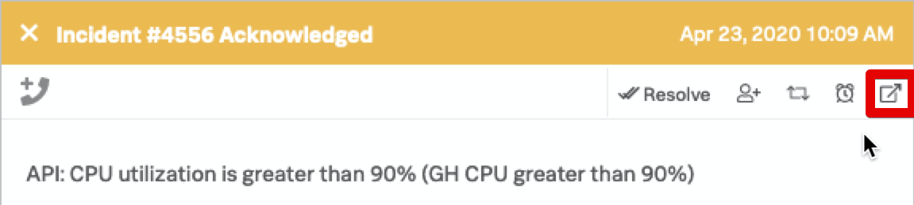

# Managing Incidents

Use your VictorOps App on your phone to acknowledge the Incident by clicking on the **push notification**...

{: .center}

...clicking on the alert...

{: .center}

...then clicking on either the **single tick** in the top right hand corner, or the **Acknowledge** link.  

The :fontawesome-solid-check: will then transform into a :fontawesome-solid-check::fontawesome-solid-check:, and the status will change from **TRIGGERED** to **ACKNOWLEDGED**.

| Single Tick  | Double Tick  |
|---|---|
|{: .center}|{: .center}|

Still on your phone, select the Alert Details tab.  Then on the Web UI, navigate back to **Timeline**, select **Team Incidents** on the right, then select **Acknowledged** and click into the new **Incident**.

You should now have the **Details** tab displayed on both your Phone and the Web UI. Notice how they both show the exact same information.

Now select the **Annotations** tab on both the Phone and the Web UI, you should have a **Graph** displayed in the UI which is generated by SignalFx.  

{: .center}

On your phone click the **Chart Showing Alert** link...

{: .center}

...and you should now get the exact same image on your phone.

{: .center}

VictorOps is a 'Mobile First' platform meaning the phone app is full functionality and you can manage an incident directly from your phone.

For the remainder of this module we will focus on the Web UI however please spend some time later exploring the phone app features.

Sticking with the Web UI, click the **2. Alert Details in SignalFx** link.

{: .center}

This will open a new browser tab and take you directly to the Alert within SignalFx where you could then progress your troubleshooting using the powerful tools built into the SignalFx UI.

However, we are focussing on VictorOps so close this tab and return to the VictorOps UI.

What if VictorOps could identify previous incidents within the system which may give you a clue to the best way to tackle this incident.

The **Similar Incidents** tab does exactly that, surfacing previous incidents allowing you to look at them and see what actions were taken to resolve them, actions which could be easily repeated for this incident.

{: .center}

At the top right in the UI are a number of icons that allow quick access to various actions, click on the far right one which will open this Incident in a new window.

{: .center}

With the Incident expanded, you can see on the right we have a Time Line view where you can add messages and see the history of previous alerts and interactions.

{: .center .zoom}

On the far left you have the option of allocating additional resources to this incident by clicking on the **Add Responders** link.

This allows you build a virtual team specific to this incident by adding other Teams or individual Users, and also share details of a **Conference Bridge** where you can all get together and collaborate.

Close the **Add Responders** dialogue by clicking **Cancel**.

You can also **snooze** this incident for up to 24hrs by clicking on the **alarm clock** in the very top left, or **re-route** it to a different team who may be better placed to deal with this particular incident.

Now lets fix this issue and update the Incident with what we did.  Add a new message at the top right such as **Discovered rogue process, terminated it**.

{: .center}

Now kill off the process we started in the VM to max out the CPU.

Within no greater than 10 seconds SignalFx should detect the new CPU value, clear the alert state in SignalFx, then automatically update the Incident in VictorOps marking it as **Resolved**.

{: .center .zoom}

---

That completes this introduction to VictorOps, but feel free to checkout the more advanced modules which will be published in the coming weeks in the **Optional Modules** section.  These will cover topics such as:

* Reporting
* Using the API
* Webhooks
* Alert Rules Engine
* Maintenance Mode
