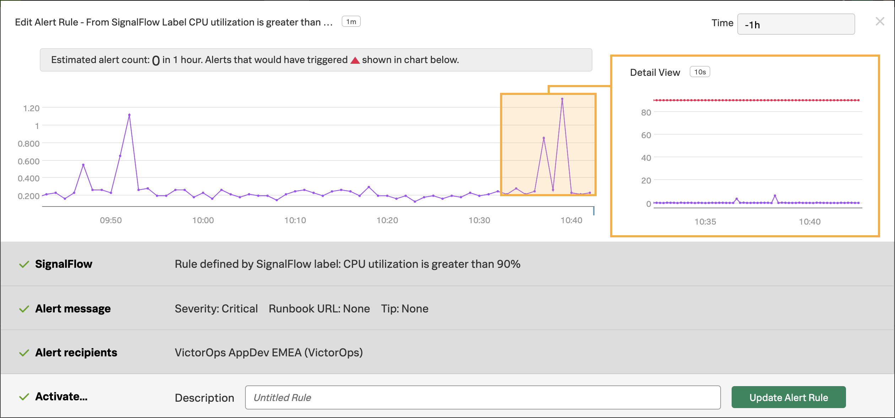
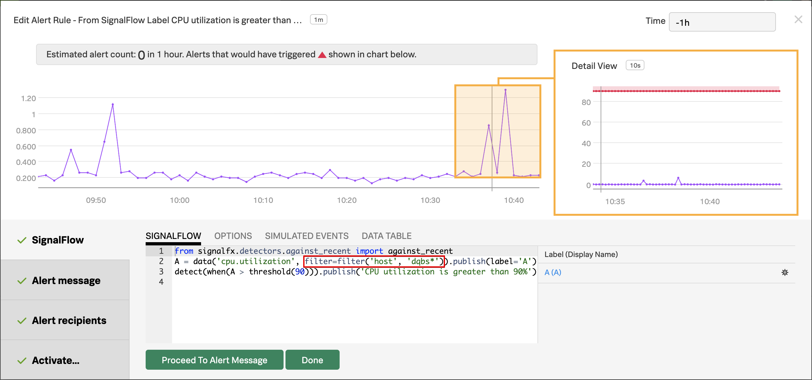
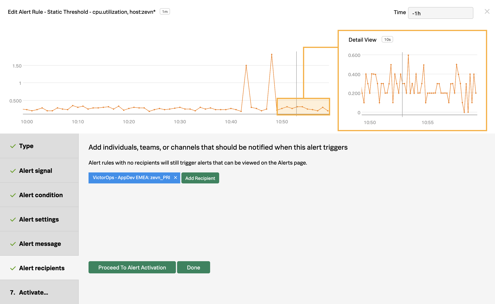

# Create a SignalFx Detector - Lab Summary

We now need to create a new Detector within SignalFx which will use VictorOps as the target to send alerts to.  We will use Terraform installed within your VM to create the Detector for us, but first we need to obtain some values required for Terraform to run.

## 1. Obtain Variables

The presenter will typically share these values with you at the start of the module to save time, but the following instructions explain how to get them for yourself.

### 1.1 Access Token

In the SignalFx UI you can find your Access Token by clicking on the **Settings** icon on the top right of the SignalFx UI, select **Organization Settings → Access Tokens**, expand the Default token, then click on **Show Token** to expose your token.

Click the **Copy** button to copy it to the notepad document you created in the previous step.

{: .zoom}

### 1.2 Realm

Still in the SignalFx UI, click on the **Settings** icon again, but this time select **My Profile**.

The Realm can be found in the middle of the page within the Organizations section. In this example it is **us1**, make a note of this in your notepad document.

{: .zoom}

### 1.3 Create Variable Commands

With all the required values now safely copied into your notepad document you can use them to compile the commands which we will run in your VM in the next step.

Add the following lines to your notepad document, and then add the three values you have collected over the previous steps

=== "Template"

    ``` bash
    export SFXVOPSID={==xxxx==}
    export ACCESS_TOKEN={==xxxx==}
    export REALM={==xxxx==}
    ```

=== "Example"

    ``` bash
    export SFXVOPSID=EYierbGA4AA
    export ACCESS_TOKEN=by78voyt7b.....
    export REALM=us1
    ```

## 2. Set Variables

Switch back to your shell session connected to the VM you created in the **Getting Started/Create a Test Environment** module, all of the following commands will be executed within this instance:

Copy the three commands you just constructed in step 1.3

=== "Example"

    ```bash
    export SFXVOPSID={==xxxx==}
    export ACCESS_TOKEN={==xxxx==}
    export REALM={==xxxx==}
    ```

Next you need to export an environment variable for your Routing Key, as this uses a pre-configured unique instance name for the VM you simply need to run the following command to create it:

=== "Shell Command"

    ```bash
    export ROUTINGKEY=${INSTANCE:0:4}_PRI
    ```

## 3. Initialize Terraform

Still within your VM, switch to the victorops folder where the Terraform config files are located (you should be logged in as Ubuntu and should not have elevated to root)

=== "Change Directory"

    ```bash
    cd ~/workshop/victorops
    ```

Now we can initialize Terraform

=== "Shell Command"

    ```bash
    terraform init -upgrade
    ```

=== "Output"

    ```text
    Initializing the backend...

    Initializing provider plugins...
    - Checking for available provider plugins...
    - Downloading plugin for provider "signalfx" (terraform-providers/signalfx) 4.21.0...

    The following providers do not have any version constraints in configuration,
    so the latest version was installed.

    To prevent automatic upgrades to new major versions that may contain breaking
    changes, it is recommended to add version = "..." constraints to the
    corresponding provider blocks in configuration, with the constraint strings
    suggested below.

    * provider.signalfx: version = "~> 4.21"

    Terraform has been successfully initialized!

    You may now begin working with Terraform. Try running "terraform plan" to see
    any changes that are required for your infrastructure. All Terraform commands
    should now work.

    If you ever set or change modules or backend configuration for Terraform,
    rerun this command to reinitialize your working directory. If you forget, other
    commands will detect it and remind you to do so if necessary.
    ```

Create a new Terraform workspace[^1] which will track the state for this environment.

=== "Shell Command"

    ```text
    terraform workspace new VictorOps
    ```

=== "Output"

    ```text
    Created and switched to workspace "VictorOps"!

    You're now on a new, empty workspace. Workspaces isolate their state,
    so if you run "terraform plan" Terraform will not see any existing state
    for this configuration.
    ```

Check the plan output for errors before typing _**yes**_ to commit the apply.

=== "Shell Command"

    ```text
    terraform apply \
    -var="access_token=$ACCESS_TOKEN" \
    -var="realm=$REALM" \
    -var="sfx_prefix=${INSTANCE:0:4}" \
    -var="sfx_vo_id=$SFXVOPSID" \
    -var="routing_key=$ROUTINGKEY"
    ```

=== "Output"

    ```
    An execution plan has been generated and is shown below.
    Resource actions are indicated with the following symbols:
      + create

    Terraform will perform the following actions:

      # signalfx_detector.cpu_greater_90 will be created
      + resource "signalfx_detector" "cpu_greater_90" {
          + description       = "Alerts when CPU usage is greater than 90%"
          + id                = (known after apply)
          + max_delay         = 0
          + name              = "vmpe CPU greater than 90%"
          + program_text      = <<~EOT
                from signalfx.detectors.against_recent import against_recent
                A = data('cpu.utilization', filter=filter('host', 'vmpe*')).publish(label='A')
                detect(when(A > threshold(90))).publish('CPU utilization is greater than 90%')
            EOT
          + show_data_markers = true
          + time_range        = 3600
          + url               = (known after apply)

          + rule {
              + detect_label          = "CPU utilization is greater than 90%"
              + disabled              = false
              + notifications         = [
                  + "VictorOps,xxx,vmpe_pri",
                ]
              + parameterized_body    = <<~EOT
                    {{#if anomalous}}
                        Rule "{{{ruleName}}}" in detector "{{{detectorName}}}" triggered at {{timestamp}}.
                    {{else}}
                        Rule "{{{ruleName}}}" in detector "{{{detectorName}}}" cleared at {{timestamp}}.
                    {{/if}}
                    
                    {{#if anomalous}}
                      Triggering condition: {{{readableRule}}}
                    {{/if}}
                    
                    {{#if anomalous}}
                      Signal value: {{inputs.A.value}}
                    {{else}}
                      Current signal value: {{inputs.A.value}}
                    {{/if}}
                    
                    {{#notEmpty dimensions}}
                      Signal details: {{{dimensions}}}
                    {{/notEmpty}}
                    
                    {{#if anomalous}}
                      {{#if runbookUrl}}
                        Runbook: {{{runbookUrl}}}
                      {{/if}}
                      {{#if tip}}
                        Tip: {{{tip}}}
                      {{/if}}
                    {{/if}}
                EOT
              + parameterized_subject = "{{ruleSeverity}} Alert: {{{ruleName}}} ({{{detectorName}}})"
              + severity              = "Critical"
            }
        }

    Plan: 1 to add, 0 to change, 0 to destroy.
    
    Do you want to perform these actions in workspace "Workshop"?
      Terraform will perform the actions described above.
      Only 'yes' will be accepted to approve.
    
      Enter a value: yes
    
    signalfx_detector.cpu_greater_90: Creating...
    signalfx_detector.cpu_greater_90: Creation complete after 2s [id=EWHU-YAAAAA]
    
    Apply complete! Resources: 1 added, 0 changed, 0 destroyed.
    ```

---

## 4. Summary

By running Terraform within the VM you have just created a new Detector within SignalFx which will send alerts to VictorOps if the CPU utilization of your specific VM goes above 90%.

Switch to the SignalFx UI, then select **Detectors** from the **ALERTS** menu to show all the Detectors, and find the one matching your **$INSTANCE** value (the first four letters of the name of your VM).

Optionally - Click on **CPU Utilization is greater than 90%** to open the Alert Rule Editor to view its settings.

{: .zoom}

A filter has been used to specifically monitor your VM using the 1st 4 characters of its name, which were randomly assigned when you created the VM.

{: .zoom}

A **Recipient** has been configured using the VictorOps Integration and your **Routing Key** has been specified.  This is how a monitoring system such as SignalFx knows to route Alerts into VictorOps, and ensure they get routed to the correct team.

{: .zoom}

---

You have now configured the Integrations between VictorOps and SignalFx!

The final part of this module is to test the flow of alerts from SignalFx into VictorOps and see how you can manage the incident with both the VictorOps UI and Mobile App.

[^1]:Workspaces allow you to run Terraform against different environments each with their own state data stored in the workspace.
