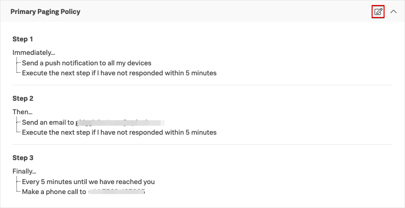
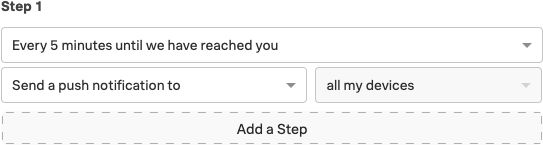
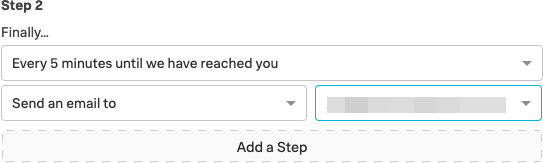
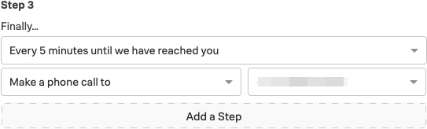
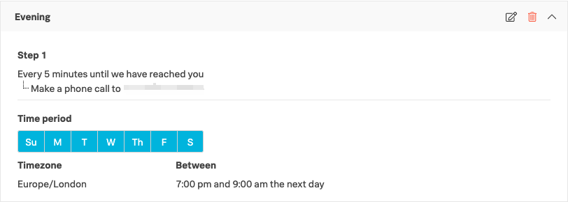
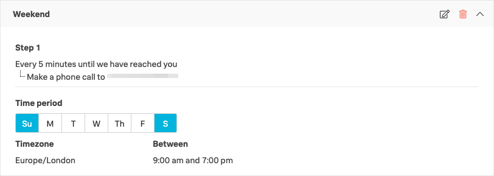

# Paging Polices

Paging Polices specify how you will be contacted by VictorOps when on-call. The Primary Paging Policy will have defaulted to sending you an SMS assuming you added your phone number when activating your account. We will now configure this policy into a three tier multi-stage policy similar to the image below.

Click the edit policy button in the top right corner for the Primary Paging Policy.  

* Step 1
  * Send a push notification to all my devices
  * Execute the next step if I have not responded within 5 minutes

Then add an new step

* Step 2
  * Send an email to [your email address]
  * Execute the next step if I have not responded within 5 minutes

Then add a new step

* Step 3
  * Every 5 minutes until we have reached you
  * Make a phone call to [your phone number]

Then save the policy.

---
Custom Paging Policies

When you are on-call or in the escalation path of an incident, you will receive notifications in this order following these time delays. To cease the paging you must acknowledge the incident. Acknowledgements can occur in one of the following ways:

* Expanding the Push Notification on your device and selecting Acknowledge
* Responding to the SMS with the 5 digit code included
* Pressing 4 during the Phone Call
* Slack Button

For more information on Notification Types, see [here](https://help.victorops.com/knowledge-base/notification-types/).

Custom paging polices enable you to override the primary policy based on the time and day of the week. A good example would be get the system to immediately phone you whenever you get a page during the evening or weekends as this is more likely to get your attention than a push notification.

Create a new Custom Policy by clicking `Add a Policy` and configure with the following settings:

Policy Name: Evening

* Step 1
  * Every 5 minutes until we have reached you
    * Make a phone call to [your phone number]
    * Time Period: All 7 Days
    * Timezone
      * [your time zone]
        * Between 7pm and 9am

Save the policy then add one more

Policy Name: Weekend

* Step 1
  * Every 5 minutes until we have reached you
    * Make a phone call to [your phone number]
    * Time Period: Sat & Sun
    * Timezone
      * [your time zone]
        * Between 9am and 7pm

These custom paging policies will be used during the specified times in place of the Primary Policy, however admins do have the ability to ignore these custom policies, and we will highlight how this is achieved in a later module.

The final option here is the setting for Recovery Notifications.  As these are typically low priority simply sending you an email or a push notification are the typical settings used.

Your profile is now fully configured using these example configurations. Organizations will have different views on how profiles should be configured and will typically issue guidelines for paging policies and times between escalations etc.
