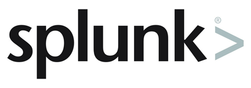

# Splunk Observability Workshop - 11th July 2020

Hi,

Thank you for registering for the Splunk Observability Workshop.

In order to ensure a smooth and enjoyable workshop there are a few prerequisites that need to be completed beforehand.

The workshop relies on using Virtual Machines (VM):

* **SignalFx Workshop** - Deploying SignalFx Smart Agent, running Kubernetes and deploying an instrumented microservice application.
* **VictorOps Workshop** - Deploying the SignalFx Smart Agent

In order to run these VMs, you will need to download and install Multipass ([https://multipass.run](https://mutlipass.run)). Multipass is available for Windows, Linux and MacOS.

Once installed, please create a VM to ensure all is working correctly:

`multipass launch --name ubuntu`

Some people might not be able to install/run Multipass due to restrictions or resource limitations on their laptop/desktop, so AWS/EC2 instances will be made available upon request at the beginning of the Workshop.

We look forward to taking you through the Workshop to see how Splunk, SignalFx and VictorOps can provide Observability for modern applications!

Regards,

## Splunk Observability Team
