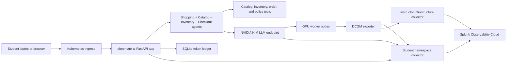

# PLANNING.md

## Goal

Finish and test the original `CLUS-LTROBS-2001` lab build today.

Session:

- `CLUS-LTROBS-2001`
- `From Deployment to Deep Insights: Mastering AI/ML with Cisco AI Pods & Splunk`
- `4-hour instructor-led lab`

The project will use a Cisco AI POD-inspired shared GPU lab, not a copied workshop. The core hands-on workload is a realistic retail AI application that students instrument and monitor with Splunk Observability Cloud.

Students will deploy their own OpenTelemetry Collector for app telemetry and GPU/NIM scraping. The instructor deploys the authoritative Kubernetes/infrastructure collector. Student collectors export directly to Splunk, use unique student/environment tags, receive app telemetry, and scrape shared DCGM/NIM Prometheus metrics.

At the start of the lab, students should understand the outcome: they will instrument a realistic retail AI app, deploy a collector, scrape GPU/NIM metrics, capture safe prompt/response content, visualize the agent flow, diagnose a bounded looping-agent token burn, correlate with instructor-collected Kubernetes metrics, and answer a tokenomics/chargeback question.

## Target Architecture



Minimum infrastructure:

- shared Kubernetes cluster, preferably AWS EKS for the pilot
- `2 x g5.4xlarge` GPU worker nodes
- NVIDIA GPU Operator
- NVIDIA NIM using a small model such as `meta/llama-3.2-1b-instruct`
- instructor-managed Splunk OpenTelemetry Collector for shared infrastructure and GPU metrics
- student-managed OpenTelemetry Collector per namespace using a unique logical `k8s.cluster.name`
- student collectors provide app traces, token metrics, chargeback metrics, safe prompt capture, agent flow visibility, and workshop-compatible GPU/NIM scraping
- Kubernetes metrics are collected only by the instructor collector and correlated by namespace, pod, container, and service attributes
- one namespace per student or team
- one `shopmate-ai` app deployment per student namespace

## What The App Does

The app is a retail shopping assistant with a clean supervisor-based multi-agent pattern. It is not an observability or telemetry app. It behaves like a real e-commerce AI feature that helps customers shop, compare products, check order status, and start returns.

Agents:

- `ShoppingAssistantAgent`: receives the customer request, classifies intent, and coordinates the workflow.
- `CatalogAgent`: searches product catalog data and compares products.
- `InventoryAgent`: checks availability, location, and delivery estimate.
- `CheckoutAgent`: applies promotions, estimates cart value, and creates a mock order.
- `PolicyAgent`: answers return, warranty, and delivery policy questions.
- `CostAgent`: records prompt tokens, completion tokens, estimated AI cost, and chargeback metadata for the lab.

Required app behaviors:

- accept a retail customer-style chat request from a student
- call deterministic tools so traces show agent/tool steps
- call NIM for customer-facing responses
- emit traces for each agent step
- emit token and cost metrics by student/team/namespace
- persist token usage in a ledger
- expose a leaderboard showing which student spent the most tokens
- support scenario triggers for token surge, missing chargeback tags, and bounded agent-loop token burn
- stop loop scenarios with guardrails such as max agent iterations and per-request token budgets

## Tokenomics Story

The lab must make cost visible as telemetry, not as a spreadsheet afterthought.

Required chargeback dimensions:

- `student.id`
- `team.name`
- `department.name`
- `department.cost_center`
- `k8s.namespace.name`
- `chargeback.account`
- `ai.model.name`
- `scenario.name`
- `conversation.id`
- `conversation.turn.index`

Required token metrics:

- `ai.tokens.prompt`
- `ai.tokens.completion`
- `ai.tokens.total`
- `ai.cost.estimated.usd`
- `ai.chargeback.missing_tags`

End-of-class challenge:

Students must answer: "Which department and student spent the most tokens, which conversation caused it, and was the spend properly chargeback-tagged?"

Expected Splunk workflow:

1. Rank total tokens by `department.name`.
2. Rank total tokens by `student.id`.
3. Split prompt tokens vs completion tokens.
4. Filter by `conversation.id` and `scenario.name`.
5. Inspect traces for the most expensive conversation turns.
6. Check whether `chargeback.account` and `department.cost_center` are present and valid.
7. Explain whether the spend came from baseline usage, free conversation, token surge, retry behavior, agent-loop behavior, or missing governance tags.

## Four-Hour Lab Flow

### Module 0: What We Will Accomplish

Duration: `15 minutes`

Student outcome:

- understand the lab goal and final investigation question
- understand the app, collector, GPU/NIM, and Kubernetes telemetry split
- understand what is real vs simulated compared with Cisco AI PODs
- receive student ID, namespace, Splunk access, and app endpoint

Teaching points:

- in this lab, students own app instrumentation and targeted GPU/NIM scraping
- the instructor owns Kubernetes metrics so students can focus on AI observability
- in a real Cisco AI POD, the same method extends to real UCS, Nexus, storage, Kubernetes, GPU, NIM, and app telemetry

### Module 1: Deploy Student Collector And Validate Path

Duration: `30 minutes`

Student outcome:

- deploy a student collector
- confirm direct export to Splunk
- confirm the app can send OTLP to the collector

Hands-on tasks:

- inspect Kubernetes namespace and app pods
- deploy the student collector in the assigned namespace
- set `student.id`, `deployment.environment`, and logical `k8s.cluster.name`
- configure `shopmate-ai` to export OTLP to the student collector
- send a baseline retail request
- verify service traces appear in Splunk

Wait strategy:

- traces should appear quickly
- GPU/NIM dashboards may need 5-10 minutes after scraping starts

### Module 2: Instrument The Retail AI App

Duration: `60 minutes`

Student outcome:

- add AI Agent Monitoring instrumentation to `shopmate-ai`
- capture safe synthetic prompt/response content
- send a request through `shopmate-ai`
- inspect the trace waterfall
- identify shopping assistant, catalog, inventory, checkout, policy, cost, tool, and NIM spans

Hands-on tasks:

- add GenAI workflow instrumentation for the retail request
- add agent invocation instrumentation for catalog, inventory, checkout, policy, and cost steps
- add LLM invocation instrumentation around the NIM call
- enable safe prompt capture with synthetic retail prompts
- add token, cost, student, and chargeback attributes
- add department and conversation-turn attributes
- call `POST /v1/chat`
- find the trace by `student.id`
- inspect prompt and response content where supported
- inspect span attributes for tokens and chargeback
- compare app latency to NIM latency

### Module 3: Add GPU And NIM Scraping

Duration: `40 minutes`

Student outcome:

- scrape shared DCGM and NIM metrics from the student collector
- understand which metrics populate out-of-the-box dashboards
- understand which metrics matter operationally

Hands-on tasks:

- add Prometheus receiver configuration for shared DCGM and NIM endpoints
- apply the workshop-compatible GPU/NIM metric allowlist
- validate metrics arrive under the student's logical environment
- inspect GPU utilization, GPU memory, NIM queueing, NIM latency, and token counters

While Waiting For Dashboards:

- inspect AI Agent Monitoring trace flow
- review collector logs
- review why each GPU/NIM metric matters
- compare trace latency and token attributes before GPU/NIM charts populate

### Module 4: Correlate With Kubernetes And Cisco AI POD Concepts

Duration: `25 minutes`

Student outcome:

- correlate app traces and GPU/NIM metrics with instructor-collected Kubernetes metrics
- understand how the same workflow maps to a real Cisco AI POD

Hands-on tasks:

- filter Kubernetes metrics by `k8s.namespace.name=<student namespace>`
- correlate pod/container behavior with `shopmate-ai` trace latency
- correlate NIM queueing and GPU utilization with app requests
- discuss what Cisco UCS, Nexus, and storage telemetry would add in a real AI POD

### Module 5: Tokenomics And Chargeback Scenario

Duration: `50 minutes`

Student outcome:

- understand how token usage becomes operational and financial telemetry
- run a promo campaign, token surge, or bounded agent-loop token burn
- run a free multi-turn retail conversation
- independently perform a chargeback investigation

Hands-on tasks:

- generate baseline traffic
- run a free multi-turn conversation using the assigned department persona
- trigger promo campaign, token surge, or agent-loop token burn
- compare request count, prompt tokens, completion tokens, estimated cost, NIM latency, and GPU utilization
- identify unattributed spend
- find the department and student who spent the most tokens
- identify the highest-token `conversation.id`
- determine whether the spend was caused by baseline traffic, free conversation, token surge, a bounded agent loop, retries, or missing chargeback tags
- explain which Splunk signals support the conclusion

### Wrap-Up

Duration: `20 minutes`

Student outcome:

- understand what maps to real Cisco AI POD operations
- understand where this lab differs from physical Cisco AI POD telemetry
- know how to extend the pattern to real environments

Total planned time: `240 minutes`

## Parallel Workstreams

Use these workstreams to split development across multiple AI agents. Each workstream can proceed independently after shared contracts are agreed.

### Agent 1: Instructor Lab Setup Agent

Mission:

- build the instructor-owned lab foundation end to end
- create the shared Kubernetes/EKS setup instructions and manifests
- document GPU Operator, NIM, instructor Splunk OTel Collector, namespaces, RBAC, secrets, validation, and teardown
- prepare student namespace templates so students can deploy collectors and apps without cluster-admin work

Inputs:

- `docs/PROJECT_BRIEF.md`
- `docs/REFERENCE_NOTES.md`
- `docs/AGENTIC_APP_PLAN.md`
- `docs/STUDENT_COLLECTOR_PLAN.md`
- `docs/GPU_NIM_METRIC_STRATEGY.md`
- `docs/INSTRUCTOR_LAB_SETUP_AGENT.md`
- `docs/ACCOUNTS_AND_ACCESS_PLAN.md`
- `docs/MINIKUBE_MACOS_TEST_PLAN.md`

Outputs:

- `infra/README.md`
- `infra/accounts-and-access.md`
- `infra/instructor-setup.md`
- `infra/validation.md`
- `infra/teardown.md`
- `infra/terraform/README.md`
- `infra/terraform/*.tf`
- `infra/terraform/backend/dev.hcl.example`
- `infra/terraform/env/dev.tfvars.example`
- `infra/eks/cluster.md`
- `infra/eks/node-groups.md`
- `infra/eks/cost-notes.md`
- `infra/k8s/namespaces.yaml`
- `infra/k8s/rbac-students.yaml`
- `infra/k8s/instructor-collector-values.yaml`
- `infra/k8s/gpu-operator-values.yaml`
- `infra/k8s/student-collector-template.yaml`
- `infra/k8s/student-collector-gpu-nim-scrape-values.yaml`
- `infra/k8s/nim-values.yaml`
- `infra/k8s/shopmate-ai-template.yaml`
- `infra/k8s/secrets-template.yaml`
- `infra/k8s/gpu-validation.md`
- `infra/scripts/create-student-namespaces.sh`
- `infra/scripts/validate-instructor-platform.sh`
- `infra/scripts/validate-student-namespace.sh`
- `infra/scripts/generate-student-roster.sh`
- `local/minikube/README.md`
- `local/minikube/fake-nim.yaml`
- `local/minikube/fake-dcgm-exporter.yaml`
- `local/minikube/student-collector.yaml`
- `local/minikube/shopmate-ai.yaml`
- `local/minikube/validate.sh`

Done when:

- an instructor can create or validate the shared cluster
- GPU nodes are ready
- NVIDIA GPU Operator is installed and healthy
- NIM endpoint is reachable and exposes `/v1/metrics`
- shared GPU telemetry is visible once
- students can deploy namespace collectors without cluster-admin privileges
- student collectors can scrape a limited set of shared DCGM/NIM metrics
- Kubernetes metrics are provided by the instructor collector and filterable by student namespace
- NIM endpoint is reachable inside the cluster
- 20 student namespaces can be generated repeatably
- one test student can deploy collector and app end to end
- teardown instructions prevent leaving GPU instances running
- required placeholders are documented
- accounts, credentials, secrets, and student access steps are documented
- local Minikube path validates app, collector, fake NIM, and fake GPU metrics before EKS is available

### Agent 2: App Agent

Mission:

- implement `shopmate-ai`

Inputs:

- `docs/AGENTIC_APP_PLAN.md`
- this `PLANNING.md`

Outputs:

- `app/README.md`
- `app/src/`
- `app/Dockerfile`
- `app/pyproject.toml` or `app/requirements.txt`
- `app/tests/`

Done when:

- `POST /v1/chat` returns a retail shopping response backed by NIM
- agent spans are emitted
- token usage is counted and persisted
- leaderboard endpoint ranks students by token usage
- baseline, token-surge, and agent-loop-token-burn profiles work locally

### Agent 3: Observability Agent

Mission:

- define Splunk dashboards, metrics, trace filters, and validation queries

Inputs:

- `docs/AGENTIC_APP_PLAN.md`
- `docs/REFERENCE_NOTES.md`
- app metric names from Agent 2

Outputs:

- `observability/README.md`
- `observability/ai-agent-monitoring-validation.md`
- `observability/dashboards/tokenomics-dashboard.md`
- `observability/dashboards/gpu-and-nim-dashboard.md`
- `observability/student-collector-validation.md`
- `observability/trace-queries.md`
- `observability/validation-checklist.md`

Done when:

- app traces can be found by `student.id`
- student collector telemetry path can be validated
- token and cost charts can rank students
- chargeback gaps are visible
- GPU and NIM views support the token surge and agent-loop token burn stories

### Agent 4: Scenario Agent

Mission:

- build the workload generator and scenario controls

Inputs:

- app API contract from Agent 2
- tokenomics requirements from this file

Outputs:

- `scenarios/README.md`
- `scenarios/loadgen.py`
- `scenarios/profiles/baseline.yaml`
- `scenarios/profiles/token-surge.yaml`
- `scenarios/profiles/agent-loop-token-burn.yaml`
- `scenarios/profiles/retry-storm.yaml`
- `scenarios/profiles/missing-chargeback-tags.yaml`

Done when:

- baseline traffic can run for all students
- token surge can be targeted to selected students
- bounded agent-loop token burn can be targeted to selected students and stopped by max-iteration guardrails
- missing chargeback tags can be injected
- final leaderboard produces a non-trivial winner

### Agent 5: Lab Content Agent

Mission:

- turn the design into attendee and instructor-facing lab docs

Inputs:

- this `PLANNING.md`
- `docs/PROJECT_BRIEF.md`
- outputs from Agents 1-4

Outputs:

- `deliverables/lab-guide.md`
- `deliverables/instructor-guide.md`
- `deliverables/topology-and-scenarios.md`
- `deliverables/slide-outline.md`

Done when:

- every module has numbered steps
- every module has expected results
- instructor notes include timing and recovery guidance
- final chargeback challenge is clear and testable

### Agent 6: Validation Agent

Mission:

- test the full flow and record pass/fail results

Inputs:

- all workstream outputs

Outputs:

- `validation/README.md`
- `validation/test-plan.md`
- `validation/results.md`
- `validation/known-issues.md`

Done when:

- local app tests pass
- Kubernetes deployment is validated or documented as pending
- Splunk ingestion is validated or documented as pending
- the final token leaderboard can be reproduced

## Shared Contracts

### Student Identity

Every request must include:

```json
{
  "student_id": "student-01",
  "team": "team-a",
  "department": "marketing",
  "department_cost_center": "cc-4100",
  "namespace": "student-01",
  "chargeback_account": "cb-student-01"
}
```

If `chargeback_account` is missing, the app must still accept the request but emit:

- `chargeback.valid=false`
- `chargeback.account=unattributed`
- increment `ai.chargeback.missing_tags`

### Chat Request Contract

```json
{
  "student_id": "student-01",
  "team": "team-a",
  "department": "marketing",
  "department_cost_center": "cc-4100",
  "namespace": "student-01",
  "chargeback_account": "cb-student-01",
  "conversation_id": "conv-student-01-001",
  "conversation_turn_index": 1,
  "prompt": "Find a waterproof running shoe under $120 and explain why it is a good choice.",
  "scenario": "baseline",
  "max_tokens": 256
}
```

### Agent Loop Scenario Contract

`agent-loop-token-burn` is a controlled scenario, not an unbounded failure.

Trigger it with a contradictory or impossible retail request, for example:

```text
Find waterproof trail running shoes under $40, available today, with carbon plate support, in every color, and explain all alternatives in detail.
```

Expected behavior:

- `CatalogAgent` repeatedly refines search criteria and calls catalog tools.
- Each iteration may call NIM to reason about alternatives or explain why the search failed.
- The app stops after a fixed limit such as `ai.agent.max_iterations=8`.
- The final response explains that the request could not be satisfied within guardrails.

Required loop attributes:

```text
scenario.name=agent-loop-token-burn
ai.agent.name=CatalogAgent
ai.agent.iteration=1..8
ai.agent.max_iterations=8
ai.agent.loop.detected=true
ai.agent.loop.reason=unsatisfiable_catalog_constraints
ai.agent.stop_reason=max_iterations_exceeded
```

Required validation:

- the trace waterfall shows repeated `agent.catalog.search` spans
- repeated `llm.nim.chat_completion` spans appear under the same `conversation.id`
- token metrics identify wasted prompt and completion tokens
- the leaderboard can identify the student and conversation affected by the loop
- chargeback metadata still shows whether the spend was attributable

### Chat Response Contract

```json
{
  "request_id": "uuid",
  "student_id": "student-01",
  "answer": "Short retail assistant response",
  "usage": {
    "prompt_tokens": 120,
    "completion_tokens": 80,
    "total_tokens": 200,
    "estimated_cost_usd": 0.00012
  },
  "chargeback": {
    "account": "cb-student-01",
    "valid": true
  }
}
```

### Leaderboard Response Contract

```json
{
  "window": "lab",
  "rankings": [
    {
      "student_id": "student-07",
      "team": "team-c",
      "department": "marketing",
      "department_cost_center": "cc-4100",
      "total_tokens": 18420,
      "estimated_cost_usd": 0.011052,
      "top_conversation_id": "conv-student-07-003",
      "top_scenario": "agent-loop-token-burn",
      "chargeback_account": "cb-student-07"
    }
  ]
}
```

## Implementation Order For Today

1. Lock metric names, span attributes, and request contracts in docs.
2. Build minimal FastAPI app locally with fake NIM mode.
3. Add NIM real mode behind `NIM_BASE_URL` and `NIM_API_KEY`.
4. Add OpenTelemetry tracing, GenAI instrumentation, and custom metrics.
5. Add safe prompt capture for synthetic retail prompts.
6. Add namespace collector deployment manifest.
7. Add workshop-compatible DCGM/NIM scrape config.
8. Add SQLite token ledger and leaderboard.
9. Add baseline, token-surge, and agent-loop-token-burn load generator profiles.
10. Containerize app.
11. Create Kubernetes manifests.
12. Deploy app and student collector to test namespace.
13. Validate traces, AI Agent Monitoring, and GPU/NIM metrics through the student collector into Splunk.
14. Validate instructor-collected Kubernetes metrics filtered by student namespace.
15. Write attendee lab steps for Modules 1-5.
16. Run the final chargeback challenge and record expected answers.

## Same-Day Minimum Viable Scope

If time becomes constrained, ship this:

- FastAPI retail AI app
- fake NIM mode plus real NIM config hooks
- OTel traces with agent spans
- safe prompt capture for synthetic retail prompts
- namespace-scoped student collector
- workshop-compatible student GPU/NIM scrape configuration
- token metrics by student
- SQLite leaderboard
- baseline loadgen
- token-surge loadgen
- agent-loop-token-burn loadgen
- Kubernetes deployment manifest
- lab guide covering validation, traces, tokenomics, and leaderboard challenge

Defer this if needed:

- polished UI
- retry-storm scenario
- storage simulation
- Cisco UCS/Nexus synthetic metrics
- advanced dashboard packaging

## Validation Checklist

Local validation:

- `POST /healthz` returns success.
- `POST /v1/chat` returns a response in fake NIM mode.
- token ledger records prompt, completion, and total tokens.
- leaderboard ranks at least three synthetic students.
- token surge creates a clear leaderboard winner.
- agent-loop-token-burn creates repeated `CatalogAgent` and NIM spans before max-iteration stop.

Kubernetes validation:

- student collector pod starts.
- app pod starts.
- app can reach the student collector.
- app can reach NIM endpoint or fake mode is enabled.
- app includes `student.id` and namespace attributes.
- student collector receives traces and metrics.
- instructor collector provides Kubernetes metrics filtered by the student's namespace.
- Splunk receives traces and metrics directly from the student collector.

Splunk validation:

- traces are searchable by `student.id`.
- spans show all agent steps.
- AI workflow, agent invocation, and LLM invocation spans are visible.
- token metrics can be grouped by `student.id`.
- token metrics can be grouped by `department.name`.
- token metrics can be grouped by `conversation.id`.
- estimated cost can be grouped by `chargeback.account`.
- missing chargeback tags are visible.
- token surge correlates with higher latency or GPU/NIM pressure.
- agent-loop-token-burn traces show repeated agent iterations, loop detection, and wasted tokens.

## Locked Decisions

- one app per student namespace for the workshop
- one namespace-scoped collector per student for the workshop
- student collectors export directly to Splunk Observability Cloud
- instructor provides Splunk realm and access token
- students run the lab from their own laptops
- `student.id` as the main tenancy boundary
- fake NIM mode for local tests
- real NIM mode for cluster tests
- mimic the original workshop NIM shape where possible: shared NIM operator/runtime with `meta/llama-3.2-1b-instruct` exposed on `/v1/metrics`
- park Cisco UCS/Nexus synthetic metrics and revisit only if core app, GPU, NIM, and tokenomics work end to end

## Remaining Open Decisions

- exact Kubernetes distribution and implementation path: EKS with NVIDIA GPU Operator is the current preference
- Terraform is the implementation path for AWS infrastructure lifecycle
- exact DNS/ingress pattern for one app per student namespace
- exact student credential distribution process for Kubernetes and Splunk
- exact instructor Kubernetes dashboard filters and validation queries
