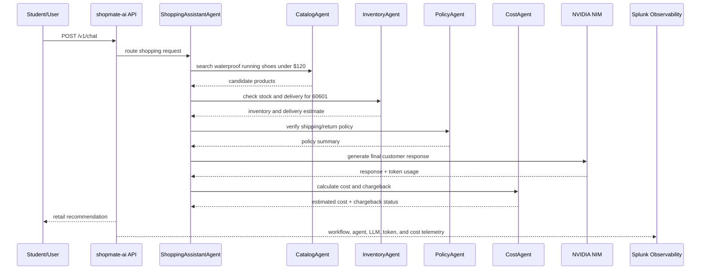
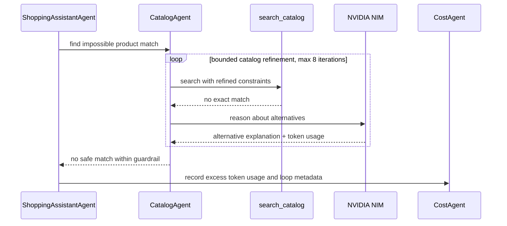

# Agent Flow Example

## Purpose

This document describes the concrete `shopmate-ai` agent flow that students will instrument and inspect during the workshop.

The app is a retail shopping assistant. It is not an observability chatbot. The observability work is added around the app so students learn how a real AI application is instrumented.

## Example Student Prompt

```text
Find a waterproof running shoe under $120, check if it can arrive by Friday in zip code 60601, and explain why it is a good choice.
```

## Expected Agent Flow



## Trace Shape Students Should See

The trace should show one workflow with child agent and LLM spans:

```text
Workflow: shopmate_shopping_request
  AgentInvocation: ShoppingAssistantAgent
    AgentInvocation: CatalogAgent
      Tool: search_catalog
    AgentInvocation: InventoryAgent
      Tool: check_inventory
      Tool: estimate_delivery
    AgentInvocation: PolicyAgent
      Tool: lookup_policy
    LLMInvocation: nvidia_nim.chat_completion
    AgentInvocation: CostAgent
      Tool: record_usage
```

## Span Attributes

### Workflow attributes

```text
workflow.name=shopmate_shopping_request
workflow.type=retail_ai_assistant
student.id=student-01
team.name=team-a
department.name=marketing
department.cost_center=cc-4100
k8s.namespace.name=student-01
deployment.environment=student-01
k8s.cluster.name=clus-ltrobs-2001-student-01
service.name=shopmate-ai
retail.intent=product_recommendation
conversation.id=conv-student-01-001
conversation.turn.index=1
chargeback.account=cb-student-01
chargeback.valid=true
```

### Agent attributes

```text
ai.agent.name=CatalogAgent
ai.agent.type=tool_using_agent
retail.product.category=running_shoes
retail.price.max=120
```

### LLM attributes

```text
ai.model.name=meta/llama-3.2-1b-instruct
ai.provider=nvidia_nim
ai.operation=chat
ai.prompt.tokens=180
ai.completion.tokens=120
ai.total.tokens=300
ai.estimated.cost.usd=0.00018
```

## Multi-Turn Conversation Example

Students will run a free multi-turn conversation to generate realistic token usage.

Example:

```text
Turn 1: I am planning a weekend hiking trip. Recommend waterproof shoes under $120.
Turn 2: Compare the top two options and explain which one is better for rain.
Turn 3: Add socks and a lightweight jacket that match the recommendation.
Turn 4: Can all items arrive by Friday in zip code 60601?
Turn 5: Summarize this as a short gift recommendation for a marketing email.
```

Each turn should carry:

```text
conversation.id=conv-student-01-001
conversation.turn.index=1..5
department.name=marketing
department.cost_center=cc-4100
student.id=student-01
```

This lets the final exercise rank token usage by department, student, and conversation.

## Agent Loop Token Burn Example

The lab includes a bounded failure scenario called `agent-loop-token-burn`.

Example prompt:

```text
Find waterproof trail running shoes under $40, available today, with carbon plate support, in every color, and explain all alternatives in detail.
```

Expected loop flow:



The trace should make the failure obvious:

```text
Workflow: shopmate_shopping_request
  AgentInvocation: ShoppingAssistantAgent
    AgentInvocation: CatalogAgent iteration=1
      Tool: search_catalog
      LLMInvocation: nvidia_nim.chat_completion
    AgentInvocation: CatalogAgent iteration=2
      Tool: search_catalog
      LLMInvocation: nvidia_nim.chat_completion
    ...
    AgentInvocation: CatalogAgent iteration=8
      Tool: search_catalog
      LLMInvocation: nvidia_nim.chat_completion
    AgentInvocation: CostAgent
      Tool: record_usage
```

Required loop attributes:

```text
scenario.name=agent-loop-token-burn
ai.agent.name=CatalogAgent
ai.agent.iteration=1..8
ai.agent.max_iterations=8
ai.agent.loop.detected=true
ai.agent.loop.reason=unsatisfiable_catalog_constraints
ai.agent.stop_reason=max_iterations_exceeded
```

Students should confirm that the loop consumed extra tokens but stopped at a guardrail, rather than behaving like an infinite loop.

## Prompt Capture Decision

For the lab, we will capture safe synthetic prompt and response content so students can see the agent flow clearly.

Guardrails:

- use only fictional retail prompts
- do not ask students to enter real customer, payment, health, or personal data
- keep prompts short
- clearly explain that production environments must review privacy, compliance, and retention rules before enabling prompt capture
- disable or reduce content capture if payload size or privacy concerns appear

Recommended lab setting:

```text
OTEL_INSTRUMENTATION_GENAI_CAPTURE_MESSAGE_CONTENT=SPAN_ONLY
```

If the environment requires full event-based conversation detail for a specific AI Agent Monitoring feature, the instructor can test:

```text
OTEL_INSTRUMENTATION_GENAI_CAPTURE_MESSAGE_CONTENT=SPAN_AND_EVENT
```

Use `SPAN_AND_EVENT` only with safe synthetic prompts and after validating payload size and UI behavior.

## What This Would Look Like In A Real Cisco AI POD

In a real Cisco AI POD deployment:

- the retail app or enterprise AI app would run on AWS EKS backed by Cisco AI POD-inspired GPU infrastructure
- NVIDIA GPUs would be physical GPUs in Cisco UCS servers
- NIM or another model server would expose inference and token metrics
- DCGM would expose GPU telemetry from real hardware
- Splunk would correlate app traces, NIM metrics, GPU metrics, Kubernetes metrics, and Cisco infrastructure telemetry
- UCS, Nexus, and storage telemetry would add physical platform context that this lab intentionally parks for later

In this lab:

- we use shared cloud GPU nodes instead of Cisco UCS GPU servers
- students instrument a realistic retail app
- students scrape shared DCGM/NIM metrics
- instructor collects Kubernetes metrics centrally
- Cisco UCS/Nexus/storage metrics are parked
