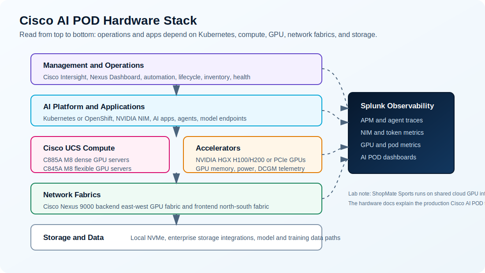

# Appendix: AI POD Hardware Docs

## Goal

Use this appendix when you want to connect the hands-on lab to the physical Cisco AI POD hardware story.

The workshop uses the same operational investigation path you would use around a production AI POD: start from an AI application, inspect the model-serving layer, check GPU behavior, review Kubernetes health, and use Splunk to connect the evidence. The hardware references below show how that workflow maps to a full Cisco AI POD deployment with UCS, Nexus, storage, and management integrations.

## Hardware Reference Links

| Hardware area | Official reference | Why it matters |
| --- | --- | --- |
| Full AI POD training architecture | [Cisco AI POD for Enterprise Training and Fine-Tuning Design Guide](https://www.cisco.com/c/en/us/td/docs/unified_computing/ucs/UCS_CVDs/cisco_ai_pod_for_training_design.html) | Best single reference for the production AI POD design: scale units, UCS GPU servers, Nexus fabrics, and training/fine-tuning architecture |
| AI POD product overview | [Cisco AI PODs data sheet](https://www.cisco.com/c/en/us/products/collateral/servers-unified-computing/ucs-x-series-modular-system/ai-pods-ds.html) | High-level product positioning, platform support, scale, Intersight management, and Cisco/NVIDIA validated-design context |
| Dense GPU compute | [Cisco UCS C885A M8 Rack Server Data Sheet](https://www.cisco.com/c/en/us/products/collateral/servers-unified-computing/ucs-c-series-rack-servers/ucs-c885a-m8-ds.html) | Dense 8-GPU server reference for AI training, fine-tuning, large inference, and high-bandwidth east-west GPU networking |
| Flexible GPU compute | [Cisco UCS C845A M8 Rack Server Data Sheet](https://www.cisco.com/c/en/us/products/collateral/servers-unified-computing/ucs-c-series-rack-servers/ucs-c845a-m8-rack-server-ds.pdf) | Flexible GPU server reference for inference, RAG, fine-tuning, and variable 2/4/6/8 GPU configurations |
| NVIDIA 2-8-9-400 architecture | [Cisco AI POD Infrastructure for the NVIDIA 2-8-9-400 Enterprise Reference Architecture](https://www.cisco.com/c/en/us/products/collateral/servers-unified-computing/ai-pod-ucs-c885a-servers-nexus-9364e--sg2-switches.html) | Explains a production pattern with UCS C885A M8 servers, Nexus 9364E-SG2 switches, backend/frontend fabrics, and rail-optimized scale units |
| Data center switching | [Cisco Nexus 9000 Series Switches](https://www.cisco.com/site/us/en/products/networking/cloud-networking-switches/nexus-9000-switches/index.html) | Nexus 9000 is the switching family used for AI POD network fabrics; current product pages describe 1G through 800G data center switching options |
| AI/ML fabric features | [Cisco Nexus 9400 Series Switches Data Sheet](https://www.cisco.com/c/en/us/products/collateral/switches/nexus-9000-series-switches/nexus9400-series-switches-ds.html) | Useful for understanding AI/ML networking capabilities such as flow control, congestion behavior, telemetry, MACsec, and high-density data center switching |
| AI Defense on AI PODs | [AI Defense on Cisco AI PODs Reference Architecture](https://www.cisco.com/c/en/us/td/docs/unified_computing/ucs/UCS_CVDs/AI_defense_on_Cisco_AI_PODs_reference_architecture.html) | Optional security architecture context for running AI Defense validation/runtime components on AI PODs with Red Hat OpenShift |
| Splunk monitoring setup | [Monitor Cisco AI PODs with Splunk Observability Cloud](https://help.splunk.com/en/splunk-observability-cloud/observability-for-ai/splunk-ai-infrastructure-monitoring/set-up-ai-infrastructure-monitoring/cisco-ai-pods) | Lists Splunk-supported Cisco AI POD components: UCS, Nexus, NVIDIA GPU, NVIDIA NIM, NetApp, and Pure Storage |
| Splunk dashboard workflow | [Monitor the performance of Cisco AI PODs](https://help.splunk.com/en/splunk-observability-cloud/observability-for-ai/splunk-ai-infrastructure-monitoring/monitor-and-troubleshoot-your-ai-infrastructure/monitor-the-performance-of-cisco-ai-pods) | Shows how to access the built-in `AI Pod overview` dashboard and explains that not all tabs apply to every environment |

## What Each Hardware Layer Means

| Layer | Production AI POD meaning | Lab mapping |
| --- | --- | --- |
| Cisco UCS GPU servers | Physical compute nodes that host GPUs, CPUs, memory, local storage, and high-speed NICs | Simulated by shared GPU-backed Kubernetes worker capacity |
| NVIDIA GPUs | Accelerators for training, fine-tuning, RAG, and inference workloads | Observed through DCGM metrics and NIM behavior |
| Cisco Nexus backend fabric | East-west network for GPU-to-GPU and node-to-node AI workload traffic | Discussed conceptually; not configured in the hands-on lab |
| Cisco Nexus frontend fabric | North-south network for management, storage, orchestration, and service access | Discussed conceptually; Kubernetes ingress/services provide the lab access path |
| Cisco Intersight | Infrastructure management, inventory, health, and automation surface | Production management context for UCS hardware and inventory |
| Nexus Dashboard | Operational and automation surface for network fabrics | Production management context for network-fabric operations |
| Storage integrations | Data path for model artifacts, datasets, vector stores, and enterprise storage | Extension path for environments that include enterprise storage telemetry |
| Splunk Observability Cloud | Monitoring layer for app traces, AI agent telemetry, GPU/NIM metrics, Kubernetes metrics, and AI POD dashboards | Central tool students use throughout the workshop |

## Scale Unit Concept

Cisco AI POD designs use scale units as repeatable building blocks. The design guide describes scale units that combine Cisco UCS GPU servers with pairs of Cisco Nexus switches so the deployment can grow predictably.

In practical terms:

- a dense server such as the Cisco UCS C885A M8 can provide eight GPUs per node
- a flexible server such as the Cisco UCS C845A M8 can support smaller or varied GPU configurations
- Nexus switches provide the backend and frontend fabrics needed to scale beyond one server
- the scale unit is the repeatable unit of compute plus network capacity

This lab keeps the scale-unit idea lightweight. You do not design a physical scale unit here; you learn the monitoring path operators use after the platform exists.

## What To Remember

The hardware docs are background material for the operator story. You can complete the commands with the core lab environment, then use these references to understand how the same signals expand in a production AI POD.

| If you see this signal | Hardware question it answers |
| --- | --- |
| `DCGM_FI_DEV_GPU_UTIL` | Are the accelerators doing useful work? |
| GPU memory metrics | Is model or workload capacity pressuring GPU memory? |
| NIM queue or latency metrics | Is inference waiting on model-serving capacity? |
| Kubernetes pod health | Is the app platform healthy enough to use the hardware? |
| Agent spans and token metrics | Is the business workflow creating unnecessary model demand? |
| Nexus/UCS/storage metrics, if enabled | Is the physical AI POD layer contributing to the issue? |

## Lab To Production

In this workshop, you practice the Cisco AI POD monitoring workflow with the core signals available in the lab: app traces, AI agent telemetry, NIM metrics, GPU metrics, Kubernetes health, and Splunk dashboards.

A full Cisco AI POD observability deployment can add UCS hardware, Nexus fabric, storage, Intersight, Nexus Dashboard, and AI Defense telemetry. Those signals extend the same investigation path rather than changing the workflow.

Keep the sequence simple: start with the user request, inspect the app and agent behavior, drill into model-serving and GPU evidence, check Kubernetes health, then add physical infrastructure signals when the environment provides them.
