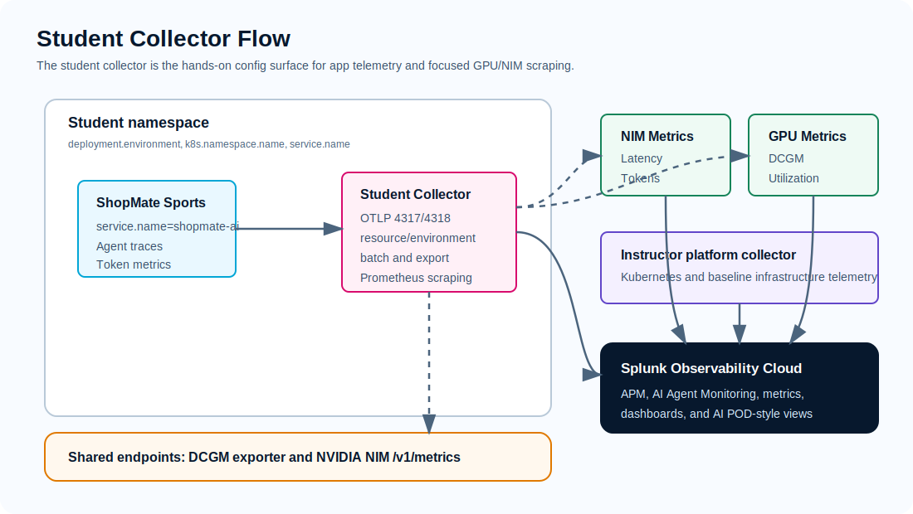
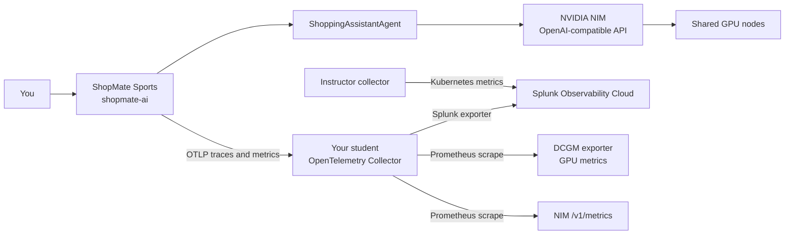

# Data Journey

## Goal

Follow one request from the ShopMate Sports assistant app into Splunk, then drill from the app trace into NIM and GPU signals in an AI POD-style monitoring workflow.

This page explains the full path. The module pages give you the detailed commands.

## Signal Path





## Configuration Sessions

Use this page as the map. Run configuration only in the module that owns that task.

| Session | Where to configure it | What changes | First evidence to expect |
| --- | --- | --- | --- |
| Lab identity and access | [Prerequisites](prerequisites.md#set-your-lab-variables) | Exports `STUDENT_ID`, `STUDENT_NAMESPACE`, `LOGICAL_CLUSTER_NAME`, `COLLECTOR_CHART`, and the preloaded Secret name | You can run namespace-scoped `kubectl` commands |
| Baseline collector | [Module 1](module-1-collector.md) | Creates and deploys `student-collector-values.yaml` with OTLP receivers, `resource/environment`, trace exporters `otlp_http` and `signalfx`, and metrics exporter `signalfx` | Collector pod is ready; no GPU or NIM scrape jobs yet |
| App and NIM instrumentation | [Module 2](module-2-app-instrumentation.md) | Deploys ShopMate Sports, points it at `student-collector:4318`, sets `deployment.environment`, and enables NIM/OpenAI-compatible instrumentation | APM trace for `service.name=shopmate-ai` under your environment |
| GPU and NIM scraping | [Module 3](module-3-gpu-nim-scraping.md) | Adds `DCGM_SCRAPE_TARGET`, `NIM_SCRAPE_TARGET`, `prometheus/gpu_nim`, and a separate filtered `metrics/gpu_nim` pipeline while keeping OTLP app metrics unfiltered | Metrics with `job=dcgm` and `job=nim` after several scrape intervals; GenAI app metrics continue to feed AI Agent Monitoring |
| Correlation | [Module 4](module-4-correlation.md) | No new configuration; use the trace timestamp to inspect app, NIM, GPU, and Kubernetes signals | One explanation that ties request latency or token use to lower-layer evidence |
| Tokenomics | [Module 5](module-5-tokenomics.md) | No new configuration; use the existing trace and metric dimensions | Highest-token environment view and supporting trace evidence |

## What Appears When

| Point in the lab | Expected in Splunk | Not expected yet |
| --- | --- | --- |
| After Module 1 | Collector is running, but no ShopMate trace exists until the app sends traffic | `service.name=shopmate-ai`, `job=nim`, `job=dcgm` |
| After Module 2 | ShopMate traces and app metrics under `deployment.environment=<your student id>` | GPU/DCGM and Prometheus-scraped NIM metrics |
| After Module 3 | App traces plus `job=nim` and `job=dcgm` metrics under the same environment | UCS, Nexus, storage, and other full AI POD infrastructure tabs unless the instructor enabled those integrations |

## Splunk Filters

Start broad, then narrow:

```text
service.name=shopmate-ai
deployment.environment=<your student id>
```

For metrics, Splunk may also show the mapped dimensions:

```text
sf_service=shopmate-ai
sf_environment=<your student id>
```

For GPU and NIM metrics after Module 3:

```text
deployment.environment=<your student id> job=nim
deployment.environment=<your student id> job=dcgm
```

Use a recent time range, such as the last 15 minutes, when validating a request you just made. App traces can appear before GPU/NIM scrape metrics because scrape jobs run on intervals.

## Drill Down In Splunk

Use the trace timestamp from the request you generated in [Module 2](module-2-app-instrumentation.md#step-5-use-the-shopmate-sports-website).

| View | What to filter | What it tells you |
| --- | --- | --- |
| APM trace | `service.name=shopmate-ai`, `deployment.environment` | Which API, assistant, or LLM span consumed time and tokens |
| AI Agent Monitoring | `deployment.environment`, `service.name` | Workflow shape, agent calls, LLM calls, token behavior |
| NIM metrics | `deployment.environment`, `job=nim`, model label if present | Inference latency, active requests, queued requests, token throughput |
| GPU metrics | `deployment.environment`, `job=dcgm`, GPU label if present | GPU utilization, memory, temperature, power, tensor activity |
| Kubernetes views | `k8s.namespace.name`, `service.name` | Whether the app pod was restarting or resource constrained |
| Cisco AI POD dashboard | search `Cisco AI PODs`, open `AI Pod overview` | AI POD-style infrastructure view where the available metrics match the dashboard |

Dashboard panels populate according to the integrations that are enabled in the environment. In the core lab, use the app, NIM, GPU, Kubernetes, and tokenomics views as the primary drilldown. In a full AI POD deployment, UCS, Nexus, storage, and vector database telemetry add more infrastructure evidence to the same workflow.

## Explain The Finding

A complete finding connects evidence across layers:

```text
Trace:
API or assistant span:
LLM/NIM span:
Prompt tokens:
Completion tokens:
NIM latency or queue:
GPU utilization and memory:
Kubernetes pod health:
Likely cause:
Recommended action:
```

!!! success "Checkpoint"
    You can explain how telemetry moved from the assistant app to your collector, how the collector exported it to Splunk, and how a single trace led you to NIM and GPU evidence.
