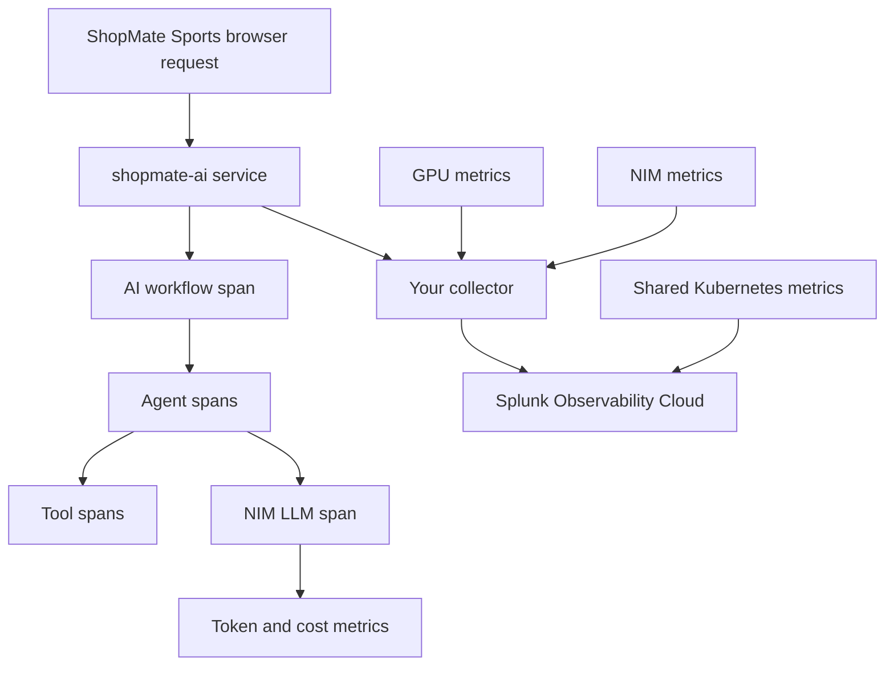

# 0. Orientation

## Goal

Understand the lab environment before you touch the collector or app.

You are working in a shared Cisco AI POD-inspired environment. The platform is already running. Your task is to observe an AI workload like an operator would.

The AI workload is the **ShopMate Sports** retail website. Students use the browser storefront and assistant. The Kubernetes deployment and Splunk service name may still be `shopmate-ai`.

## AI PODs In Plain English

A Cisco AI POD is a repeatable infrastructure design for AI work. It combines GPU servers, high-speed network fabrics, storage, Kubernetes or OpenShift, model-serving software, and operations tools.

In this lab, the production hardware details are background. The hands-on lesson is the GPU-centered monitoring workflow:

```text
ShopMate request -> AI agents -> NVIDIA NIM -> GPUs -> Splunk drilldown
```

That is the path you will practice. When something is slow or expensive, you will ask whether the cause is the app workflow, the model-serving layer, GPU pressure, or Kubernetes health.

## What Is Already Running

The shared lab environment includes:

- Kubernetes with GPU worker nodes
- NVIDIA GPU Operator
- DCGM exporter for GPU metrics
- NVIDIA NIM for model inference
- ShopMate Sports, the retail AI workload
- Splunk Observability Cloud
- shared Kubernetes/platform telemetry

You will not build those platform pieces during the lab.

## What You Will Control

Inside your namespace, you will work with:

- your student OpenTelemetry Collector
- your ShopMate Sports telemetry configuration
- your standard environment filter
- your Splunk filters, dashboards, and trace searches
- scenario traffic for tokenomics and agent-loop analysis

## Signal Map



## What To Look For During The Lab

As you move through the modules, keep asking:

- Did the request reach the app?
- Did the app emit workflow, agent, tool, and LLM spans?
- Did token metrics include `deployment.environment`?
- Did NIM latency or GPU utilization change during token-heavy work?
- Did an agent loop burn tokens before guardrails stopped it?
- Can you explain the final token usage result with evidence?

## AI POD Mapping


| Lab Signal | Production AI POD Meaning |
| --- | --- |
| App traces | User-visible AI workflow and application behavior |
| NIM metrics | Model-serving throughput, latency, queueing, and errors |
| DCGM metrics | GPU utilization, memory, temperature, power, and accelerator activity |
| Kubernetes metrics | Pod health, resource pressure, scheduling, and restarts |
| Token metrics | AI cost, model demand, and environment-level usage evidence |

This lab starts with the core signals every AI operator needs: the user request, app traces, model-serving behavior, GPU metrics, Kubernetes health, and token usage. In a full Cisco AI POD deployment, Cisco UCS, Nexus, storage, Intersight, Nexus Dashboard, and AI Defense telemetry extend the same reasoning model with physical infrastructure evidence.

For more hardware context after the main lab flow, use the [AI POD hardware appendix](appendix-ai-pod-hardware.md).

## Checkpoint

Before continuing, you should be able to say:

- what the ShopMate Sports website does
- where your collector fits
- what the final tokenomics question asks

## Knowledge Check

??? question "Why is the retail app not an observability chatbot?"
    The lab is more realistic when the app behaves like a normal business AI feature. Observability is what you add around the app.

??? question "What is the difference between a token surge and an agent loop?"
    A token surge can be legitimate high demand. An agent loop is repeated orchestration work, such as repeated catalog searches and NIM calls, that burns tokens before a guardrail stops it.
