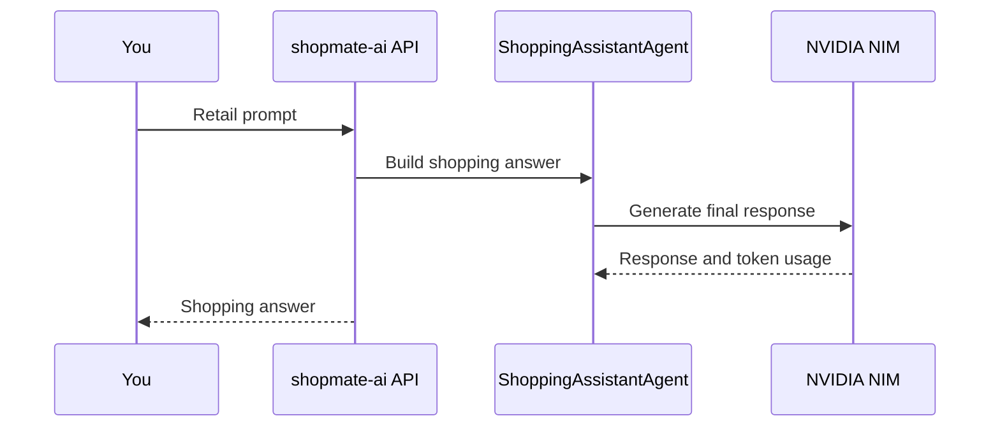

# 2. App Instrumentation

## Goal

Verify that the ShopMate Sports web app emits AI workflow telemetry that you can inspect in Splunk Observability Cloud.

You should finish this module with one complete trace that shows:

- the retail request
- the ShopMate API span
- OpenAI-compatible assistant or agent activity
- the NIM-backed LLM call
- prompt and response content for safe synthetic prompts
- token metrics
- the standard `deployment.environment` resource attribute

## The App Flow

The student-facing website is the ShopMate Sports storefront. In Kubernetes it can still be deployed as the `shopmate-ai` service so Splunk sees a stable service name, but students interact with the retail website in the browser.

The baseline lab image uses a simple ShopMate assistant path backed by the OpenAI Agents SDK and NVIDIA NIM. If the instructor enables tool routing, additional CatalogAgent, PolicyAgent, and tool spans can appear; do not block the baseline validation on those optional spans.



## Step 1: Deploy The App

Apply the [ShopMate Sports manifest](lab-files/shopmate-ai.yaml) you downloaded from the lab guide:

```bash
kubectl apply -n "$STUDENT_NAMESPACE" -f shopmate-ai.yaml
kubectl rollout status deploy/shopmate-ai -n "$STUDENT_NAMESPACE"
```

Expected result:

- `deployment/shopmate-ai` exists in your namespace
- service `shopmate-ai` exposes port `8080`

## Step 2: Point The App At Your Collector

Your app should export OTLP to the collector service in your namespace.

```bash
export OTEL_SERVICE_NAME=shopmate-ai
export OTEL_EXPORTER_OTLP_ENDPOINT=http://student-collector:4318
export OTEL_EXPORTER_OTLP_PROTOCOL=http/protobuf
```

Apply those values to the Kubernetes deployment unless the lab manifest already includes them:

```bash
kubectl set env deploy/shopmate-ai -n "$STUDENT_NAMESPACE" \
  OTEL_SERVICE_NAME="$OTEL_SERVICE_NAME" \
  OTEL_EXPORTER_OTLP_ENDPOINT="$OTEL_EXPORTER_OTLP_ENDPOINT" \
  OTEL_EXPORTER_OTLP_PROTOCOL="$OTEL_EXPORTER_OTLP_PROTOCOL"
```

Expected result:

- app telemetry goes to your collector
- your collector exports to Splunk

What these variables mean:

| Variable | Meaning | Splunk result |
| --- | --- | --- |
| `OTEL_SERVICE_NAME` | Sets the logical OpenTelemetry service name | Appears as `service.name=shopmate-ai` or the lab-provided service name in APM and trace search |
| `OTEL_EXPORTER_OTLP_ENDPOINT` | Base OTLP endpoint used by the app exporter | Sends app traces and metrics to your collector service |
| `OTEL_EXPORTER_OTLP_PROTOCOL` | OTLP transport and encoding | `http/protobuf` targets the collector OTLP HTTP receiver on port `4318` |

References:

- OpenTelemetry documents the OTLP endpoint and protocol environment variables in [OTLP Exporter Configuration](https://opentelemetry.io/docs/concepts/sdk-configuration/otlp-exporter-configuration/).
- OpenTelemetry defines SDK environment variable parsing rules in [Environment Variable Specification](https://opentelemetry.io/docs/specs/otel/configuration/sdk-environment-variables/).

Debug if telemetry does not arrive:

```bash
kubectl get svc -n "$STUDENT_NAMESPACE" student-collector
kubectl logs -n "$STUDENT_NAMESPACE" deploy/shopmate-ai --tail=100
kubectl logs -n "$STUDENT_NAMESPACE" deploy/student-collector --tail=100
```

If you see connection refused or DNS errors, confirm the collector service exists and the app is in the same namespace.

## Step 3: Set The Environment Filter

The app should include the standard OpenTelemetry environment attribute:

```bash
export OTEL_RESOURCE_ATTRIBUTES="deployment.environment=${STUDENT_ID}"
```

Apply the resource attribute to the app deployment:

```bash
kubectl set env deploy/shopmate-ai -n "$STUDENT_NAMESPACE" \
  OTEL_RESOURCE_ATTRIBUTES="$OTEL_RESOURCE_ATTRIBUTES"
```

In Splunk, you should be able to filter traces by:

```text
service.name=shopmate-ai
deployment.environment=<your student id>
```

Important mapping:

| Attribute | Splunk UI use |
| --- | --- |
| `service.name` | APM service map, service filters, trace search |
| `deployment.environment` | APM environment filter and related content |

Do not add custom resource attributes unless the lab instructor explicitly provides them. Extra dimensions can make app metrics harder to find and can exceed Splunk metric dimension limits.

## Step 4: Confirm GenAI Instrumentation

ShopMate Sports uses the OpenAI Agents SDK pointed at the NIM OpenAI-compatible endpoint. Splunk zero-code OpenAI and OpenAI Agents instrumentation should emit GenAI workflow, agent, and LLM telemetry without adding tracing calls to the app code.

Expected instrumentation settings:

```bash
export NIM_BASE_URL=http://nim-service.nim-system.svc.cluster.local:8000/v1
export NIM_MODEL=meta/llama-3.2-1b-instruct
export OTEL_INSTRUMENTATION_GENAI_EMITTERS=span_metric
export OTEL_INSTRUMENTATION_GENAI_CAPTURE_MESSAGE_CONTENT=SPAN_ONLY
export OTEL_EXPORTER_OTLP_METRICS_TEMPORALITY_PREFERENCE=delta
```

Apply the GenAI and NIM values to the app deployment:

```bash
kubectl set env deploy/shopmate-ai -n "$STUDENT_NAMESPACE" \
  NIM_BASE_URL="$NIM_BASE_URL" \
  NIM_MODEL="$NIM_MODEL" \
  OTEL_INSTRUMENTATION_GENAI_EMITTERS="$OTEL_INSTRUMENTATION_GENAI_EMITTERS" \
  OTEL_INSTRUMENTATION_GENAI_CAPTURE_MESSAGE_CONTENT="$OTEL_INSTRUMENTATION_GENAI_CAPTURE_MESSAGE_CONTENT" \
  OTEL_EXPORTER_OTLP_METRICS_TEMPORALITY_PREFERENCE="$OTEL_EXPORTER_OTLP_METRICS_TEMPORALITY_PREFERENCE"
kubectl rollout status deploy/shopmate-ai -n "$STUDENT_NAMESPACE"
```

If the NIM endpoint requires an API key, the instructor-provided manifest should mount it from a Kubernetes Secret. Do not paste shared NIM credentials into screenshots, public notes, or chat windows.

!!! warning "Prompt Capture"
    Only use fictional retail prompts. Prompt text is lab telemetry.

What these GenAI variables do:

| Variable | Lab value | Meaning | Splunk result |
| --- | --- | --- | --- |
| `NIM_BASE_URL` | NIM `/v1` endpoint | Points the OpenAI-compatible client at NIM. | LLM spans represent NIM-backed model calls |
| `NIM_MODEL` | lab model name | Selects the NIM model. | Model name appears on GenAI/OpenAI spans where supported |
| `OTEL_INSTRUMENTATION_GENAI_EMITTERS` | `span_metric` | Controls which GenAI telemetry emitters are active. `span_metric` emits spans and metrics for workflows, agents, and LLM calls. | Enables trace waterfalls and token metrics for AI Agent Monitoring/APM views |
| `OTEL_INSTRUMENTATION_GENAI_CAPTURE_MESSAGE_CONTENT` | `SPAN_ONLY` | Captures safe prompt and response content on spans only. | Lets you inspect synthetic prompts in trace details without also creating event copies |
| `OTEL_EXPORTER_OTLP_METRICS_TEMPORALITY_PREFERENCE` | `delta` | Requests delta temporality for OTLP metrics. | Helps Splunk process counter-style metric streams such as token counts |

The app must be started with `opentelemetry-instrument` after installing `shopmate-sports/requirements.txt`, which includes `splunk-otel-instrumentation-openai` and `splunk-otel-instrumentation-openai-agents`.

```bash
opentelemetry-instrument python shopmate-sports/server.py
```

In Kubernetes, this should already be part of the lab-provided container command or entrypoint. You normally validate it from telemetry and logs rather than running this command on your laptop.

This keeps the code path realistic: ShopMate Sports calls NIM through OpenAI-compatible SDKs, and Splunk-supported zero-code instrumentation observes those libraries.

References:

- Splunk AI Agent Monitoring setup: [Set up AI Agent Monitoring](https://help.splunk.com/en/splunk-observability-cloud/observability-for-ai/splunk-ai-agent-monitoring/set-up-ai-agent-monitoring).
- Splunk Python GenAI configuration: [Configure the Python agent for AI applications 0.1.14 and higher](https://help.splunk.com/en/splunk-observability-cloud/observability-for-ai/splunk-ai-agent-monitoring/configure-ai-agent-monitoring/configure-the-python-agent-for-ai-applications-0.1.14-and-higher).
- Splunk zero-code instrumentation: [Zero-code instrumentation](https://help.splunk.com/en/splunk-observability-cloud/observability-for-ai/splunk-ai-agent-monitoring/set-up-ai-agent-monitoring/zero-code-instrumentation).

## Step 5: Use The ShopMate Sports Website

Open the ShopMate Sports website from your workstation:

```bash
kubectl port-forward -n "$STUDENT_NAMESPACE" svc/shopmate-ai 8080:8080
```

Leave that command running, then open:

```text
http://127.0.0.1:8080/
```

In the website:

1. Search or filter products.
2. Open one product detail.
3. Add one product to the cart.
4. Open the ShopMate assistant.
5. Send a baseline retail prompt.

Suggested baseline prompt:

```text
Find a waterproof hiking jacket under $200, check inventory, and explain the return policy.
```

Expected result:

- the website returns a shopping answer
- the token meter updates
- the NIM status shows `NIM live` for the NIM-backed trace and token exercises
- telemetry appears in Splunk after the app and collector export path is working

If the status shows `Local mode`, the storefront still works, but NIM-backed LLM spans and NIM token metrics will not prove the AI Agent Monitoring path. Check `NIM_BASE_URL`, NIM credentials, and the app logs before continuing.

??? tip "Optional API Debug"
    Use this only if the browser path is not working and you need to test the backend directly.

    ```bash
    curl -sS -X POST "http://127.0.0.1:8080/api/chat" \
      -H "content-type: application/json" \
      -d '{
        "message": "Find a waterproof hiking jacket under $200, check inventory, and explain the return policy.",
        "history": []
      }' | jq
    ```

Debug the request path:

```bash
kubectl get pods -n "$STUDENT_NAMESPACE" -l app=shopmate-ai
kubectl logs -n "$STUDENT_NAMESPACE" deploy/shopmate-ai --tail=100
kubectl describe deploy/shopmate-ai -n "$STUDENT_NAMESPACE"
```

Reset the app if you changed its configuration incorrectly:

```bash
kubectl rollout restart deploy/shopmate-ai -n "$STUDENT_NAMESPACE"
kubectl rollout status deploy/shopmate-ai -n "$STUDENT_NAMESPACE"
```

If the deployment is broken, reapply the [baseline manifest](lab-files/shopmate-ai.yaml):

```bash
kubectl apply -n "$STUDENT_NAMESPACE" -f shopmate-ai.yaml
```

## Step 6: Inspect The Trace

In Splunk Observability Cloud:

1. Open APM or trace search.
2. Filter by `service.name=shopmate-ai` or the service name provided by the instructor.
3. Add `deployment.environment=<your student id>`.
4. Open the latest trace.

Confirm the trace includes:

- `shopmate.workflow`
- `shopmate.agent.CatalogAgent`, `shopmate.agent.InventoryAgent`, `shopmate.agent.PolicyAgent`, `shopmate.agent.CheckoutAgent`, `shopmate.agent.CostAgent`, and `shopmate.agent.ShoppingAssistantAgent` when tool routing is enabled
- `ShoppingAssistantAgent`
- OpenAI/OpenAI Agents SDK spans generated by Splunk zero-code instrumentation
- NIM-backed LLM call spans
- prompt tokens, completion tokens, and total tokens
- `deployment.environment`

If your instructor enabled tool routing, the custom `shopmate.agent.*` spans should show the app-owned workflow structure in the waterfall. OpenAI Agents SDK, tool, and NIM spans should appear inside or near those steps depending on the installed instrumentation version.

The Agent Flow should use the zero-code OpenAI Agents SDK spans. The custom `shopmate.*` spans use app-specific attributes, not `gen_ai.*` agent attributes, so they add context without creating duplicate Agent Flow nodes.

If the trace is missing:

```bash
kubectl get deploy,svc,pod -n "$STUDENT_NAMESPACE" -l app=shopmate-ai
kubectl get deploy shopmate-ai -n "$STUDENT_NAMESPACE" \
  -o jsonpath='{range .spec.template.spec.containers[0].env[*]}{.name}={.value}{"\n"}{end}' \
  | sort
kubectl logs -n "$STUDENT_NAMESPACE" deploy/shopmate-ai --tail=100
kubectl logs -n "$STUDENT_NAMESPACE" deploy/student-collector --tail=100
```

Confirm these values before searching Splunk again:

```text
OTEL_SERVICE_NAME=shopmate-ai
OTEL_EXPORTER_OTLP_ENDPOINT=http://student-collector:4318
OTEL_EXPORTER_OTLP_PROTOCOL=http/protobuf
OTEL_RESOURCE_ATTRIBUTES=deployment.environment=<your student id>
```

Then check Splunk with a wider time range, for example the last 15 minutes, and filter only by `service.name=shopmate-ai` before adding `deployment.environment`.

!!! success "Checkpoint"
    You can explain the path from user prompt to agents to NIM to token accounting.

## Step 7: Exercise: Why Add Custom Workflow Spans?

Zero-code instrumentation shows what the SDK and model did. Custom instrumentation shows what the application meant.

Keep the two layers separate: Agent Flow should come from zero-code OpenAI Agents SDK spans, while custom `shopmate.*` spans should remain app context in the trace waterfall.

For this lab, the app adds a small readable backbone:

| Span | Meaning |
| --- | --- |
| `shopmate.workflow` | One shopper request from start to final response |
| `shopmate.agent.CatalogAgent` | Catalog search and tradeoffs |
| `shopmate.agent.InventoryAgent` | Stock, pickup, and delivery context |
| `shopmate.agent.PolicyAgent` | Returns, fit, shipping, and policy context |
| `shopmate.agent.CheckoutAgent` | Demo cart and checkout caveats |
| `shopmate.agent.CostAgent` | Tokenomics context |
| `shopmate.agent.ShoppingAssistantAgent` | Final coordinator response |

The exercise is to open one trace and answer:

1. Which spans came from the app's custom instrumentation?
2. Which spans came from Splunk zero-code OpenAI/OpenAI Agents instrumentation?
3. Where do you see the final response preview?
4. Where do you see the NIM model call and token data?

Keep the conclusion simple: custom spans make the workflow understandable; zero-code spans and metrics show the model and SDK details. Do not add `gen_ai.*` agent attributes to custom app spans, or Splunk can show duplicate agent nodes.

## Step 8: Trigger A More Expensive Multi-Agent Request

In the ShopMate assistant, send a deliberately difficult request:

```text
Find waterproof trail running shoes under $40, available today, with carbon plate support, in every color, and explain all alternatives in detail.
```

Expected result:

- the request returns instead of running forever
- the trace shows OpenAI Agents SDK activity
- the trace shows NIM-backed LLM activity
- token usage is higher than the baseline request

Reset if the app stops responding:

```bash
kubectl rollout restart deploy/shopmate-ai -n "$STUDENT_NAMESPACE"
```

## Knowledge Check

??? question "What span tells you the model was called?"
    The LLM invocation span, expected here as `llm.nim.chat_completion`.

??? question "What proves the token burn was caused by an agent loop?"
    Look for the `shopmate.workflow` span, repeated `shopmate.agent.*` steps, OpenAI Agents SDK activity, NIM spans, and higher token metrics.

## Troubleshooting

If no traces or token metrics appear, use the [troubleshooting appendix](appendix-troubleshooting.md#app-instrumentation-issues).
