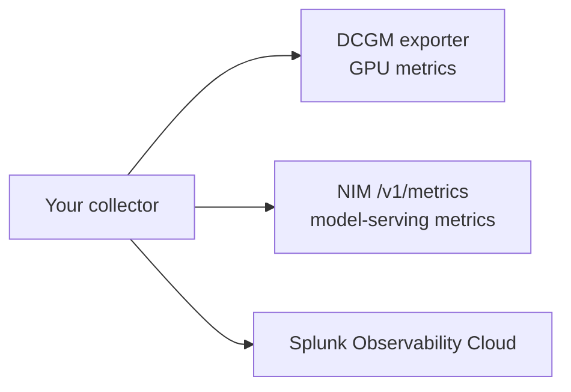

# 3. GPU And NIM Scraping

## Goal

Add Prometheus scraping to your collector for selected GPU and NVIDIA NIM metrics.

This gives you a view of model-serving and accelerator behavior during the same time window as your app traces.


## What You Are Scraping



The GPU and NIM endpoints are shared by the class. Your primary Splunk filter is the standard OpenTelemetry `deployment.environment` value assigned to your lab environment.

## Step 1: Confirm The Scrape Targets

Set the targets provided for the lab:

```bash
export DCGM_SCRAPE_TARGET=nvidia-dcgm-exporter.gpu-operator.svc.cluster.local:9400
export NIM_SCRAPE_TARGET=nim-service.nim-system.svc.cluster.local:8000
```

Test DCGM:

```bash
kubectl run scrape-test -n "$STUDENT_NAMESPACE" --rm -it --restart=Never \
  --image=curlimages/curl:8.10.1 -- \
  curl -sS "http://${DCGM_SCRAPE_TARGET}/metrics"
```

Test NIM:

```bash
kubectl run nim-test -n "$STUDENT_NAMESPACE" --rm -it --restart=Never \
  --image=curlimages/curl:8.10.1 -- \
  curl -sS "http://${NIM_SCRAPE_TARGET}/v1/metrics"
```

Expected result:

- both commands return Prometheus-formatted metrics

Cleanup the temporary test pods if they are left behind:

```bash
kubectl delete pod scrape-test nim-test -n "$STUDENT_NAMESPACE" --ignore-not-found
```

Debug if a target fails:

```bash
kubectl get pods -n "$STUDENT_NAMESPACE" -o wide
kubectl run dns-test -n "$STUDENT_NAMESPACE" --rm -it --restart=Never \
  --image=busybox:1.36 -- nslookup "$(echo "$DCGM_SCRAPE_TARGET" | cut -d: -f1)"
```

If DNS works but curl fails, the issue is likely service port, path, or NetworkPolicy.

## Step 2: Snapshot The Current Collector File

This module is a collector config file change. Open the same `student-collector-values.yaml` file you edited and deployed in Module 1.

First, save the baseline so you can show the before/after difference:

```bash
cp student-collector-values.yaml student-collector-values.before-gpu-nim.yaml
grep -n "prometheus/gpu_nim\\|filter/gpu_nim_allowlist\\|DCGM_SCRAPE_TARGET\\|NIM_SCRAPE_TARGET" student-collector-values.yaml \
  || echo "No GPU/NIM scrape config yet"
```

Expected result:

- the file has no `prometheus/gpu_nim` receiver yet
- the file has no `filter/gpu_nim_allowlist` processor yet
- the file has no `DCGM_SCRAPE_TARGET` or `NIM_SCRAPE_TARGET` collector pod environment values yet

If those entries already exist, you may be holding the completed collector file instead of the Module 1 baseline. Ask the instructor before continuing.

Use [collector-observability-snippet.yaml](lab-files/collector-observability-snippet.yaml) as the reference for the sections you add in the next steps.

If your file gets tangled, compare it with the complete reference values file: [student-collector-values-gpu-nim-reference.yaml](lab-files/student-collector-values-gpu-nim-reference.yaml). The reference file is not personalized; replace the `<STUDENT_ID>`, `<STUDENT_NAMESPACE>`, `<LOGICAL_CLUSTER_NAME>`, `<SPLUNK_ACCESS_TOKEN_SECRET>`, and `<SPLUNK_REALM>` placeholders before using it.

## Step 3: Add Scrape Target Environment Values

Append the GPU and NIM targets to `gateway.extraEnvs`. Keep the existing `STUDENT_ID`, `STUDENT_NAMESPACE`, and `LOGICAL_CLUSTER_NAME` entries from Module 1.

```yaml
gateway:
  extraEnvs:
    # Keep the Module 1 student identity entries above these values.
    - name: DCGM_SCRAPE_TARGET
      value: nvidia-dcgm-exporter.gpu-operator.svc.cluster.local:9400
    - name: NIM_SCRAPE_TARGET
      value: nim-service.nim-system.svc.cluster.local:8000
```

These values become environment variables inside the collector pod. The Prometheus receiver uses them so the scrape targets are easy to find and change without rewriting the receiver body.

## Step 4: Add Prometheus Receiver Jobs

Your collector should include scrape jobs like this:

```yaml
receivers:
  prometheus/gpu_nim:
    config:
      scrape_configs:
        - job_name: dcgm
          scrape_interval: 60s
          static_configs:
            - targets:
                - ${env:DCGM_SCRAPE_TARGET}
        - job_name: nim
          scrape_interval: 60s
          metrics_path: /v1/metrics
          static_configs:
            - targets:
                - ${env:NIM_SCRAPE_TARGET}
```

How this maps to the collector:

| Config | Meaning |
| --- | --- |
| `prometheus/gpu_nim` | A named Prometheus receiver instance inside the collector |
| `job_name: dcgm` | Adds a scrape job label for GPU metrics |
| `job_name: nim` | Adds a scrape job label for NIM metrics |
| `scrape_interval: 60s` | Controls collection frequency and ingest volume |
| `metrics_path: /v1/metrics` | Uses the NIM Prometheus endpoint |

Make sure the receiver is also activated in a metrics pipeline. Defining a receiver without adding it to a pipeline is a common collector mistake.

## Step 5: Keep The Metric Set Focused

Use a focused GPU allowlist:

```text
DCGM_FI_DEV_GPU_UTIL
DCGM_FI_DEV_FB_USED
DCGM_FI_DEV_FB_FREE
DCGM_FI_DEV_GPU_TEMP
DCGM_FI_DEV_POWER_USAGE
DCGM_FI_PROF_GR_ENGINE_ACTIVE
DCGM_FI_PROF_PIPE_TENSOR_ACTIVE
```

Use NIM metrics that explain:

- request rate
- active and waiting requests
- request latency
- time to first token
- prompt tokens
- generation tokens
- errors

This keeps the lab fast and avoids flooding Splunk with duplicate metrics from every student.

Add the allowlist processor to the collector config:

```yaml
processors:
  filter/gpu_nim_allowlist:
    metrics:
      include:
        match_type: regexp
        metric_names:
          - ^DCGM_FI_DEV_(GPU_UTIL|FB_USED|FB_FREE|GPU_TEMP|POWER_USAGE)$
          - ^DCGM_FI_PROF_(GR_ENGINE_ACTIVE|PIPE_TENSOR_ACTIVE)$
          - ^(vllm[:_])?(num_requests_running|num_requests_waiting|prompt_tokens_total|generation_tokens_total|request_success_total|request_failure_total|request_finish_total|e2e_request_latency_seconds|time_to_first_token_seconds|time_per_output_token_seconds|request_prompt_tokens|request_generation_tokens|gpu_cache_usage_perc)$
          - ^http\.server\.active_requests$
```

Reference:

- Splunk AI Infrastructure Monitoring uses the Splunk Distribution of OpenTelemetry Collector for AI infrastructure data integrations: [Set up AI Infrastructure Monitoring](https://help.splunk.com/en/splunk-observability-cloud/observability-for-ai/splunk-ai-infrastructure-monitoring/set-up-ai-infrastructure-monitoring).
- Splunk AI Agent Monitoring requires histogram metrics for the AI pages and documents `send_otlp_histograms: true` on the SignalFx exporter: [Set up AI Agent Monitoring](https://help.splunk.com/en/splunk-observability-cloud/observability-for-ai/splunk-ai-agent-monitoring/set-up-ai-agent-monitoring).
- Splunk Collector troubleshooting lists common reasons a collector does not receive, process, or export data: [Troubleshoot the Splunk OpenTelemetry Collector](https://help.splunk.com/en?resourceId=gdi_opentelemetry_splunk-collector-troubleshooting).
- Splunk's Cisco AI-ready POD examples show Prometheus receivers and metric filtering for NVIDIA/NIM-style collection: [Cisco AI-ready PODs collector values](https://github.com/signalfx/splunk-opentelemetry-examples/blob/main/collector/cisco-ai-ready-pods/otel-collector/values.yaml).

## Step 6: Wire The Receiver Into The Metrics Pipeline

Update the same collector config file you used in Module 1.

Keep the existing app OTLP metrics pipeline unfiltered, and add a second pipeline for GPU/NIM scrape metrics.

This separation matters. The `filter/gpu_nim_allowlist` processor only allows selected DCGM and NIM metric names. If you put `otlp` and `prometheus/gpu_nim` in the same filtered metrics pipeline, GenAI token, request, latency, and error metrics from ShopMate are dropped before Splunk AI Agent Monitoring can use them.

Also keep the SignalFx exporter configured for OTLP histograms. AI Agent Monitoring uses GenAI histogram metrics for its overview, agents, latency, token, and cost pages. Without this flag, traces can exist while the AI Overview and AI Agents pages still show zeroes.

```yaml
exporters:
  signalfx:
    send_otlp_histograms: true
```

```yaml
service:
  pipelines:
    metrics:
      receivers: [otlp]
      processors: [memory_limiter, resource/environment, batch]
      exporters: [signalfx]
    metrics/gpu_nim:
      receivers: [prometheus/gpu_nim]
      processors: [memory_limiter, resource/environment, filter/gpu_nim_allowlist, batch]
      exporters: [signalfx]
```

What changed:

| Change | Result |
| --- | --- |
| `DCGM_SCRAPE_TARGET` and `NIM_SCRAPE_TARGET` env values | The collector pod knows which shared endpoints to scrape |
| `prometheus/gpu_nim` receiver | The collector scrapes DCGM and NIM Prometheus endpoints |
| existing `metrics` pipeline | Continues to export unfiltered OTLP app and GenAI metrics |
| new `metrics/gpu_nim` pipeline | Activates the Prometheus scrape receiver |
| `filter/gpu_nim_allowlist` processor | Limits only GPU/NIM scrape metrics so duplicate lab ingest stays controlled |
| `send_otlp_histograms: true` | Preserves GenAI histogram metrics for Splunk AI Agent Monitoring |
| existing `resource/environment` processor | GPU/NIM metrics carry your lab environment value |

Before you redeploy, check that the file change activated the targets, receiver, processor, and pipeline:

```bash
grep -n "send_otlp_histograms\\|prometheus/gpu_nim\\|filter/gpu_nim_allowlist\\|DCGM_SCRAPE_TARGET\\|NIM_SCRAPE_TARGET" student-collector-values.yaml
diff -u student-collector-values.before-gpu-nim.yaml student-collector-values.yaml
```

Expected result:

- the diff shows new `DCGM_SCRAPE_TARGET` and `NIM_SCRAPE_TARGET` entries in `gateway.extraEnvs`
- the `prometheus/gpu_nim` receiver is defined
- the existing `metrics` pipeline still lists only `receivers: [otlp]`
- the new `metrics/gpu_nim` pipeline lists `receivers: [prometheus/gpu_nim]`
- only the `metrics/gpu_nim` pipeline includes `filter/gpu_nim_allowlist`
- `send_otlp_histograms: true` is present under `exporters.signalfx`

If any of those checks are hard to interpret, download [student-collector-values-gpu-nim-reference.yaml](lab-files/student-collector-values-gpu-nim-reference.yaml) and compare your file against it section by section.

This is the core configuration change for the module. Be ready to explain it before moving on: you added two scrape targets, added one Prometheus receiver, preserved unfiltered app metrics, limited the GPU/NIM metric set, and activated the receiver in its own metrics pipeline.

## Step 7: Redeploy The Collector Config

Redeploy the collector with Helm:

```bash
helm upgrade --install student-collector "$COLLECTOR_CHART" \
  --namespace "$STUDENT_NAMESPACE" \
  --values student-collector-values.yaml
```

Then restart and validate the rollout:

```bash
kubectl rollout restart deploy/student-collector -n "$STUDENT_NAMESPACE"
kubectl rollout status deploy/student-collector -n "$STUDENT_NAMESPACE"
kubectl logs deploy/student-collector -n "$STUDENT_NAMESPACE" --tail=100
```

Wait at least three scrape intervals. With a 60-second scrape interval, expect 3 to 5 minutes before charts look populated.

For a failed collector restart, inspect the logs and generated config:

```bash
kubectl logs deploy/student-collector -n "$STUDENT_NAMESPACE" --previous --tail=100
kubectl describe deploy/student-collector -n "$STUDENT_NAMESPACE"
kubectl get configmap -n "$STUDENT_NAMESPACE" student-collector-otel-collector -o yaml
```

Reset this step:

```bash
helm rollback student-collector -n "$STUDENT_NAMESPACE"
```

Fallback: rebuild `student-collector-values.yaml` from the Module 1 baseline snippet, then rerun the Helm upgrade.

## Step 8: Validate The Difference In Splunk

This is the first time you should expect `job=nim` and `job=dcgm` metrics in Splunk for your student environment. Module 1 only proved that the collector gateway was healthy; after the collector restart and three scrape intervals, the new GPU/NIM scrape metrics should appear.

Filter by:

```text
deployment.environment=<your student id>
```

In Metrics search, look for these dimensions and signals:

| Signal | Why It Matters |
| --- | --- |
| `DCGM_FI_DEV_GPU_UTIL` | Whether inference uses GPU resources |
| `DCGM_FI_DEV_FB_USED` | GPU memory pressure |
| `DCGM_FI_PROF_PIPE_TENSOR_ACTIVE` | Accelerator activity |
| NIM request latency | Model-serving experience |
| NIM queue or active request metrics | Inference pressure |
| NIM token metrics | Demand created by prompts and completions |

Use these searches first:

```text
deployment.environment=<your student id> job=nim
deployment.environment=<your student id> job=dcgm
```

Splunk filtering tips:

| Signal | Useful filters or group-bys |
| --- | --- |
| GPU metrics | `deployment.environment`, `job=dcgm`, GPU/device label if present |
| NIM metrics | `deployment.environment`, `job=nim`, `model`, `instance` if present |
| App traces | `service.name=shopmate-ai` or the lab-provided ShopMate service name, `deployment.environment` |
| Kubernetes views | `k8s.namespace.name`, `k8s.pod.name`, `service.name` |

!!! success "Checkpoint"
    You can explain the collector diff and can see new GPU and NIM metrics under your lab environment in Splunk Observability Cloud.

## Knowledge Check

??? question "Why are GPU metrics logically isolated but not physically isolated?"
    The class shares GPU infrastructure. Your collector attaches your environment value to the scraped metrics, but the hardware is shared.

??? question "Why use a metric allowlist?"
    It controls duplicate ingest and keeps the lab focused on signals that explain GPU pressure, NIM latency, and token demand.

## Troubleshooting

If scrape targets are unreachable or dashboards stay empty, use the [troubleshooting appendix](appendix-troubleshooting.md#gpu-and-nim-issues).
