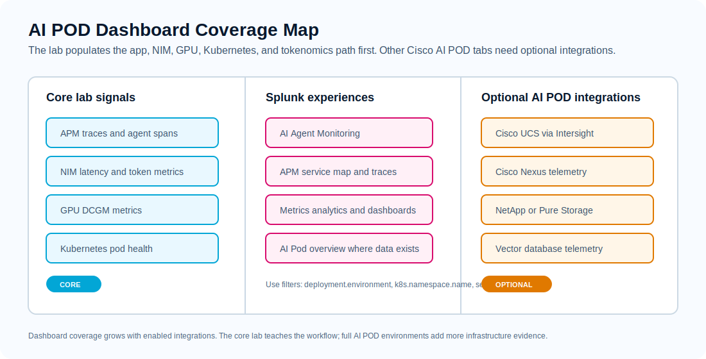
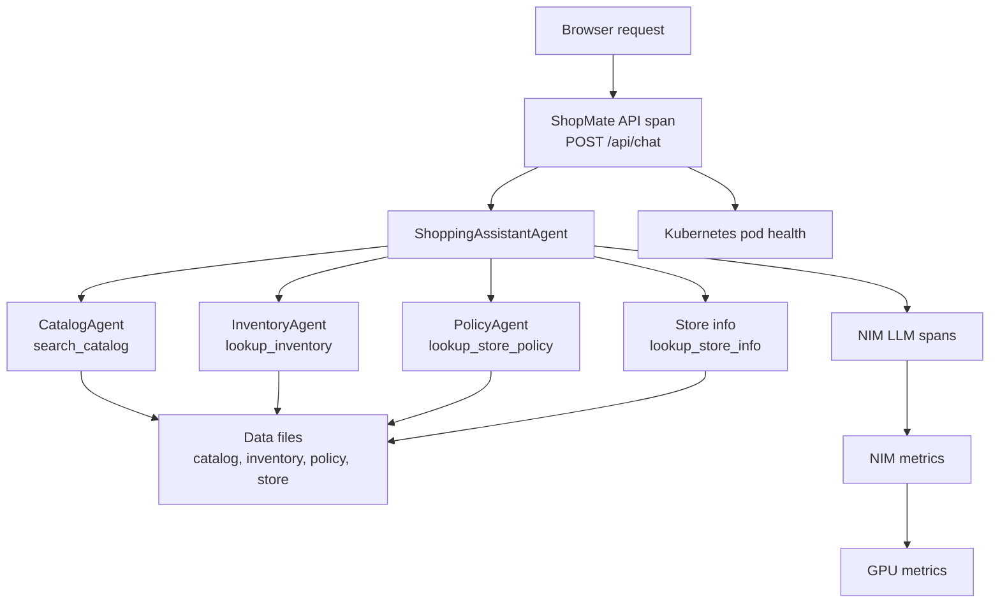

# 4. Correlation

## Goal

Use Splunk Observability Cloud to follow one ShopMate Sports request from the browser, through the assistant workflow, into NIM, GPU, and Kubernetes evidence.

This is the operator workflow: start with one user-visible request, then explain what happened across the application, model-serving, and platform layers.

Use the [Data Journey](data-journey.md) as the map for this module. Module 4 does not add new collector configuration; it uses the telemetry you already enabled.



## Correlation Path



## Step 1: Generate A Correlation Request

Open the ShopMate Sports website from Module 2 and send this request:

```text
Find me wide running shoes with good stability, and explain the pickup or delivery options.
```

Expected response:

- products from the demo catalog, such as `RoadFlow 880` and `TrailRidge GTX`
- inventory examples from demo locations
- pickup or delivery notes from the demo store data
- no invented products, locations, delivery dates, or order actions

!!! note "Why this prompt"
    This prompt intentionally crosses several parts of the app: catalog search, inventory lookup, store pickup or delivery information, LLM calls, and the final API response. It should create a richer waterfall than a simple product-only question.

## Step 2: Start From The Trace

In Splunk Observability Cloud:

1. Open **APM** and then **Traces** or **Trace Analyzer**.
2. Use a recent time range, such as the last 15 minutes.
3. Filter to your request:

```text
service.name = shopmate-ai
deployment.environment = <your student id>
operation = POST /api/chat
```

Open the newest matching trace.

Record:

- trace start time
- trace duration
- number of spans
- slowest span
- number of LLM or NIM spans

## Step 3: Read The Waterfall

In the trace waterfall, look for the ShopMate API span and the assistant or tool activity below it.

You may see span names or attributes similar to:

| Evidence | What It Means |
| --- | --- |
| `POST /api/chat` | Browser request reached the ShopMate API |
| `shopmate.workflow` | Custom app span for the whole shopper request |
| `shopmate.agent.*` | Custom app spans for each ShopMate agent step |
| `ShoppingAssistantAgent` | Coordinator agent ran for the shopper request |
| `CatalogAgent` or `search_catalog` | Product facts came from `catalog.json` |
| `InventoryAgent` or `lookup_inventory` | Availability examples came from `inventory.json` |
| `PolicyAgent` or `lookup_store_policy` | Return or fit policy came from `policies.json` |
| `lookup_store_info` | Pickup, delivery, or store information came from `store.json` |
| `gen_ai.*`, model, or NIM span attributes | The app called the OpenAI-compatible NIM endpoint |

Click the API span and inspect its tags or attributes:

```text
service.name=shopmate-ai
deployment.environment=<your student id>
http.route=/api/chat
http.status_code=200
```

Then click the AI, agent, tool, or LLM spans and inspect:

- span name
- duration
- service name
- model name or server address, if present
- prompt, completion, or token attributes, if present
- error status

Expected result:

- the request returns with `http.status_code=200`
- the waterfall shows assistant, tool, or LLM activity below the API span
- the tool activity lines up with the answer: product facts, inventory, store, and policy evidence
- the Agent Flow shows each agent once; custom `shopmate.*` spans add waterfall context but are not classified as GenAI agent nodes

!!! info "About data-backed tools"
    ShopMate is not using hardcoded customer answers. The agents consult simple data files through tools: `catalog.json`, `inventory.json`, `policies.json`, and `store.json`. The trace shows the workflow. The answer should stay tied to those data sources.

## Step 4: Compare A Simple Request

Send a simpler request:

```text
Recommend walking shoes for travel.
```

Open its newest trace with the same filters.

Compare it with the correlation request:

| Question | Simple Request | Correlation Request |
| --- | --- | --- |
| How many spans? |  |  |
| Which agent or tool spans appear? |  |  |
| How many NIM or LLM calls? |  |  |
| Total request duration? |  |  |
| Token evidence, if visible? |  |  |

Expected result:

- the correlation request has more workflow evidence than the simple request
- pickup, delivery, inventory, or policy spans only appear when the question needs them
- higher duration usually means more app orchestration, more LLM work, or both

## Step 5: Correlate To NIM Metrics

Use the trace timestamp to inspect NIM metrics around the same time.

Look for:

- request latency
- active requests
- waiting or queued requests
- prompt token counters
- generation token counters
- errors

Useful Splunk filters:

```text
deployment.environment=<your student id>
job=nim
```

Ask:

- Did the trace line up with NIM activity?
- Did the richer request create more NIM calls or token work than the simple request?
- Did the problem look like model-serving pressure, app orchestration, or both?

## Step 6: Correlate To GPU Metrics

Inspect GPU metrics around the same time window:

```text
DCGM_FI_DEV_GPU_UTIL
DCGM_FI_DEV_FB_USED
DCGM_FI_DEV_FB_FREE
DCGM_FI_PROF_GR_ENGINE_ACTIVE
DCGM_FI_PROF_PIPE_TENSOR_ACTIVE
```

Useful Splunk filters:

```text
deployment.environment=<your student id>
job=dcgm
```

Ask:

- Was the GPU active during the request?
- Did GPU utilization rise during token-heavy work?
- Was the request slow while GPU activity stayed normal?

For an AI POD-style view, open **Dashboards**, search for `Cisco AI PODs`, and open `AI Pod overview`. In the core lab, use the GPU and NIM panels as the primary infrastructure drilldown.

## Step 7: Check Kubernetes Health

Use shared Kubernetes views filtered by your namespace:

```text
k8s.namespace.name=<your namespace>
service.name=shopmate-ai
```

Ask:

- Was the app pod restarting?
- Was the app CPU or memory constrained?
- Did Kubernetes look healthy while the trace was slow?
- Did the issue come from app workflow, NIM/model serving, GPU pressure, or platform health?

## Evidence Table

Fill this out before moving to Module 5.

| Evidence | What You Found |
| --- | --- |
| Trace ID or link |  |
| API span duration |  |
| Agent or tool spans observed |  |
| Number of NIM or LLM spans |  |
| Prompt tokens vs completion tokens, if visible |  |
| NIM latency or queue evidence |  |
| GPU utilization during request |  |
| Kubernetes pod health |  |
| Likely cause |  |

!!! success "Checkpoint"
    You can explain whether a request's duration came from app orchestration, NIM/model serving, GPU pressure, or Kubernetes health.

## Knowledge Check

??? question "Why start from a trace instead of a dashboard?"
    The trace anchors the investigation to one user-visible transaction. You can then use the trace timestamp and attributes to inspect related metrics.

??? question "Why use a request that asks about products, inventory, and pickup or delivery?"
    It exercises multiple data-backed tools, so the waterfall shows more of the assistant workflow than a simple product-only question.

??? question "What evidence points to app orchestration instead of GPU pressure?"
    Multiple agent, tool, or LLM spans, higher duration, and normal GPU utilization point toward the app workflow rather than platform saturation.
